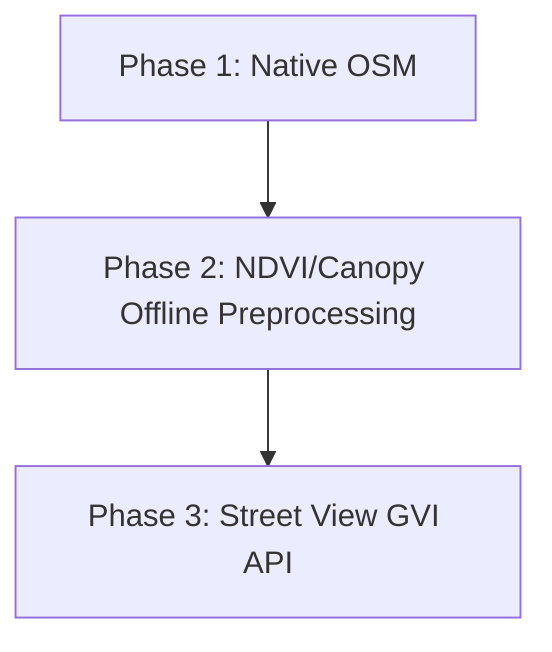

# Environmental Enrichment & Analysis Implementation Plan

This document serves as the master implementation plan and conceptual reference for enriching GSR (Galvanic Skin Response) recordings with OpenStreetMap (OSM) and external vegetation datasets in the Bio Mapping 2.0 visualizer.

---

## 1. Conceptual Overview & Scientific Rationale

Skin conductance (GSR/EDA) measures sympathetic nervous system activation, reflecting physiological arousal and stress. When people navigate urban spaces, their arousal levels fluctuate in response to environmental conditions. By pairing physiological data with spatial location, we can identify environmental drivers of stress and restoration.

```
[Urban Stressors]     --> [Sympathetic Spike]    --> GSR Peak / SCL Rise (after 1.5–3.0s latency)
[Restorative Zones]   --> [Sympathetic Decay]    --> GSR Recovery / SCL Decline
```

This implementation captures five primary environmental dimensions:
1. **Traffic & Acoustic Stress**: High-traffic streets, multi-lane roads, and transit crossings are major noise and danger stressors.
2. **Visual & Natural Restoration (Green Spaces)**: Tree canopy, grass, forests, and parks lower baseline physiological tension.
3. **Blue Spaces (Water Bodies)**: Proximity to rivers, canals, lakes, and coasts has strong restorative qualities.
4. **Built Complexity (Enclosure)**: Dense building canyons create sensory overload and feel claustrophobic, elevating baseline SCL.
5. **Social & Pedestrian Activity**: High-density retail zones and transit hubs increase cognitive arousal.

---

## 2. Phased Implementation Roadmap

We will implement this analysis in three distinct phases to ensure reliability, offline utility, and technical feasibility.



### Phase 1: Native OSM Integration (Browser-Native)
*   **Goal**: Fetch and process structural environmental data directly in the browser using the public Overpass API.
*   **Attributes Captured**: Road classification, distance to major roads, presence in parks/green spaces, green space density, building density, proximity to water, and count of amenities/shops/bus stops.
*   **Key Advantage**: Zero-configuration, free, client-side, and requires no API keys or preprocessing.

### Phase 2: Satellite NDVI & LiDAR Canopy Support (Hybrid Offline/Online)
*   **Goal**: Integrate high-resolution continuous vegetation indices (NDVI) and localized tree canopy layers.
*   **Attributes Captured**: Continuous chlorophyll greenness score (NDVI, 10m resolution) and actual canopy heights.
*   **Integration Method**: 
    1. A Python preprocessing helper script (in the repository's `scratch/` folder) queries Google Earth Engine or Sentinel Hub using the track coordinates and outputs an enriched CSV.
    2. The browser's CSV parser detects the new columns and loads them.

### Phase 3: Street View Greenery Index (GVI)
*   **Goal**: Assess visual greenery from a human eye-level rather than a satellite bird's-eye view.
*   **Integration Method**: Optional API integration with Mapillary (open-source) or Google Street View. The app queries street-level panorama metadata at downsampled track nodes and segments images to calculate green pixel percentages.

---

## 3. Technical Implementation Details (Phase 1 Focus)

### A. Data Retrieval Flow (Overpass API)
1. **Bounding Box Calculation**:
   Find the minimum and maximum latitudes and longitudes of the track. Add a `100-meter buffer` around the edges to account for spatial buffers (e.g. buildings within 50m of the track edge).
2. **Overpass QL Query**:
   Fetch roads, buildings, parks, water, amenities, and trees in a single POST request to the Overpass interpreter:
   ```overpass
   [out:json][timeout:90];
   (
     way["highway"]({{bbox}});
     way["building"]({{bbox}});
     relation["building"]({{bbox}});
     way["leisure"="park"]({{bbox}});
     way["landuse"~"grass|forest|meadow"]({{bbox}});
     way["natural"="wood"]({{bbox}});
     relation["leisure"="park"]({{bbox}});
     relation["landuse"~"grass|forest|meadow"]({{bbox}});
     relation["natural"="wood"]({{bbox}});
     way["natural"="water"]({{bbox}});
     way["waterway"]({{bbox}});
     relation["natural"="water"]({{bbox}});
     relation["waterway"]({{bbox}});
     node["amenity"]({{bbox}});
     way["amenity"]({{bbox}});
     node["shop"]({{bbox}});
     node["natural"="tree"]({{bbox}});
   );
   out body;
   >;
   out skel qt;
   ```
3. **BBox Area Guard**:
   $$\text{Area} = (\text{maxLat} - \text{minLat}) \times 111 \text{ km} \times (\text{maxLon} - \text{minLon}) \times 111 \cos(\text{avgLat}) \text{ km}$$
   If Area $> 10 \text{ km}^2$, the app will warn the user and suggest using a path-buffered query (fetching features strictly within 100m of the line).

### B. Client-Side Spatial Math
To prevent browser tab freezing, we downsample spatial calculations to the **unique 1 Hz GPS coordinates** of the track, then interpolate back to the 10 Hz GSR series.

*   **Distance to Segment (Road Proximity)**:
    For a GPS coordinate $P$ and a road line segment defined by $AB$:
    1. Project $P$ onto the line segment $AB$ to find the closest point $C$.
    2. If $C$ lies outside the segment, the distance is $\min(d(P, A), d(P, B))$.
    3. Convert the Cartesian distance to meters using the Haversine formula at the local latitude.
*   **Point in Polygon (Park Containment)**:
    Ray-casting algorithm: Cast a horizontal ray to the right of the point. Count how many times the ray intersects the polygon boundaries. An odd count means the point is inside the polygon.
*   **Concentric Circular Grid Sampling (Green Space %)**:
    Instead of complex polygon area intersections, we sample 25 points inside a 50m radius of the GPS coordinate (concentric rings at 10m, 25m, 40m). We run point-in-polygon tests on these sample coordinates. The fraction of points inside green space polygons represents `osm_green_pct_50m`.
*   **Spatial Hash Indexing**:
    To avoid checking every GPS point against every OSM geometry, we place OSM features into a 2D spatial grid.
    $$\text{CellX} = \lfloor \text{longitude} \times \text{scale} \rfloor, \quad \text{CellY} = \lfloor \text{latitude} \times \text{scale} \rfloor$$
    We only check geometries inside the point's current grid cell and its 8 neighboring cells.

### C. Temporal Latency Compensation
Physiological sweat gland reactions lag 1.5 to 3 seconds behind environmental triggers.
*   We will add a **Latency Shift Slider** (0 to 5 seconds, default 2.0s) in the Analysis Panel.
*   When calculating correlations, the GSR timeline is shifted backward:
    $$\text{Arousal}(t) \text{ is correlated with } \text{Environment}(t - \text{latency})$$

---

## 4. UI/UX Changes

### A. Sidebar: OSM Enrichment Panel
*   Add a new control card **OSM Enrichment**:
    *   `Search Radius` slider (25m - 200m, default 50m).
    *   `Latency Shift` slider (0s - 5s, default 2.0s).
    *   **Enrich Track** button.
    *   Progress bar & entity count status.

### B. Map Panel: Visual Overlay Selection
*   Add a dropdown in the Map toolbar to change track path color-coding:
    *   `GSR Arousal (Phasic)` [Default]
    *   `Green Space %` (Green gradient)
    *   `Building Density` (Orange/Red gradient)
    *   `Water Proximity` (Blue gradient)
    *   `Road Classification` (Discrete colors)
*   Checkbox: **Show Environmental Polygons** (renders the retrieved park/water/building shapes under the track).

### C. Dashboard: Environmental Analysis Panel
*   Add a tabbed dashboard next to the SCR Peaks Table:
    1.  **Correlation Matrix**: Interactive matrix of Pearson/Spearman coefficients ($r$ values) between GSR parameters (`Tonic SCL`, `Phasic SCR`, `Peak Count`) and environmental features.
    2.  **Scatter Plot**: Plotting GSR vs. a selected spatial metric with a linear regression line ($y = mx+c$) and $R^2$ score.
    3.  **Road Category Arousal**: Bar chart comparing mean GSR amplitude on primary vs. residential vs. park paths.

---

## 5. File Architecture

The implementation modifies and adds the following files:

```
gsr-map-analyzer/
├── osm_enrichment.js     [NEW]  - Overpass fetch, spatial math, grid indexing.
├── index.html            [MOD]  - Sidebar enrichment panel, stats tab UI.
├── styles.css            [MOD]  - Layouts for stats charts, cards, map layers.
├── map.js                [MOD]  - Track overlay rendering, custom colors.
├── analyzer.js           [MOD]  - GSRAnalyzer state extension, CSV parser & exporter.
├── ui.js                 [MOD]  - Event listeners, dashboard charts rendering.
└── events.js             [MOD]  - Collapse toggles for new panels.
```

---

## 6. Verification Plan

### Automated Testing (`scratch/test_spatial_math.js`)
We will create a Node.js testing script to verify:
1.  **Point-in-Polygon (PIP) correctness**: Verify standard rectangular and complex non-convex polygons.
2.  **Distance calculations**: Verify Haversine implementation against known spherical test cases.
3.  **Grid indexing speed**: Run a benchmark checking index retrieval time for 1,800 points against 5,000 geometries (target: $< 200\text{ms}$).

### Manual Testing
1.  Load track file `default_processed.csv`.
2.  Click **Enrich Track** and check network panel for Overpass POST request.
3.  Toggle Map coloring to **Green Space %** and confirm color switches on the map.
4.  Examine the **Correlation Dashboard** and confirm scatter plot updates when dragging the **Latency Shift Slider**.
5.  Export CSV and verify that the 8 environmental columns are populated, and re-importing this file skips the API query.
