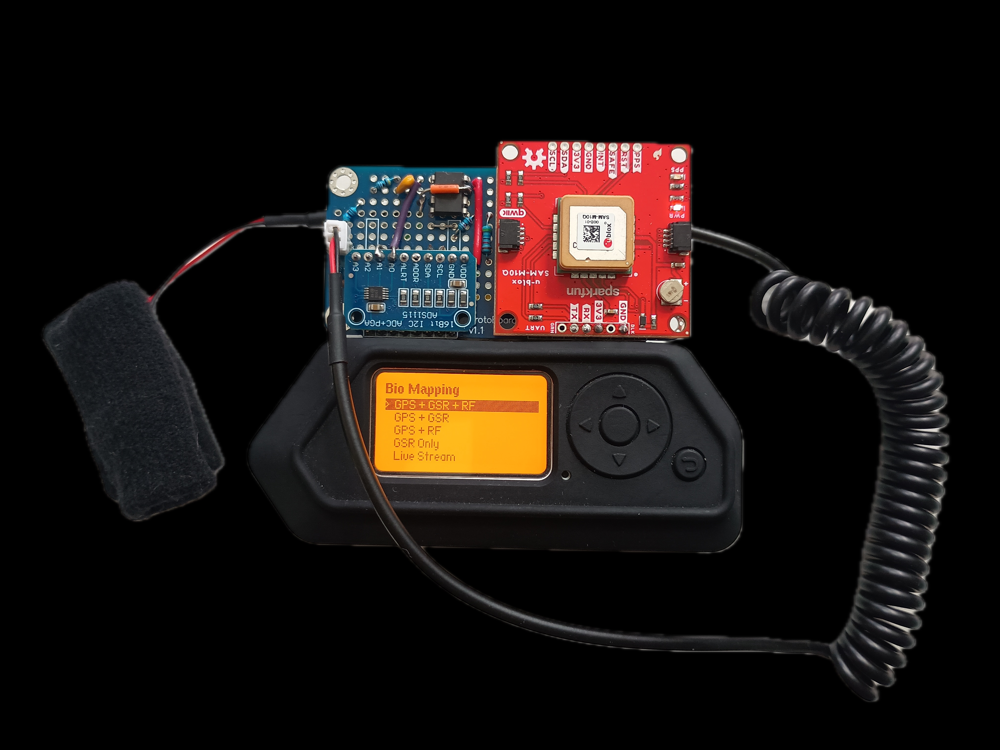
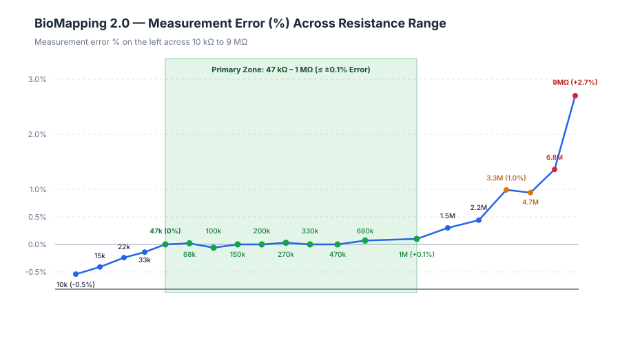
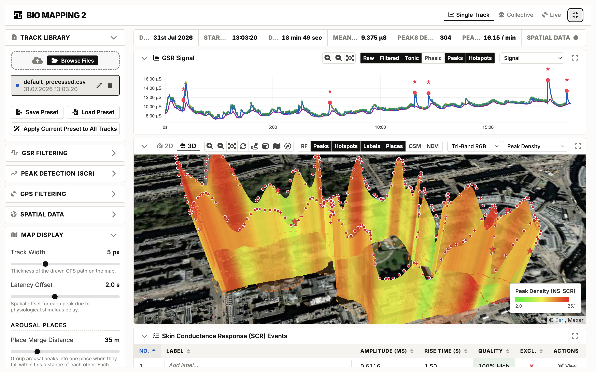

# BioMapping 2.0

*Christian Nold, 2026*

BioMapping 2.0 records your Galvanic Skin Response — a measure of emotional arousal — mapped to your geographical location as you walk through an environment.

It has two parts:

- **[The Hardware](#the-hardware)** — a Flipper Zero wired to a custom skin-response sensor and a GPS module, logging to the SD card as CSV.
- **[The Visualiser](#the-visualiser)** — browser-based analysis and mapping suite ([launch online](https://softhook.github.io/BioMapping/visualiser/) or open [`visualiser/index.html`](visualiser/index.html)).

## Quick Start

1. **Build the hardware** — gather the [components](#components) and follow the [wiring guide](docs/wiring_guide.md).
2. **Flash the app** — download `biomap.fap` from the [Releases](https://github.com/Softhook/BioMapping/releases) page and copy it to your Flipper's SD card, or build from `firmware/` with [`ufbt`](https://pypi.org/project/ufbt/).
3. **Record a walk** — launch the Bio Mapping app on the Flipper, clip on the electrodes, and walk. Logs save to `/ext/biomapping/*.csv` on the SD card.
4. **Analyse & map** — drop your CSV into the [online visualiser](https://softhook.github.io/BioMapping/visualiser/) — no install needed.

## The Original Bio Mapping

The first Bio Mapping device (Christian Nold, 2004) was used in workshops with thousands of people across sixteen countries. Participants walked through an area wearing the device and then annotated the recorded data together, producing collective emotion maps. Results from those workshops are published online — the [Greenwich Emotion Map](http://emotionmap.net/), the [San Francisco Emotion Map](http://www.sf.biomapping.net/) and the [Stockport Emotion Map](http://stockport.emotionmap.net/) — and the approach is discussed in the book [*Emotional Cartography*](http://www.emotionalcartography.net/).

BioMapping 2.0 is a high-fidelity successor that takes you much deeper into the body and uses more sophisticated hardware and software to identify subtle nervous system responses and create a new vision of the mind-body relationship.

---

# The Hardware

The device is a Flipper Zero running the Bio Mapping app, wired to a custom skin-response sensor circuit and a GPS module. It records to the Flipper's SD card as CSV.

## What It Records

| Stream | Sensor | Notes |
|---|---|---|
| **Galvanic Skin Response (GSR)** | Transimpedance amplifier + 16-bit ADS1115 ADC | Skin conductance in nanosiemens (nS) |
| **Location** | u-blox SAM-M10Q GNSS | Sub-metre accuracy, up to 10 Hz (GPS + Galileo + GLONASS + BeiDou) |
| **Environmental RF** | Flipper SubGHz radio | Band activity at 815 / 868 / 915 MHz |

Everything is logged to `/ext/biomapping/*.csv` at 10 Hz. A Live Stream mode sends GPS + GSR over Bluetooth instead of recording.

## Hardware Accuracy & Device Comparison

The GSR front-end is built to research-grade specification and measured against a precision metal-film resistor grid (10 kΩ – 9 MΩ), full sweep in [`docs/reference_test_results.csv`](docs/reference_test_results.csv).

Accuracy zones by the fraction of real-world track data that falls inside them:

- **≤ ±0.1%** — 47 kΩ – 1 MΩ (1,000 – 21,277 nS): 99.05% of data
- **≤ ±0.5%** — 22 kΩ – 2.2 MΩ (455 – 45,455 nS): 99.75%
- **≤ ±1.0%** — 15 kΩ – 4.7 MΩ (213 – 66,667 nS): 99.89%
- Below 100 nS (over 10 MΩ) the device reports an open circuit (electrodes disconnected / air).

| Device | Type / Price | ADC Resolution | Noise Floor | Accuracy / Error |
| :--- | :--- | :--- | :--- | :--- |
| [BIOPAC EDA100C + MP160](https://www.biopac.com/product/electrodermal-activity-amplifier/) | Lab Benchmark (~£8,000+) | 16-bit *(MP160 DAQ)* | 0.7 nS *(published sensitivity)* | Unknown |
| **[BioMapping 2.0](https://github.com/Softhook/BioMapping)** | **Custom Portable (~£250)** | **16-bit** *(Onboard ADS1115)* | **2.7 nS** | **±0.1% *(calibrated)* / ±0.4% *(raw)*** |
| [Empatica E4](https://support.empatica.com/hc/en-us/articles/202581999-E4-wristband-technical-specifications) | Clinical Wearable (~£1,350) *(discontinued)* | 0.9 nS per digit | Unknown | Unknown |
| [Empatica EmbracePlus](https://www.empatica.com/embraceplus/) | Clinical Research Wearable (~£1,400+) | ~0.055 nS per digit | Unknown | Unknown |
| [Shimmer3 GSR+](https://shimmersensing.com/product/shimmer3-gsr-unit/) | Research Wearable (~£650) | 12-bit *(Onboard MCU ADC)* | Unknown | ±3% to ±10% |
| [Movisens EdaMove 4](https://www.movisens.com/en/products/eda-and-activity-sensor/) | Ambulatory Research (~£800+ est.) | 14-bit | Unknown | Unknown |
| [BITalino EDA](https://www.pluxbiosignals.com/collections/bitalino/products/electrodermal-activity-eda-sensor) | Academic Toolkit (~£200) | 10-bit *(BITalino Core)* | Unknown | Unknown |
| [ProtoCentral tinyGSR](https://protocentral.com/product/protocentral-tinygsr-gsr-eda-digital-output-sensor-board-qwiic-stemma-qt/) | Maker Breakout (~£16) | Sensor only | Unknown | Unknown |
| [Grove GSR v1.2](https://wiki.seeedstudio.com/Grove-GSR_Sensor/) | Hobbyist Module (~£12) | Sensor Only | Unknown | Unknown |

> **Note on comparisons:** Most manufacturers do not publish detailed technical specifications. Where figures do appear, they reflect different testing conditions, comparing a bench-measured noise floor against a precision resistor grid (BioMapping 2.0) are not directly equivalent. The BioMapping 2.0 data come from testing that most manufacturers have not performed or chosen to publish.

## Components

**Core boards**
* **[Flipper Zero](https://flipperzero.one/)**
* **SparkFun u-blox SAM-M10Q GNSS Breakout** — GPS positioning. Integrated 15×15 mm ceramic patch antenna, 10 Hz updates.
* **Flipper Zero Prototyping Board** — mounts the ADS1115 and op-amp circuit.
* **ADS1115 Breakout Board** — 16-bit I²C ADC.

**Active components**
* 1× rail-to-rail dual op-amp (MCP602 / MCP6002 / MCP6042 or equivalent 3.3 V CMOS dual op-amp)

**Passive components** (all 0.1% tolerance metal-film resistors)
* 1× 56 kΩ — voltage divider
* 1× 10 kΩ — voltage divider
* 1× 47 kΩ — TIA gain / feedback
* 2× 4.7 kΩ — electrode safety (inline)
* 2× 100 nF (0.1 µF) ceramic capacitors — one power bypass, one feedback filter

**Biometric interface**
* GSR finger electrodes — biometric finger clips, or velcro strips with foil / copper tape.

## GSR TransImpedance Circuit

The circuit uses both channels of a rail-to-rail dual op-amp: one as a buffered 0.5 V virtual-ground reference (V_ref), and one as a transimpedance amplifier (TIA) that converts skin current to a voltage read differentially by the ADS1115. Two 4.7 kΩ safety resistors protect the electrodes, and a 100 nF feedback capacitor acts as a hardware low-pass filter against 50/60 Hz mains hum.

Full step-by-step pin connections, op-amp pinout, and build phases are in **[`docs/wiring_guide.md`](docs/wiring_guide.md)**.

## Installing the App

A Flipper external app (FAP) for stock firmware; also runs on the API-compatible forks (Momentum, Unleashed, RogueMaster). Download `biomap.fap` from the [Releases](https://github.com/Softhook/BioMapping/releases) page, or build from `firmware/` with [`ufbt`](https://pypi.org/project/ufbt/).

Run the host unit tests with `./run_tests.sh` from `firmware/`.

## CSV Schema

[`docs/csv_schema.md`](docs/csv_schema.md) is the canonical, versioned definition of every column and sentinel value, shared by the device and both visualiser pages.

---

# The Visualiser

The visualiser runs client-side in any modern browser with no server, installation, or build step required. You can launch it directly online:

👉 **[Launch BioMapping Visualiser Online](https://softhook.github.io/BioMapping/visualiser/)**

It provides two entry points:

- **Track Visualiser & Analysis** ([Online App](https://softhook.github.io/BioMapping/visualiser/) | [`visualiser/index.html`](visualiser/index.html)) — Load recorded `.csv` logs from the device to inspect waveforms, clean signals, detect SCR events, map emotional arousal in 2D or 3D, and generate collective emotion maps across participants.
- **Live Stream Visualiser** ([Online Live View](https://softhook.github.io/BioMapping/visualiser/live.html) | [`visualiser/live.html`](visualiser/live.html)) — Connects to the Flipper Zero in real time via Web Bluetooth to graph live biometric arousal and plot GPS movements as you walk.

## Available Methods & Pipeline

The visualiser provides a full suite of research-grade methods for ambulatory EDA signal processing and spatial analysis:

- **Signal Filtering & Motion Artefact Rejection:**
  - *Hampel / Median Filter* — Removes transient spikes and electrode loose-contact glitches.
  - *Butterworth Low-Pass* — 4th-order zero-phase filter to smooth high-frequency electrical fuzz and tremor.
  - *Zero-Phase Gait Filter* — 4th-order Linkwitz-Riley low-pass at 1.0 Hz, tuned to reject ~1.4–2.0 Hz walking-cadence ripple without ringing or genuine SCR amplitude loss.
- **Tonic / Phasic Decomposition:**
  - *Ultra Low-Pass (EMA)* — Exponential moving average baseline estimation with configurable time window (15–90 s).
  - *Moving Median* — Robust sliding-window baseline estimation.
  - *Trough Tracker* — 10th-percentile baseline follower.
  - *Matching Pursuit Deconvolution* — Greedy decomposition against a canonical Bateman SCRF kernel.
  - *SparsEDA* — Sparse deconvolution using multi-scale dictionary pursuit and active-set refinement.
  - *cvxEDA* — Convex optimisation jointly estimating cubic B-spline tonic drift and physiological sudomotor nerve impulses.
- **Peak Detection (SCR):**
  - *Full-Scan Trough-to-Peak (Default)* — Evaluates candidate peaks against minimum amplitude, SNR, and shape-quality criteria.
  - *Topographic Prominence* — Measures peak height relative to adjacent troughs, isolating compound responses riding larger rises.
  - *Driver Impulses* — Direct peak extraction from deconvolution and cvxEDA sudomotor nerve drivers.
- **Autonomic Indices & Derived Metrics:**
  - *Tonic SCL & Phasic SCR* — Separates slow baseline level from rapid emotional responses.
  - *Peak Density & Phasic AUC* — SCR frequency over time and cumulative phasic energy (Area Under the Curve).
  - *Arousal Index & Tri-Index* — Normalised multi-parameter arousal intensity metrics.
  - *EDASymp* — Spectral sympathetic tone index derived from low-frequency EDA dynamics.
- **Spatial & Collective Mapping:**
  - *Pedestrian GPS Filter Pipeline* — Fix-quality gating, speed clamping, HDOP thresholding, and Zero Velocity Update (ZUPT) velocity smoothing.
  - *Dual 2D/3D Rendering* — Toggle between interactive 2D maps and 3D globe terrain.
  - *Multi-Metric Path Colouring* — Dynamically colour paths by raw GSR, phasic arousal, tonic level, peak density, or RF field activity.
  - *Spatial Hotspots & "Places"* — Spatial clustering of emotional arousal sites along walking routes.
  - *Collective Emotion Topography* — Multi-track aggregation generating shared contour surfaces and arousal isolines across groups of participants.
  - *Environmental Layers* — Overlaid OpenStreetMap geometries (buildings, parks, water), Sentinel-2 NDVI satellite vegetation greenness, and tri-band RF fluid fields.

## Software & Algorithmic Accuracy

Detecting a genuine skin-conductance response (SCR) — separating it from sensor noise, walking motion, and baseline drift — is a well-studied problem in psychophysiology, with two established open-source reference tools: **NeuroKit2** (Python) and **Ledalab** (MATLAB/Octave), plus the peer-reviewed **cvxEDA** convex-optimisation model for decomposing skin conductance into its slow (tonic) and fast (phasic) components.

BioMapping ships its own detection pipeline — built to run entirely client-side, in the browser, on recordings made while walking outdoors — and checks it against those references on three grounds:

1. **A synthetic benchmark with a known answer.** Generated tracks carry SCR events at exactly known times and amplitudes, across a range of difficulty (evenly spaced, densely packed, overlapping bursts, and walking motion), so detection accuracy can be measured directly rather than inferred.
2. **Direct agreement on real recordings.** On clean, stationary recordings — the condition NeuroKit2 and Ledalab are designed for — BioMapping's output is compared peak-for-peak against theirs.
3. **A 62-track real-world field corpus.** Outdoor walking recordings totalling over 100,000 data points, to confirm the above holds up outside the lab.

**On the known-answer synthetic benchmark** (210 injected responses, evenly spaced through overlapping and compound), BioMapping's detectors sit at the strong end of recall, precision, and timing accuracy:

| Detector | Recall | Precision | F1 | Mean timing error |
|---|---:|---:|---:|---:|
| **BioMapping Full-Scan** (production default) | 93.3% | 100.0% | 0.966 | 0.029 s |
| **BioMapping Prominence** | 95.2% | 99.5% | 0.973 | 0.032 s |
| NeuroKit2 (default) | 83.8% | 84.2% | 0.840 | 0.035 s |
| Ledalab CDA (literature-tuned) | 81.9% | 88.2% | 0.849 | 0.556 s |

**On real, clean stationary recordings**, agreement with NeuroKit2 is close to total — BioMapping's Prominence detector matches 100% of NeuroKit2's own peaks (163/163) within ~60 ms, while also picking up dozens of genuine subtle responses NeuroKit2's fixed relative threshold leaves out.

**The standout result is cvxEDA.** BioMapping's from-scratch JavaScript port of the convex-optimisation solver reproduces the published Python reference implementation's output essentially exactly — on the full 62-track field corpus, 99.7% of 4,494 detections matched with a mean timing difference of 0.002 seconds — entirely in-browser, with no Python, MATLAB, or server backend required.

**Where BioMapping is built differently** is ambulatory use: NeuroKit2 and Ledalab are designed for seated laboratory sessions, so BioMapping adds a zero-phase motion filter tuned to footstep cadence and a noise-floor gate for sensor dropouts, neither of which a stationary-recording toolbox needs. On a synthetic walking benchmark with the gait filter enabled, BioMapping recovers 100% of injected responses at 96.8% precision.

Full methodology, every detector variant, and the complete benchmark history are in [`docs/eda_detection_benchmark.md`](docs/eda_detection_benchmark.md).

---

# Contributing

Bug reports, hardware build notes, and pull requests are welcome. A few things to know before you submit:

**Firmware (C — `firmware/`)**
- Run the host tests before opening a PR: `./run_tests.sh` from the `firmware/` directory.
- The app targets the Flipper Zero SDK via [`ufbt`](https://pypi.org/project/ufbt/); keep changes compatible with stock firmware and the API-compatible forks (Momentum, Unleashed, RogueMaster).

**Visualiser (JavaScript — `visualiser/`)**
- The app is plain ES modules with no build step. Run `npm ci` once to install dev tools, then:
  - `npm test` — Node test runner
  - `npm run lint` — [Biome](https://biomejs.dev/) linter (also runs on every PR via CI)
  - `npm run format` — auto-format with Biome
- CI runs lint and tests automatically on every pull request against `main`.

**Docs & CSV Schema**
- [`docs/csv_schema.md`](docs/csv_schema.md) is the canonical schema shared by the firmware and both visualiser pages — update it whenever the CSV format changes.
- New `docs/` files for proposals or research notes are welcome.

Open an issue first if you're planning a significant change — especially to the sensor circuit, the signal processing pipeline, or the CSV schema — so we can discuss it before you invest the time.

---

# Licence

Bio Mapping is open for community, artistic, and educational use under the **Bio Mapping Community Licence 1.0**.

In short: You are free to build your own Bio Mapping devices for personal use, research, and workshops (including charging participants for materials). You cannot manufacture or sell Bio Mapping hardware or software commercially without written permission. See [LICENCE.md](LICENCE.md) for full details.
