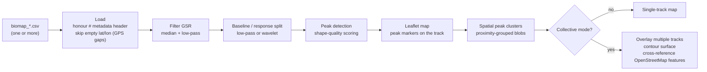

# BioMapping 2.0

*Christian Nold, 2026*

BioMapping 2.0 records your Galvanic Skin Response — a measure of emotional arousal — mapped to your geographical location as you walk through a landscape. The visualiser finds the moments of strongest response and shows where they cluster on a map, either for a single walk or across many walks combined.

It has two parts:

- **[The Hardware](#the-hardware)** — a Flipper Zero wired to a custom skin-response sensor and a GPS module, logging to the SD card as CSV.
- **[The Visualiser](#the-visualiser)** — browser pages that turn a recording into a map ([`visualiser/index.html`](visualiser/index.html)), or show the walk live over Bluetooth as it happens ([`visualiser/live.html`](visualiser/live.html)).

## The Original Bio Mapping

The first Bio Mapping device (Christian Nold, 2004) was used in workshops with thousands of people across sixteen countries. Participants walked through an area wearing the device and then annotated the recorded data together, producing collective emotion maps. Results from those workshops are published online — the [Greenwich Emotion Map](http://emotionmap.net/), the [San Francisco Emotion Map](http://www.sf.biomapping.net/) and the [Stockport Emotion Map](http://stockport.emotionmap.net/) — and the approach is discussed in the book [*Emotional Cartography*](http://www.emotionalcartography.net/).

BioMapping 2.0 is a higher-fidelity successor to that original device.

## What It Records

| Stream | Sensor | Notes |
|---|---|---|
| **Galvanic Skin Response (GSR)** | Transimpedance amplifier + 16-bit ADS1115 ADC | Skin conductance in nanosiemens (nS) |
| **Location** | u-blox SAM-M10Q GNSS | Sub-meter accuracy, up to 10 Hz (GPS + Galileo + GLONASS + BeiDou) |
| **Environmental RF** | Flipper SubGHz radio | Band activity at 815 / 868 / 915 MHz |

Everything is logged to `/ext/biomapping/*.csv` at 10 Hz. A Live Stream mode sends GPS + GSR over Bluetooth instead of recording.

## How It Compares

The GSR front-end is built to research-grade specification and measured against a precision metal-film resistor grid (10 kΩ – 9 MΩ), full sweep in [`docs/reference_test_results.csv`](docs/reference_test_results.csv).

| | BioMapping 2.0 | [Shimmer3 GSR+](https://shimmersensing.com/product/shimmer3-gsr-unit/) |
|---|---|---|
| Method | Constant voltage, 0.5 V | Constant voltage, 0.5 V |
| Resolution | **< 0.5 nS** (16-bit ADC + 100 ms decimation) | Variable (12-bit ADC, worse at low conductance) |
| Accuracy error (primary range) | **≤ ±0.1%** (47 kΩ – 1 MΩ) | ±3% (22 kΩ – 680 kΩ) |
| Accuracy error (wide range) | ≤ ±0.5% (22 kΩ – 2.2 MΩ) | ±10% (10 kΩ – 4.7 MΩ) |
| Accuracy error (extreme range) | ≤ ±1.0% (15 kΩ – 4.7 MΩ) | — |

Accuracy zones by the fraction of real-world track data that falls inside them:

- **≤ ±0.1%** — 47 kΩ – 1 MΩ (1,000 – 21,277 nS): 99.05% of data
- **≤ ±0.5%** — 22 kΩ – 2.2 MΩ (455 – 45,455 nS): 99.75%
- **≤ ±1.0%** — 15 kΩ – 4.7 MΩ (213 – 66,667 nS): 99.89%
- Below 100 nS (over 10 MΩ) the device reports an open circuit (electrodes disconnected / air).


---

# The Hardware

The device is a Flipper Zero running the Bio Mapping app, wired to a custom skin-response sensor circuit and a GPS module. It records to the Flipper's SD card as CSV.

## Installing the App

A Flipper external app (FAP) for stock firmware; also runs on the API-compatible forks (Momentum, Unleashed, RogueMaster). Download `biomap.fap` from the [Releases](https://github.com/Softhook/BioMapping/releases) page, or build from `firmware/` with [`ufbt`](https://pypi.org/project/ufbt/).

Run the host unit tests with `./run_tests.sh` from `firmware/`.

## Hardware Requirements

**Core boards**
* **[Flipper Zero](https://flipperzero.one/)**
* **SparkFun u-blox SAM-M10Q GNSS Breakout** — GPS positioning. Integrated 15×15 mm ceramic patch antenna, 10 Hz updates.
* **Flipper Zero Prototyping Board** — mounts the ADS1115 and op-amp circuit.
* **ADS1115 Breakout Board** — 16-bit I²C ADC.

**Active components**
* 1× rail-to-rail dual op-amp (MCP602 / MCP6002 / MCP6042 or equivalent 3.3 V CMOS dual op-amp)

**Passive components** (all 0.1% tolerance metal-film resistors)
* 1× 56 kΩ — voltage divider
* 1× 10 kΩ — voltage divider
* 1× 47 kΩ — TIA gain / feedback
* 2× 4.7 kΩ — electrode safety (inline)
* 2× 100 nF (0.1 µF) ceramic capacitors — one power bypass, one feedback filter

**Biometric interface**
* GSR finger electrodes — biometric finger clips, or velcro strips with foil / copper tape.

## Wiring Guide


### Phase 1: The I2C Bus
The SAM-M10Q connects via UART, leaving Pin 15 / Pin 16 free for the ADS1115 I²C bus.

* Pin 15 (PC1) — I2C **SDA**
* Pin 16 (PC0) — I2C **SCL**

### Phase 2: GPS Wiring
No wiring beyond UART TX/RX and 3.3V/GND.

### Phase 3: Installing the Biometric Sensor Circuit
Mount the ADS1115 and the dual op-amp onto the Flipper Zero Prototyping Board. Both op-amp channels are used — one as a voltage follower for V_ref, one as the TIA.

**Standard 8-pin dual op-amp pinout** (MCP602, MCP6002, MCP6042, and equivalents):
```
Pin 1 = Out A     Pin 8 = 3.3V
Pin 2 = In- A     Pin 7 = Out B
Pin 3 = In+ A     Pin 6 = In- B
Pin 4 = GND       Pin 5 = In+ B
```

* **Power & I2C (ADS1115):**
  * `VDD` -> **Pin 9 (3.3V)**
  * `GND` -> **Pin 8 (GND)**
  * `ADDR` -> **Pin 8 (GND)** *(hardcodes the I2C address to 0x48)*
  * `SDA` -> **Pin 15 (PC1)**
  * `SCL` -> **Pin 16 (PC0)**

* **Power & bypass (dual op-amp):**
  * Pin 8 -> **Pin 9 (3.3V)**
  * Pin 4 -> **Pin 8 (GND)**
  * **Mandatory:** solder one **100nF capacitor** directly across Pin 8 and Pin 4 to filter digital power spikes from the Flipper.

* **Generate the 0.5V bias (V_ref) with Op-Amp B (voltage follower):**
  * **56kΩ** from 3.3V to In+ B (pin 5).
  * **10kΩ** from In+ B (pin 5) to GND.
  * Tie Out B (pin 7) directly to In- B (pin 6).
  * *Pin 7 is now a buffered 0.5V reference (V_ref).*

* **Build the TIA with Op-Amp A:**
  * Connect V_ref (from Out B) to In+ A (pin 3).
  * Tie the **47kΩ** and the second **100nF capacitor** in parallel between Out A (pin 1) and In- A (pin 2). This is both the amplifier gain and a hardware low-pass filter against 50/60 Hz mains hum.

* **Connect electrodes & safety resistors:**
  * Electrode 1 (GND): GND -> **4.7kΩ** -> wire -> foil/finger 1.
  * Electrode 2 (signal): foil/finger 2 -> wire -> **4.7kΩ** -> In- A (pin 2).
  * *These resistors (9.4 kΩ total) keep skin current safe while holding the TIA output within ADC range across the span of human skin resistance.*

* **Differential connection to ADS1115:**
  * **AIN0** -> Out A (pin 1) — the amplified GSR signal.
  * **AIN1** -> Out B (pin 7) — the clean 0.5V V_ref.

The ADS1115 subtracts the 0.5V virtual-ground offset, isolating the amplified skin-current data while rejecting system noise.

## Recording Modes

Selected from the main menu:

```
┌─────────────────────────────┐
│  Bio Mapping                │
│  ▓ GPS + GSR + RF      ▓    │   ← selected item (inverse bar)
│    GPS + GSR                │
│    GPS + RF                 │
│    GSR Only                 │
│    Live Stream              │
│    Options                  │
└─────────────────────────────┘
```

| Mode | What it does | Output |
|---|---|---|
| **GPS + GSR + RF** | GPS, GSR and RF scanning all active. Each row carries the most recent GPS fix (carried forward, not interpolated). | 14-column CSV @ 10 Hz |
| **GPS + GSR** | GPS and GSR, RF off. | 11-column CSV @ 10 Hz |
| **GPS + RF** | GPS and RF, no GSR sensor (`gsr_raw` = `0.0`). | 14-column CSV @ 10 Hz |
| **GSR Only** | GSR waveform only, no GPS driver (module put into Software Standby to save power). | 2-column CSV @ 10 Hz |
| **Live Stream** | GPS + GSR streamed over Bluetooth in real time — **nothing is written to the SD card**. See [Live View](#live-view). | BLE, ~300 ms packets |
| **Options** | Opens the Options screen. | — |

Diagnostics is reached via **Options → Diagnostics**, not the main menu.

## Using the Device

Pick a mode from the main menu and press **OK** to start and stop recording. While recording, the arrow keys scale the on-screen graph (Up/Down = amplitude, Left/Right = time); **Back** stops and returns to the menu.

The graph shows the GSR **rate of change** (the derivative of skin conductance), not the absolute level. The two RF modes (GPS + GSR + RF and GPS + RF) add a per-band RSSI panel down the left edge. The CSV always stores the **absolute** conductance in nS; the derivative is display-only.

The RGB LED gives a once-per-second heartbeat while recording: green = OK, red = electrodes reading open-circuit, solid red = SD/filesystem error (recording stopped). Short tones mark recording start/stop, mode changes, and errors — mute them in **Options → Sound**.

## Options

Backlight, sound, and auto-zoom are self-explanatory toggles. The rest:

- **GPS Profile** — dynamic navigation model: Pedestrian (default), Wrist-worn, Vehicle, Stationary, Sea, Bike, Flight.
- **Reset GPS** — hot-start command; use if GPS data looks stale or frozen.
- **GSR Calibration** — 3-point wizard (below); shows `YES` when a custom calibration is loaded.
- **RF Calibration** — per-band Faraday noise-floor wizard; its result becomes the `# Band Floors` line in the CSV header.
- **Debug Fields** — appends diagnostic columns to recordings (off by default, applies to the next recording). Column list in [`docs/csv_schema.md`](docs/csv_schema.md).
- **Diagnostics** — live raw sensor values (PGA range, single-sample and 100 ms-mean conductance), no recording.

### GSR Calibration Wizard

Connect three reference resistors to the electrodes in turn; the wizard solves a linear fit ($y = \text{gain} \times x + \text{offset}$) in nS.

- **Points:** 470 kΩ → 2127.66 nS; 100 kΩ → 10000.0 nS; 47 kΩ → 21276.6 nS.
- Each step gathers 20 samples over 2 s (min/max discarded) and must pass a range gate; the final fit must hold gain $\in [0.2, 5.0]$, offset $\in [\pm20000]$ nS, $R^2 \ge 0.95$.
- **OK** saves to `/ext/biomapping/biomap.cal`; **Reset to Default** restores gain 1.0 / offset 0.0.

## Recordings on the SD Card

Files are written to `/ext/biomapping/` as `biomap_001.csv` … `biomap_999.csv` (auto-incrementing, wraps at 999). Each row is one 10 Hz tick.

**Header.** Every file starts with `#`-prefixed metadata lines, then the column header:

```
# RecordingStartTime:1751204579
# DeviceName:Clara
# Band Floors (dBm): 815:-91.5,868:-91.5,915:-91.5
# GPSChipID:axis slang boast putt chunk
# GSR Calibration: gain:1.0234,offset:-152.7000
timestamp,lat,lon,hdop,pdop,sats,fix_type,speed_kts,course_deg,gsr_raw,hacc_m,rssi_815,rssi_868,rssi_915
0.00,51.5072000,-0.1276000,1.2,1.5,8,3,2.40,185.0,4523.0,2.4,-91.5,-88.0,-95.0
0.10,51.5072000,-0.1276000,1.2,1.5,8,3,2.40,185.0,4528.0,2.3,-91.5,-88.0,-95.0
```

- `RecordingStartTime` and `DeviceName` are always present, in that order. `RecordingStartTime` is a Unix epoch (UTC) from the Flipper RTC (`0` if the RTC was never set — set it to UTC before recording); `DeviceName` is the Flipper's user-visible name, empty if the HAL returns none.
- The other three lines are conditional: `# Band Floors` when RF is active **and** an RF calibration exists (the visualiser uses it to normalise RSSI); `# GPSChipID` (a 5-word mnemonic for the M10Q's unique ID) in GPS modes once the chip answers the poll, M10Q builds only; `# GSR Calibration` (the `gain`/`offset` nS fit) only when a custom calibration is loaded. Full detail in [`docs/csv_schema.md`](docs/csv_schema.md).
- `timestamp` is **relative seconds since record start** (0.1 s resolution) — absolute time for a row is `RecordingStartTime + timestamp`.
- When there's no GPS fix on a tick, `lat`/`lon` and the other GPS columns are left empty (e.g. `0.30,,,,,,,,,4519.0,`) so the visualiser reads a gap rather than a `(0,0)` point. `hacc_m` is horizontal accuracy in meters; it stays `99.9` until the module reports an estimate.

**Column count per mode:** GPS + GSR + RF and GPS + RF → 14; GPS + GSR → 11; GSR Only → 2 (`timestamp,gsr_raw`). GPS + RF rows carry `gsr_raw` = `0.0`. [`docs/csv_schema.md`](docs/csv_schema.md) is the canonical, versioned column reference; **Options → Debug Fields** appends further diagnostic columns.

**Approximate size per hour at 10 Hz:** GPS + GSR ≈ 2.1 MB; GPS + GSR + RF / GPS + RF ≈ 2.8 MB; GSR Only ≈ 0.4 MB. The log file is pre-allocated at record start and trimmed at stop, so free space briefly looks lower during a recording.

## Circuit Reference

Key component values, matching the [schematic](docs/gsr_circuit.png) in the Wiring Guide:

| Parameter | Value |
|---|---|
| V_ref (voltage divider) | 0.5 V = 3.3 V × 10 kΩ / (56 kΩ + 10 kΩ) |
| R_f (TIA feedback) | 47 kΩ |
| R_safety (two 4.7 kΩ in series) | 9.4 kΩ |

The sensor is read continuously in the background. Each 10 Hz sample written to the CSV is a 100 ms average — which cancels mains hum — converted to skin conductance in nanosiemens. The on-screen graph shows the rate of change of that signal, not its absolute level.

## GPS Quality

The device logs every GPS fix the receiver reports, regardless of quality, so nothing is lost in built-up areas. Rows with no fix are written with empty `lat`/`lon`, and the visualiser applies its own quality filter at display time.

---

# The Visualiser

Browser software under [`visualiser/`](visualiser/) — no server, no build step to run it. It has two entry points.

## Post-Processing

[`visualiser/index.html`](visualiser/index.html) — open it directly in a browser and drag one or more `biomap_*.csv` files onto it. It:

1. **Loads** the CSV, honouring the `#` metadata header and relative-seconds `timestamp`, skipping rows with empty `lat`/`lon` (GPS gaps).
2. **Filters** the GSR signal (median + low-pass) and separates the slow-moving baseline from the fast responses — low-pass by default, or a wavelet transform.
3. **Detects peaks** in the fast responses, scored by shape quality (an optional deconvolution mode can replace this step).
4. **Maps** the track on a Leaflet base map and places a marker at each detected peak.
5. **Clusters** the peaks by geographic proximity into boundary blobs styled by severity. **Collective mode** does this across multiple overlaid tracks and adds a smooth contour surface, optionally cross-referenced with OpenStreetMap features (road class, green space, buildings).



Filtering, peak detection, and the GPS quality filter are all adjustable in the UI at runtime. The device logs every GPS fix; the quality filter (default HDOP 3.0) is applied here, at display time, and is non-destructive.

## Live View

[`visualiser/live.html`](visualiser/live.html) — receives GPS + GSR from the Flipper's **Live Stream** mode over Bluetooth LE in real time, for watching a walk unfold on a laptop or phone as it happens.

- **On the Flipper:** select **Live Stream**. The screen shows BLE status (`Advertising` / `Connected`), the dropped-packet count, and live GSR / GPS readouts. It sends a 45-byte packed binary packet every 300 ms over the stock BLE serial profile. Design notes: [`docs/archive/bluetooth_serial_investigation.md`](docs/archive/bluetooth_serial_investigation.md).
- **In the browser:** open `live.html`, press **Connect**, and pair with the Flipper. It shows a rolling GSR graph and a Leaflet map of the track, flags dropped-packet gaps, and can **Export CSV** in the same 11-column GPS + GSR schema as a recorded track.
- **Browser support:** Web Bluetooth needs desktop Chrome / Edge or Android Chrome / Edge. Safari (any platform) and Firefox are unsupported — there is no iPhone path.

## CSV Schema

[`docs/csv_schema.md`](docs/csv_schema.md) is the canonical, versioned definition of every column and sentinel value, shared by the device and both visualiser pages.

## Licence

Bio Mapping is open for community, artistic, and educational use under the **Bio Mapping Community Licence 1.0**.

In short: You are free to build your own Bio Mapping devices for personal use, research, and workshops (including charging participants for materials). You cannot manufacture or sell Bio Mapping hardware or software commercially without written permission. See `LICENCE.md` for full details.
