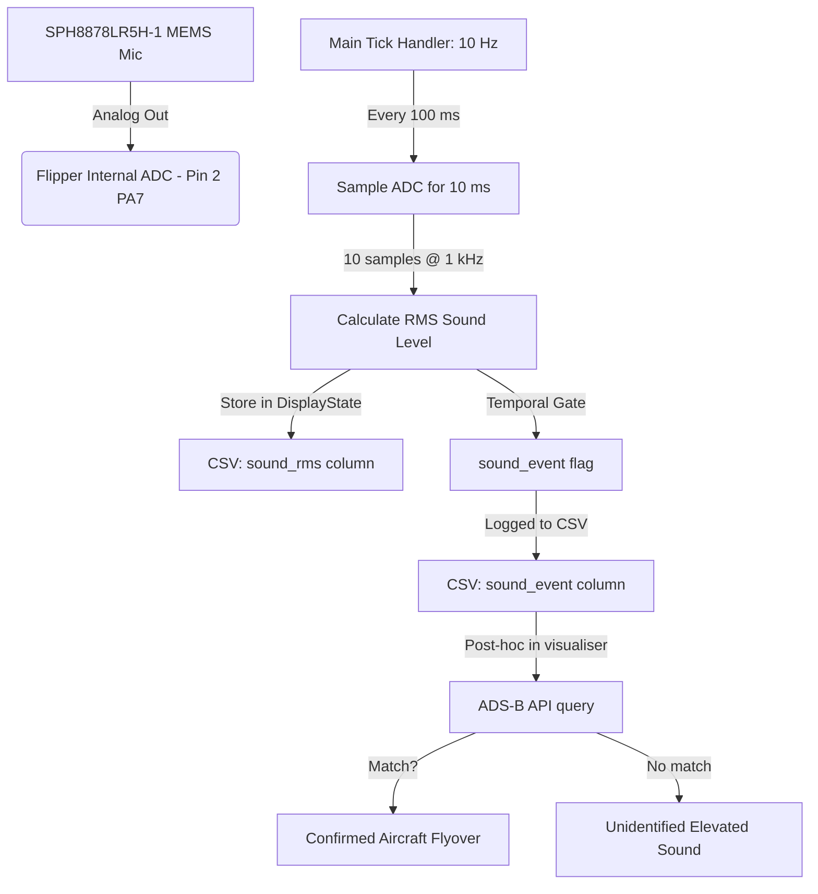

# Architectural Proposal & Feasibility Report: Environmental Sound Level Logging for the Flipper Zero `biomap` Application

This document details the hardware integration, firmware implementation, signal processing, and temporal gating required to add real-time environmental sound level logging to the BioMapping device. The onboard microphone records a continuous RMS sound level at 10 Hz. Elevated-sound events detected in the field are cross-referenced against aircraft transponder data to identify genuine flyovers — combining a cheap, always-on hardware sensor with ground-truth aircraft position data.

---

## 1. Architectural Overview

The strategy separates what the hardware can do reliably (measure how loud the environment is) from what needs external data to classify (was that loud thing an aircraft?).

**On the Flipper (firmware):** A **SparkFun Analog MEMS Microphone Breakout (SPH8878LR5H-1)** connects to the Flipper's internal 12-bit ADC on Pin 2 (PA7). The main tick handler samples the ADC for 10 ms every 100 ms, computes the RMS sound level, and logs it to the CSV. A temporal gate detects sustained elevated-sound periods and flags them as `sound_event=1`.

**In the web analyser (post-processing):** The analyser already has GPS coordinates and UTC timestamps for every row. Aircraft transponder data (ADS-B) is matched against the recording's time window and location to determine which `sound_event=1` segments correspond to actual overflights — see §7.3 for the data-source strategy and tradeoffs. Any `sound_event=1` segment that coincides with a known aircraft overflight is promoted to a *confirmed aircraft event*. Segments without ADS-B matches remain flagged as *unidentified elevated sound* — still useful for correlating GSR arousal with environmental noise, but not attributed to aircraft.



---

## 2. Architecture: Parallel Internal ADC

* **Physical Interface:** Connect the analog output of the SPH8878LR5H-1 MEMS breakout directly to Flipper **Pin 2** (`PA7`, which routes to internal `ADC1_IN12`). Per the [Flipper Zero GPIO documentation](https://docs.flipper.net/zero/gpio-and-modules), `PA7` is broken out on pin 2 — not pin 6, which is `PB2`. Verify that `FuriHalAdcChannel7` in the Flipper firmware's ADC channel enum maps to `PA7`/pin 2 (the name suggests channel 7, but channel numbering and pin numbering are independent).
* **Sensing Rate:** Continuous **10 Hz** logging. The main tick handler samples the microphone for 10 ms every 100 ms.
* **GSR Impact:** **ZERO.** The external ADS1115 ADC is 100% dedicated to GSR, running continuous 860 SPS oversampling with no interruptions, gaps, or MUX switches.
* **Bus Overhead:** **ZERO.** Sampling the internal ADC uses no external I2C bus traffic.

### Why Not the Spare ADS1115 AIN Pin?

The ADS1115 on the BioMapping breakout has two unused single-ended inputs: **AIN2** and **AIN3**. Wiring the microphone to one of these seems attractive — it's a 16-bit ADC already on the board, and the pin is free.

However, the ADS1115 is configured in **continuous-conversion differential mode** across AIN0–AIN1 (GSR signal minus V_ref). To read AIN2, the MUX register must be switched to a single-ended channel, which halts differential GSR conversion for the duration of the microphone sample window. At 860 SPS, a 10 ms window costs ~8–9 lost GSR samples every 100 ms — a ~9% duty-cycle gap. Each MUX switch also requires an I2C register write (two per cycle: switch-in + switch-back), adding 20 I2C transactions per second to a bus that is already running at full throughput for GSR.

More critically, the ADS1115's 16-bit resolution is wasted here: the microphone signal at typical outdoor sound levels spans only ~5–40 mV peak-to-peak at the breakout's AUD pin (see §5.2). On the Flipper's internal 12-bit ADC at 3.3V reference (0.8 mV/LSB), that's ~6–50 ADC counts — sufficient for RMS power measurement. The 16-bit ADC would deliver ~16× finer quantization, but for a loudness detector (not a spectrum analyzer) the extra bits add no practical value while costing GSR sample gaps and I2C bus contention.

**Verdict:** The spare AIN pin is technically usable but introduces GSR gaps, I2C bus overhead, and firmware complexity for a resolution improvement that doesn't benefit the use case. The internal ADC path is strictly better.

---

## 3. Hardware Integration

This architecture achieves continuous 10 Hz acoustic logging with absolutely no compromise to GSR signal quality, utilizing the Flipper's built-in STM32 internal ADC.

### 3.1 Wiring (Minimal)

The SparkFun SPH8878LR5H-1 breakout uses the OPA344 op-amp as a **unity-gain voltage follower** — the op-amp buffers the MEMS element's AC-coupled output at 1× gain, providing a low-impedance output but no voltage amplification. The SPH8878LR5H-1 MEMS capsule itself has a nominal sensitivity of **–38 dBV/Pa** (≈ 12.6 mV RMS at 94 dB SPL / 1 Pa). No external filter components are required for the BioMapping use case:

* **Power decoupling:** The breakout has its own bypass capacitors — the OPA344 is internally compensated and stable without external compensation. The Flipper's 3.3V rail has acceptable ripple for an RMS power measurement where we subtract the DC midpoint.
* **Signal anti-aliasing:** An RC low-pass filter would be mandatory for FFT-based spectral analysis (to satisfy Nyquist at 500 Hz), but we are measuring **RMS amplitude**, not frequency content. For the broadband, incoherent noise sources this sensor targets (engines, traffic, aircraft), aliased energy sums approximately correctly in the time domain — total RMS power is largely conserved. A strong single-frequency tone above 500 Hz (e.g. a turbine whine) would alias to a fixed lower frequency and could constructively or destructively combine with in-band content, so a dedicated anti-aliasing filter should be added if the sensor is ever repurposed for tonal noise measurement. The OPA344's natural 19.7 kHz bandwidth already rolls off RF carrier frequencies well above the audible band.

**Minimal wiring — three connections:**

```
[ Flipper Pin 9: 3.3V ]  --->  [ SPH8878LR5H-1 VCC ]
[ Flipper Pin 8: GND  ]  --->  [ SPH8878LR5H-1 GND ]
[ Flipper Pin 2: PA7  ]  <---  [ SPH8878LR5H-1 AUD ]
```

Pin 9 is the correct +3.3V supply pin (pin 1 is +5V, which is disabled by default on battery power and must be manually enabled via Settings → GPIO → "5V on GPIO"). Pin 9 is already used by the existing GSR circuit's ADS1115 (see `README.md`); the mic breakout's current draw is small enough to share that rail. Pin 2 is `PA7` (see §2); pin 8 is GND.

If RF interference from the Flipper's sub-GHz or BLE radios becomes a concern during testing (BioMapping does not normally use these radios), a simple single-pole RC low-pass ($R = 1.5\text{ k}\Omega$, $C = 0.1\text{ }\mu\text{F}$, cutoff $\approx 1060$ Hz) can be added between AUD and PA7 as a precaution. This is optional and not part of the baseline BOM.

---

## 4. Firmware Implementation

### 4.1 Compile-Time Feature Flag

Sound level logging is gated behind a single define in [`biomap_config.h`](../biomap_config.h):

```c
// Environmental sound level logging — SparkFun SPH8878LR5H-1 MEMS microphone
// on Pin 2 (PA7).  When 0, the firmware is byte-identical to a build
// without the feature — no extra columns in the CSV, no ADC sampling.
#define BIOMAP_FEATURE_ACOUSTIC  0  // 0 = disabled, 1 = enabled
```

When `BIOMAP_FEATURE_ACOUSTIC` is 0, all acoustic code is stripped by the preprocessor. The CSV stays at the canonical 11 columns. When set to 1, two columns are appended (`sound_rms`, `sound_event`) and the tick handler runs the sampling routine below.

### 4.2 Integration Into the Main Tick Handler

Rather than a standalone thread (which would drift relative to the 10 Hz `FuriTimer`), acoustic sampling runs inline inside `handle_recording_tick()` in [`biomap_session.c`](../biomap_session.c). This guarantees that the sound RMS value written to each CSV row corresponds to the same 100 ms window as the GSR and GPS data in that row.

**Mutex consideration:** The tick handler holds `app->mutex` while `acoustic_tick()` runs. The 10 ms of `furi_delay_us(1000)` busy-wait blocks the GUI render callback (`biomap_render_callback`) and any other mutex contenders for that window — roughly 10% of each 100 ms frame cycle. The STM32WB55 has no hardware FPU, so the soft-float `sqrt()` and double-precision accumulation add ~300 µs on top. The effective tick-handler duration is ~12 ms, leaving ~88 ms headroom. The "GSR Impact: ZERO" claim in §2 refers to the analog hardware path (the ADS1115 keeps running independently); this software-side mutex contention is a separate concern. The STM32WB55 supports ADC with DMA — using DMA-triggered capture instead of a busy-wait loop would eliminate the mutex block entirely and is the recommended follow-up if timing proves tight in practice.

```c
#include <furi.h>
#include <furi_hal_adc.h>
#include <math.h>

#if BIOMAP_FEATURE_ACOUSTIC

#define ACOUSTIC_NUM_SAMPLES   10
#define ACOUSTIC_BIAS_INIT      2048.0f   // 12-bit ADC midpoint (VCC/2)
#define ACOUSTIC_BIAS_ALPHA     0.001f    // EMA time constant ≈ 100 s at 10 Hz
#define ACOUSTIC_MIC_PRESENT_MIN 1900     // ADC counts — plausible bias floor
#define ACOUSTIC_MIC_PRESENT_MAX 2200     // ADC counts — plausible bias ceiling

// Called once per tick (10 Hz) from handle_recording_tick().
// Samples the internal ADC for 10 ms, computes RMS, and stores the
// result in s->display.sound_rms.  Must be called while app->mutex
// is held (the tick handler already holds it).
static void acoustic_tick(Session* s) {
    uint16_t samples[ACOUSTIC_NUM_SAMPLES];

    furi_hal_bus_enable(FuriHalBusADC);

    for (uint8_t i = 0; i < ACOUSTIC_NUM_SAMPLES; i++) {
        samples[i] = furi_hal_adc_read(FuriHalAdcChannel7); // Pin 2 (PA7); verify FuriHalAdcChannel7 maps to PA7
        furi_delay_us(1000);
    }

    furi_hal_bus_disable(FuriHalBusADC);

    // ── Microphone presence detection ──────────────────────────────
    // A floating pin (mic disconnected or wire broken) drifts toward
    // rail.  If the raw mean falls outside the plausible bias window,
    // treat the mic as absent and skip RMS — prevents garbage data.
    uint32_t raw_sum = 0;
    for (uint8_t i = 0; i < ACOUSTIC_NUM_SAMPLES; i++) raw_sum += samples[i];
    float raw_mean = (float)raw_sum / ACOUSTIC_NUM_SAMPLES;

    bool mic_present = (raw_mean >= ACOUSTIC_MIC_PRESENT_MIN &&
                        raw_mean <= ACOUSTIC_MIC_PRESENT_MAX);

    if (!mic_present) {
        s->display.sound_rms   = 0.0f;
        s->display.mic_present = false;
        return;
    }
    s->display.mic_present = true;

    // ── Slow-tracking EMA bias (rejects signal, tracks rail drift) ─
    // Initialised to 2048 on first tick; decays toward the raw mean
    // with a ~100 s time constant.  Aircraft flyovers (tens of seconds)
    // are too brief to pull the bias; rail voltage drift (minutes to
    // hours) is tracked continuously.  No dedicated calibration phase.
    if (!s->display.bias_primed) {
        s->display.sound_bias = raw_mean;
        s->display.bias_primed = true;
    } else {
        s->display.sound_bias += ACOUSTIC_BIAS_ALPHA *
            (raw_mean - s->display.sound_bias);
    }

    // ── RMS with DC-offset removal ─────────────────────────────────
    double sum_squares = 0;
    for (uint8_t i = 0; i < ACOUSTIC_NUM_SAMPLES; i++) {
        float val = (float)samples[i] - s->display.sound_bias;
        sum_squares += (double)(val * val);
    }
    s->display.sound_rms = (float)sqrt(sum_squares / ACOUSTIC_NUM_SAMPLES);
}

#endif // BIOMAP_FEATURE_ACOUSTIC
```

---

## 5. Signal Characteristics & Calibration

### 5.1 Frequency Response Limits & Aliasing
* The breakout's OPA344 op-amp has a hardware-defined frequency response of **7.2 Hz to 19.7 kHz**.
* The MEMS capsule's own response is specified from **100 Hz to 10 kHz** (±3 dB), rolling off below 100 Hz.
* Because the Flipper samples the ADC at 1 kHz, the Nyquist frequency is **500 Hz**. Any sounds above 500 Hz will technically alias into the measurement band.
* **Why this is safe for the target use case:** We are measuring **RMS amplitude (total sound power)** rather than performing spectral analysis (FFT). For the broadband, incoherent noise sources this sensor targets (engines, traffic, aircraft), aliased energy sums approximately correctly in the time domain — total RMS power is largely conserved. See §3.1 for the caveat about strong tonal sources above 500 Hz.
* To prevent very high frequency RF carrier signals (e.g. Flipper's radio transmissions) from corrupting the readings, the OPA344's natural 19.7 kHz bandwidth already attenuates RF. If needed, an optional single-pole RC low-pass (see §3.1) can be added.

### 5.2 Minimum and Maximum Detectable Sound Levels

The SPH8878LR5H-1 MEMS capsule has a nominal sensitivity of **–38 dBV/Pa** and the OPA344 buffers it at **unity gain** (1×). The Flipper's 12-bit ADC has a 3.3V reference, giving 0.806 mV/LSB. The table below maps sound pressure levels to the resulting signal at the ADC input and the usable ADC counts above the DC bias:

| Environment | SPL (dBA) | Pressure (Pa) | Mic output (mV RMS) | pk–pk at AUD pin (mV) | ADC counts pk–pk | Detectable? |
|---|---|---|---|---|---|---|
| Threshold of hearing | 0 | 0.00002 | 0.00025 | 0.0007 | <1 | ❌ Below self-noise |
| Quiet library / light wind | 35 | 0.0011 | 0.014 | 0.04 | <1 | ❌ Below ADC noise floor |
| Quiet countryside night | 45 | 0.0035 | 0.045 | 0.13 | <1 | ❌ Below ADC noise floor |
| Normal conversation at 1 m | 60 | 0.02 | 0.25 | 0.71 | <1 | ❌ Below ADC noise floor |
| **Busy street / background traffic** | **70** | **0.063** | **0.79** | **2.2** | **~3** | **⚠️ Marginal — near quantization limit** |
| Vacuum cleaner at 1 m | 75 | 0.11 | 1.4 | 4.0 | ~5 | ✅ Faint but measurable |
| **Jet flyover at 2 000 ft** | **80** | **0.20** | **2.5** | **7.1** | **~9** | **✅ Clearly detectable** |
| Jet flyover at 1 000 ft | 90 | 0.63 | 7.9 | 22 | ~28 | ✅ Strong signal |
| Jet flyover at 500 ft | 100 | 2.0 | 25 | 71 | ~88 | ✅ Very strong |
| Rock concert / ambulance siren | 110 | 6.3 | 79 | 225 | ~279 | ✅ Strong — approaching clip |
| **Op-amp saturation (3.3V rail)** | **~118** | **16** | **200** | **566 → clips** | **~702 → clips** | **⚠️ Clips at rail** |
| Jet engine at 30 m / pain threshold | 130 | 63 | 794 | — | — | ❌ MEMS element distorts |

The pk–pk and clipping columns assume a sinusoidal crest factor (pk–pk ≈ 2√2 × RMS). Real broadband engine and traffic noise is more impulsive than a pure tone — instantaneous peaks can exceed what the table implies for a given RMS level. Clipping at ~118 dBA may onset a few dB earlier for genuinely random noise; the ADC-counts column is a representative estimate, not a hard ceiling.

**Key takeaways:**
* **Minimum detectable (per-tick):** ~70 dBA (busy street). Below this, a single 10-sample RMS window is lost in ADC quantization noise (1 LSB = 0.8 mV). This is a property of the current per-tick design, not a hard physical floor — see §5.2.1 for firmware-only methods to push this lower.
* **Sweet spot:** 80–100 dBA. Jet flyovers at typical overflight altitudes (1 000–2 000 ft) produce 9–88 ADC counts peak-to-peak — easily measurable.
* **Maximum before clipping:** ~118 dBA nominal (real broadband noise may clip a few dB earlier due to higher crest factor). This is extremely loud — ambulance siren, very low helicopter — and unlikely during normal BioMapping walks.
* **The system cannot measure ambient/quiet soundscapes with the current per-tick RMS design.** A quiet park (~45 dBA), a residential street at night (~50 dBA), or normal conversation (~60 dBA) produce <1 ADC count of signal within a single 10-sample window. The `sound_rms` column will read near-zero for most of a recording. This is appropriate for the use case (detecting loud events against a quiet baseline); §5.2.1 describes how the floor can be lowered without hardware changes if broader sound level coverage is desired.

### 5.2.1 Lowering the Detection Floor via Temporal Smoothing

The ~70 dBA floor is a consequence of computing RMS from only 10 raw samples per tick with no further averaging — it is not a fundamental limit of the sensor + ADC combination. A signal whose peak-to-peak swing is smaller than 1 ADC LSB (0.806 mV) mostly digitizes to the same code within a single short window. But STM32 SAR ADCs typically exhibit 1–2 LSB of inherent noise even on a static input (from reference noise and board-level effects), providing natural dither. Averaging more independent samples reduces the noise-driven estimation error by √N and can resolve signals below the nominal 1-LSB quantization step.

Two approaches to exploit this, with different costs:

* **More samples per tick** (e.g. 30–50 instead of 10) — directly improves the RMS estimate but proportionally increases the busy-wait duration (see §4.2 mutex concern). Not recommended given the existing timing headroom.
* **Smooth the per-tick `sound_rms` value across additional ticks** (e.g. a short EMA or moving average over 1–3 seconds) before it feeds the §6 threshold gate. This costs nothing in per-tick CPU time, and the arm/disarm gate already tolerates 3 seconds of latency. Averaging across a 3-second window combines roughly 300 raw samples instead of 10 (a 30× increase), yielding a ~5.5× reduction in noise-driven error — about 14–15 dB of effective floor improvement. Applied to the current ~70 dBA floor, this suggests **~55–60 dBA** is achievable, picking up ordinary background traffic and closer conversation.

This requires bench validation: connect the mic in a silent environment and measure the actual sample-to-sample noise (in LSBs) at the raw ADC output. If that noise is near zero (ADC returns the same code every time on a static input), the averaging gain won't materialize and 70 dBA stands as the real floor. If there is measurable dither (typical for this class of ADC), the smoothed-RMS approach should meaningfully lower it. Either way, this is a firmware-only change with no BOM impact.

### 5.3 Slow-Tracking EMA Bias (Software)
The OPA344 output floats at **1/2 VCC** (nominally 1.65V, or 2048 ADC counts) when all is quiet. Resistor tolerances and Flipper power rail fluctuations (backlight, battery voltage droop) shift this bias over minutes to hours — from ~2030 to ~2060 counts across a recording session.

A one-shot calibration at session start is fragile: if the user presses OK while standing next to a road, the bias captures traffic noise instead of silence. Instead, the firmware maintains a **slow-tracking exponential moving average** ($\alpha = 0.001$, time constant $\approx 100$ seconds at 10 Hz):

$$bias_t = bias_{t-1} + 0.001 \times (raw\_mean_t - bias_{t-1})$$

This continuously tracks rail voltage drift (slow, minutes-to-hours) while rejecting the aircraft signal itself (transient, tens of seconds). The bias is initialised to 2048 on the first tick and converges toward the true quiet-state midpoint over the first several minutes of recording: ~63% at 100 s (1τ), ~86% at 200 s (~3.3 min), and >95% at 300 s (5 min). No dedicated calibration phase is needed.

To prevent the bias from drifting during extended loud periods (frequent flyovers near an airport could nudge the EMA in the same direction repeatedly), the bias update should be gated to quiet periods only — skip the update on any tick where `sound_event == 1`, consistent with how `baseline_rms` in §6.1 already excludes loud periods from its own baseline calculation.

---

## 6. Elevated-Sound Event Detection (Temporal Gating)

The microphone measures broadband RMS sound level — it cannot distinguish an aircraft from a truck, a motorcycle, or a construction site. The firmware's job is simply to detect *sustained elevated sound* and flag it. Source classification (was this an aircraft?) happens later in the web visualiser via ADS-B data matching (see §7.3).

### 6.1 Adaptive Threshold

A fixed RMS threshold is brittle across recordings — different environments have different baseline noise floors. Instead, the threshold is derived from a long-running quiet-period baseline:

$$threshold = baseline\_rms + margin$$

Where `baseline_rms` is a slow EMA ($\alpha = 0.0005$, time constant $\approx 200$ s) of `sound_rms` values that fall below the current threshold (i.e., only quiet periods update the baseline — loud periods are excluded so they don't ratchet the threshold upward). The `margin` is a configurable offset in ADC counts (default: 3). The equivalent dB increase depends on the current baseline: $20\log_{10}((B+3)/B)$ gives ~12 dB if $B = 1$ count, ~6 dB if $B = 3$ counts, and ~2–3 dB if $B \ge 10$ counts. The gate is therefore more sensitive in very quiet environments and more conservative in already-noisy ones — which is the intended adaptive behavior.

This means the gate automatically adapts: a recording in a quiet park triggers on moderate sounds; a recording next to a busy road requires genuinely loud events to cross the threshold.

### 6.2 State Machine (Symmetric Hysteresis)

The gate uses symmetric arm/disarm timing to avoid the asymmetry problem where a 15-second flyover produces 45+ seconds of `sound_event=1`:

| Parameter | Value | Rationale |
|---|---|---|
| Arm count | 30 frames (3 s) | `sound_rms > threshold` for 3 consecutive seconds before `sound_event` flips to 1. Filters door slams, dog barks, single car pass. |
| Disarm count | 30 frames (3 s) | `sound_rms < threshold` for 3 consecutive seconds before `sound_event` flips back to 0. Prevents flickering during brief lulls within a sustained loud event. |

```
                         sound_rms > threshold
   +---------------+  (counter increments each tick)  +------------------+
   |               | -------------------------------> |                  |
   |   IDLE        |                                  |   ARMING         |
   | sound_event=0 | <------------------------------- |   counter: 1..29  |
   |               |  sound_rms < threshold           |                  |
   +---------------+  (counter resets to 0)           +------------------+
          ^                                                    |
          |                                      counter reaches 30
          |                                                    v
          |                                           +------------------+
          |                                           |                  |
          |                                           |   ACTIVE         |
          |                                           | sound_event=1    |
          |                                           |                  |
          |                                           +------------------+
          |                                                    |
          |                                      sound_rms < threshold
          |                                      (counter increments)
          |                                                    v
          |                                           +------------------+
          |                                           |                  |
          +------------------------------------------ |   DISARMING      |
                         counter reaches 30           |   counter: 1..29  |
                         sound_event flips to 0       |                  |
                                                      +------------------+
                                                               |
                                                               | sound_rms > threshold
                                                               | (counter resets — stays ACTIVE)
                                                               v
                                                           [back to ACTIVE]
```

With symmetric 3-second arm/disarm, a 15-second flyover produces approximately 15 seconds of `sound_event=1` (plus up to 3 seconds of tail if the sound fades gradually). Transient loud events shorter than 3 seconds are fully rejected.

---

## 7. Data Logging & Dashboard Visualiser Integration

### 7.1 CSV Logging Format

When `BIOMAP_FEATURE_ACOUSTIC` is enabled, two columns are appended to the canonical 11-column schema (which already ends in `hacc_m` — see [`csv_schema.md`](csv_schema.md)):

```csv
timestamp,lat,lon,hdop,pdop,sats,fix_type,speed_kts,course_deg,gsr_raw,hacc_m,sound_rms,sound_event
12.30,51.5074,-0.1278,1.2,1.5,12,3,4.50,182.3,12450.5,2.4,4.2,1
```

| # | Column | Type | Unit | Notes |
|---|---|---|---|---|
| 12 | `sound_rms` | float | ADC counts | RMS amplitude above EMA bias. Near-zero for quiet environments (<70 dBA). `0.0` when mic disconnected. |
| 13 | `sound_event` | int | boolean | `1` = sustained elevated sound detected by temporal gate (≥3 s above adaptive threshold), `0` otherwise. Source classification is performed post-hoc in the analyser. |

When `BIOMAP_FEATURE_ACOUSTIC` is 0, columns 12–13 are absent and the CSV is byte-identical to the canonical 11-column format defined in [`csv_schema.md`](csv_schema.md).

### 7.2 Web Dashboard Visualiser — Sound Level Display

In the browser visualiser:
* **Sound Level Timeline:** The `sound_rms` column is rendered as a second trace below the GSR tonic/phasic graph, sharing the same time axis.
* **Event Marker Overlay:** `sound_event=1` segments are highlighted as coloured bands behind the GSR trace so elevated-sound periods are visually aligned with arousal data.
* **Latency Compensation:** A shift slider offsets the sound timeline relative to GSR (default: 0 s; adjustable 0–6 s). Skin conductance responses to startling noises typically peak 1.5–3.0 seconds after stimulus onset.

### 7.3 Post-Hoc Aircraft Identification via ADS-B Data

The visualiser imports public aircraft transponder data to determine which `sound_event=1` segments correspond to actual overflights. Both data sources below have been verified against their current API documentation; neither supports free, no-signup, browser-callable historical queries in the way originally envisioned. The constraints are documented here along with a recommended alternative (§7.3.3).

#### 7.3.1 Data sources — verified constraints

**OpenSky Network** (`opensky-network.org`), current API version 1.4.0:
* **Anonymous (no account) access is live-only.** For `/states/all`, "the time parameter is ignored" for anonymous requests — you only ever get the single most-recent state vector. There is no way to query anonymously for a time window in the past, which rules out anonymous access for this use case entirely.
* **Historical access requires a registered account.** Even authenticated, `/states/all` only reaches 1 hour back; `/flights/all` (a 2-hour window) and the experimental `/tracks` endpoint (up to 30 days back, and the only endpoint that returns actual lat/lon/altitude waypoints rather than just flight metadata) both require it too.
* **Authentication is OAuth2 client-credentials** (`client_id` + `client_secret` exchanged for a 30-minute bearer token) — HTTP Basic auth with username/password is no longer accepted. A `client_secret` is not safe to embed in client-side JavaScript (anyone can read it from the page/network tab); doing this properly needs a small backend to hold the secret and proxy the token exchange, which this project does not currently have — the visualiser is a static, serverless page.
* The previously-stated "400 requests/day for anonymous users" figure is accurate as a number (it's the correct anonymous credit quota) but is moot given the above — those credits can't be spent on historical data at all.

**ADS-B Exchange** (`adsbexchange.com`):
* The free tier is real-time-only. Historical backfill (their own materials describe up to 10 years of archive) is a paid-subscription feature, not part of free access.
* The API does not support CORS. A direct `fetch()` call from browser JavaScript — the architecture described below and used everywhere else in this visualiser — would be blocked by the browser regardless of authentication, unless routed through a server-side proxy.

Net effect: as described, this feature cannot be built as a client-side-only addition to the existing static visualiser. It needs either new backend infrastructure (to hold OpenSky credentials and/or proxy around ADS-B Exchange's CORS restriction), or a different approach — see §7.3.3.

#### 7.3.2 Matching algorithm (as originally proposed — logic is fine, only the data-fetch step needs to change)

1. Extract the recording's UTC time window and GPS bounding box from the CSV header and position data.
2. Query for all flights intersecting that bounding box during that time window (via whichever data-access path from §7.3.1/§7.3.3 is adopted).
3. For each `sound_event=1` segment in the CSV, compute the minimum 3D distance between the user's GPS track and each candidate aircraft using timestamp-aligned interpolation of the aircraft's barometric altitude and lat/lon.
4. If any aircraft passes within a configurable radius (default: 2 km horizontal, 3 000 ft vertical) during the segment, the segment is tagged as a **confirmed aircraft overflight**.
5. Segments with no match remain as **unidentified elevated sound** — still visible in the correlation analysis but not attributed to aircraft.

This proximity-matching logic doesn't depend on *which* data source feeds it, so it carries over unchanged regardless of which fix below is chosen.

#### 7.3.3 Recommended alternative: capture ADS-B locally, during the walk

Rather than depending on a third party's auth model, rate limits, and CORS policy after the fact, consider logging ADS-B traffic **live, alongside the GSR/GPS recording**, with a small local receiver:

* A ~$20–30 RTL-SDR USB dongle (or an ADS-B-capable module) tuned to 1090 MHz, paired with a phone running a logging app, or a small companion SBC (e.g. Raspberry Pi Zero) running `dump1090`, carried alongside the Flipper during the walk.
* This logs real aircraft transponder data for exactly the recording window and location with zero dependency on any API's historical-access tier, no OAuth2 flow to implement, no CORS restriction (it's a local log file, not a browser fetch), and no risk of the provider changing access terms later.
* Trade-off: an extra piece of hardware to carry, versus the current single-Flipper simplicity. Given both named "free" ADS-B APIs turned out not to actually support this use case for free, that trade-off is probably worth it if aircraft identification is a hard requirement rather than a nice-to-have.
* The §7.3.2 matching algorithm applies identically to a locally-logged CSV/JSON of ADS-B state vectors — only the ingestion step changes.

If a pure "no extra hardware" solution is a hard requirement, the fallback is to accept the backend dependency: stand up a minimal server that holds an OpenSky account's OAuth2 credentials and proxies bounding-box/time-window queries to the browser. This is a scope increase (this project has no backend today) but is the only path that keeps the OpenSky data source.

**Why ADS-B correlation (via either path above) is better than trying to classify aircraft from the microphone alone:**
* Zero false positives from trucks, motorcycles, construction, or helicopters not in the ADS-B database.
* The microphone provides the *timing* of the loud event (when did the user's body hear it?); ADS-B provides the *identity* (was that actually an aircraft, and how close was it?).
* Both `sound_rms` and aircraft proximity can be plotted against GSR simultaneously — the visualiser can show whether arousal correlates with raw loudness, confirmed overflights, or both.

**Limitations:**
* Light aircraft without ADS-B transponders (ultralights, some private planes) are invisible either way.
* Military jets with transponders disabled won't appear.
* The matching is only as good as the GPS fix — if the Flipper has poor satellite coverage, the user's position may be too imprecise to reliably compute aircraft proximity.
