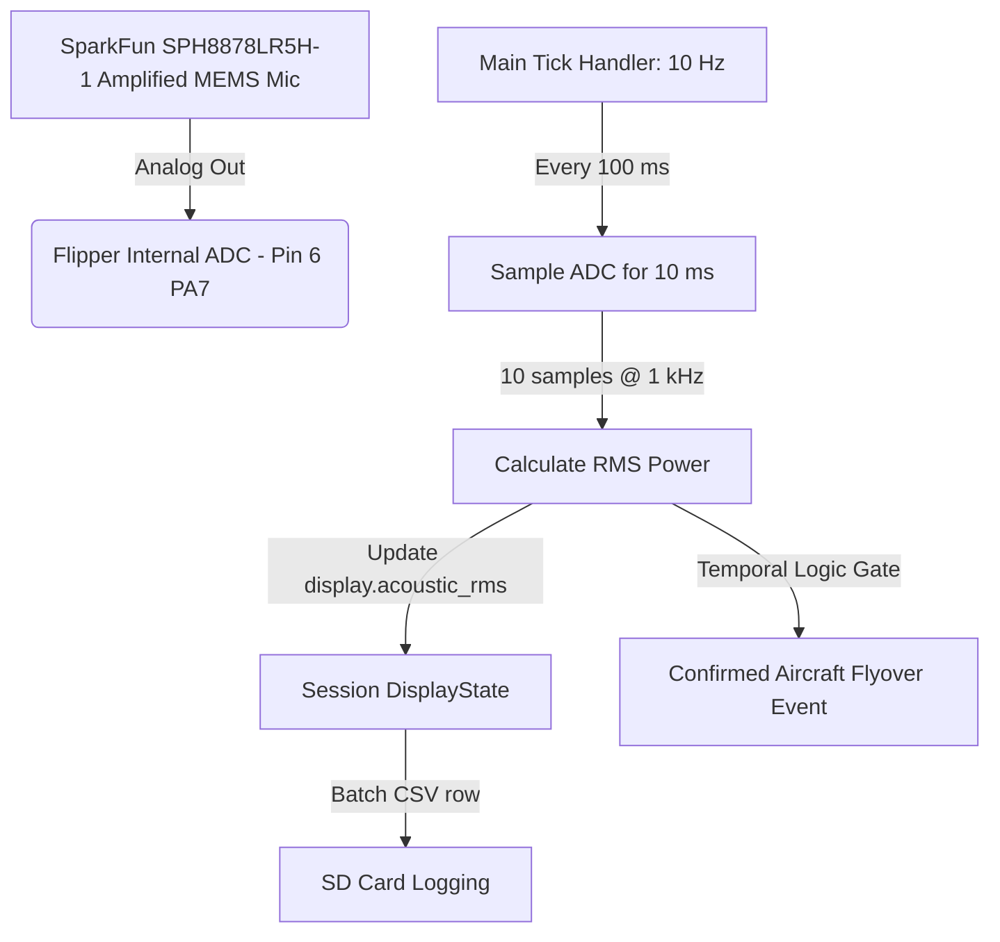

# Architectural Proposal & Feasibility Report: Acoustic Aircraft Detection on Flipper Zero

This document details the hardware integration, low-level firmware configuration, signal processing math, and temporal logic required to add real-time, low-power acoustic aircraft detection to the Flipper Zero `biomap` application.

---

## 1. Architectural Overview

To detect aircraft flyovers without compromising skin conductance (GSR) or location (GPS) tracking, we implement the **SparkFun Analog MEMS Microphone Breakout (SPH8878LR5H-1)**. 

The breakout features a **built-in op-amp amplifier (OPA344) providing a fixed gain**, boosting the raw audio signal to a level that can be read with high resolution. The recommended approach uses the Flipper's internal 12-bit ADC on Pin 6 (PA7), keeping the external ADS1115 100% dedicated to GSR with zero gaps or multiplexing.



---

## 2. Architecture: Parallel Internal ADC

* **Physical Interface:** Connect the analog output of the SPH8878LR5H-1 MEMS breakout directly to Flipper Pin 6 (`PA7`, which routes to internal `ADC1_IN12`).
* **Sensing Rate:** Continuous **10 Hz** logging. The main tick handler samples the microphone for 10 ms every 100 ms.
* **GSR Impact:** **ZERO.** The external ADS1115 ADC is 100% dedicated to GSR, running continuous 860 SPS oversampling with no interruptions, gaps, or MUX switches.
* **Bus Overhead:** **ZERO.** Sampling the internal ADC uses no external I2C bus traffic.

### Why Not the Spare ADS1115 AIN Pin?

The ADS1115 on the BioMapping breakout has two unused single-ended inputs: **AIN2** and **AIN3**. Wiring the microphone to one of these seems attractive — it's a 16-bit ADC already on the board, and the pin is free.

However, the ADS1115 is configured in **continuous-conversion differential mode** across AIN0–AIN1 (GSR signal minus V_ref). To read AIN2, the MUX register must be switched to a single-ended channel, which halts differential GSR conversion for the duration of the microphone sample window. At 860 SPS, a 10 ms window costs ~8–9 lost GSR samples every 100 ms — a ~9% duty-cycle gap. Each MUX switch also requires an I2C register write (two per cycle: switch-in + switch-back), adding 20 I2C transactions per second to a bus that is already running at full throughput for GSR.

More critically, the ADS1115's 16-bit resolution is wasted here: the amplified microphone signal already spans hundreds of millivolts peak-to-peak (see §5.3). The Flipper's internal 12-bit ADC at 3.3V reference (0.8 mV/LSB) provides ~160–500 counts of signal for a flyover — more than enough dynamic range for RMS power measurement. The 16-bit ADC would deliver ~16× finer quantization, but for a loudness detector (not a spectrum analyzer) the extra bits add no practical value while costing GSR sample gaps and I2C bus contention.

**Verdict:** The spare AIN pin is technically usable but introduces GSR gaps, I2C bus overhead, and firmware complexity for a resolution improvement that doesn't benefit the use case. The internal ADC path is strictly better.

---

## 3. Hardware Integration

This architecture achieves continuous 10 Hz acoustic logging with absolutely no compromise to GSR signal quality, utilizing the Flipper's built-in STM32 internal ADC.

### 3.1 Wiring (Minimal)

The SparkFun SPH8878LR5H-1 breakout already includes the OPA344 op-amp with onboard power-supply decoupling and a fixed 65× gain stage. No external filter components are required for the BioMapping use case:

* **Power decoupling:** The breakout has its own bypass capacitors — the OPA344 is internally compensated and stable without external compensation. The Flipper's 3.3V rail has acceptable ripple for an RMS power measurement where we subtract the DC midpoint.
* **Signal anti-aliasing:** An RC low-pass filter would be mandatory for FFT-based spectral analysis (to satisfy Nyquist at 500 Hz), but we are measuring **RMS amplitude**, not frequency content. Aliasing folds total energy without distortion in the time domain — the RMS sum is mathematically conserved. The OPA344's natural 19.7 kHz bandwidth already rolls off RF carrier frequencies well above the audible band.

**Minimal wiring — three connections:**

```
[ Flipper Pin 1: 3.3V ]  --->  [ SPH8878LR5H-1 VCC ]
[ Flipper Pin 8: GND  ]  --->  [ SPH8878LR5H-1 GND ]
[ Flipper Pin 6: PA7  ]  <---  [ SPH8878LR5H-1 AUD ]
```

If RF interference from the Flipper's sub-GHz or BLE radios becomes a concern during testing (BioMapping does not normally use these radios), a simple single-pole RC low-pass ($R = 1.5\text{ k}\Omega$, $C = 0.1\text{ }\mu\text{F}$, cutoff $\approx 1060$ Hz) can be added between AUD and PA7 as a precaution. This is optional and not part of the baseline BOM.

---

## 4. Firmware Implementation

### 4.1 Compile-Time Feature Flag

Acoustic detection is gated behind a single define in [`biomap_config.h`](../biomap_config.h):

```c
// Acoustic aircraft detection — SparkFun SPH8878LR5H-1 MEMS microphone
// on Pin 6 (PA7).  When 0, the firmware is byte-identical to a build
// without the feature — no extra columns in the CSV, no ADC sampling.
#define BIOMAP_FEATURE_ACOUSTIC  0  // 0 = disabled, 1 = enabled
```

When `BIOMAP_FEATURE_ACOUSTIC` is 0, all acoustic code is stripped by the preprocessor. The CSV stays at the canonical 10 columns. When set to 1, two columns are appended (`acoustic_rms`, `aircraft_event`) and the tick handler runs the sampling routine below.

### 4.2 Integration Into the Main Tick Handler

Rather than a standalone thread (which would drift relative to the 10 Hz `FuriTimer`), acoustic sampling runs inline inside `handle_recording_tick()` in [`biomap_session.c`](../biomap_session.c). This guarantees that the acoustic RMS value written to each CSV row corresponds to the same 100 ms window as the GSR and GPS data in that row — no desynchronization, no extra mutex contention, no additional thread stack.

The sampling window (10 ms of ADC reads) fits comfortably within the 100 ms tick budget. The GSR `gsr_sensor_tick()` call already blocks for ~1 ms; adding 10 ms of ADC sampling brings the tick handler to ~11 ms, leaving 89 ms of headroom per cycle on the Cortex-M4 @ 64 MHz.

```c
#include <furi.h>
#include <furi_hal_adc.h>
#include <math.h>

#if BIOMAP_FEATURE_ACOUSTIC

#define ACOUSTIC_NUM_SAMPLES  10
#define ACOUSTIC_ADC_MIDPOINT 2048.0f  // 12-bit ADC midpoint (VCC/2)

// Called once per tick (10 Hz) from handle_recording_tick().
// Samples the internal ADC for 10 ms, computes RMS, and stores the
// result in s->display.acoustic_rms.  Must be called while app->mutex
// is held (the tick handler already holds it).
static void acoustic_tick(Session* s) {
    uint16_t samples[ACOUSTIC_NUM_SAMPLES];

    furi_hal_bus_enable(FuriHalBusADC);

    for (uint8_t i = 0; i < ACOUSTIC_NUM_SAMPLES; i++) {
        samples[i] = furi_hal_adc_read(FuriHalAdcChannel7); // Pin 6 (PA7)
        furi_delay_us(1000);
    }

    furi_hal_bus_disable(FuriHalBusADC);

    // RMS with DC-offset removal
    double sum_squares = 0;
    for (uint8_t i = 0; i < ACOUSTIC_NUM_SAMPLES; i++) {
        float val = (float)samples[i] - s->display.acoustic_bias;
        sum_squares += (double)(val * val);
    }
    s->display.acoustic_rms = (float)sqrt(sum_squares / ACOUSTIC_NUM_SAMPLES);
}

#endif // BIOMAP_FEATURE_ACOUSTIC
```

---

## 5. Signal Characteristics & Calibration

### 5.1 Frequency Response Limits & Aliasing
* The breakout's OPA344 op-amp has a hardware-defined frequency response of **7.2 Hz to 19.7 kHz**.
* Because the Flipper samples the ADC at 1 kHz, the Nyquist frequency is **500 Hz**. Any sounds above 500 Hz will technically alias into the measurement band.
* **Why this is safe:** Because we are measuring **RMS amplitude (total sound power)** rather than performing spectral analysis (FFT), aliasing does not distort our loudness reading. Total energy remains mathematically conserved in the time domain. 
* To prevent very high frequency RF carrier signals (e.g. Flipper's radio transmissions) from corrupting the readings, the OPA344's natural 19.7 kHz bandwidth already attenuates RF. If needed, an optional single-pole RC low-pass (see §3.1) can be added.

### 5.2 Dynamic DC Bias Auto-Calibration (Software)
The OPA344 output floats at **1/2 VCC** (nominally 1.65V, or 2048 ADC counts) when all is quiet. However, resistor tolerances and Flipper power rail fluctuations (e.g. when the LCD backlight turns on) will shift the quiet bias slightly (e.g. 2030 or 2060 counts).
* **Firmware Fix:** At the start of a recording session, the tick handler samples the ADC for 100 ms under quiet conditions to calculate a **dynamic DC offset bias**, stored in `s->display.acoustic_bias`. This replaces the hardcoded `2048.0f` constant, ensuring perfect symmetry in the AC calculations.

### 5.3 Quiet Noise Floor & Outdoor Saturation Thresholds (Acoustic Feasibility)
* **The Noise Floor (Quiet Limits):** The SPH8878LR5H-1 has a self-noise floor of 29 dBA SPL. Quiet sounds below **45 dB SPL** (like whispering or light wind) produce voltages under 1.5 mV peak-to-peak (<2 ADC divisions). These merge into the Flipper's ADC noise floor and are ignored, which is appropriate for aircraft tracking.
* **The Saturation Point (Loud Limits):** While the raw silicon capsule can handle **134 dB SPL** before distorting, the breakout's 65x gain op-amp operates on a 3.3V rail. The op-amp output will saturate (clip) when the signal exceeds **103 dB SPL** (3.3V peak-to-peak swing).
* **Outdoor Feasibility:** An outdoor commercial jet flyover at 1,000–2,000 feet typically peaks at **70 dB to 85 dB SPL** at ground level. This produces a clean **130 mV to 400 mV peak-to-peak swing**, sitting comfortably within the op-amp's linear headroom without saturating or clipping. The sensor will only clip in extreme noise environments (>103 dB SPL, e.g. standing directly next to sirens, lawnmowers, or construction machinery).

---

## 6. Rolling Temporal Gating Logic

To filter out transient noise spikes (barking dogs, slamming doors), the rolling gate checks for a sustained elevated loudness threshold over **30 seconds** (6 consecutive elevated 5-second bins or a sliding window of 10 Hz frames).

```
   +--------------------+  RMS > Threshold  +----------------------+
   |                    | ----------------> |                      |
   |     Idle / Quiet   |                   |  Sustained Elevated  |
   |                    | <---------------- |  (Count 1..5)        |
   +--------------------+   RMS < Threshold +----------------------+
            ^                                          |
            |                                          | Count reaches 6
            |                                          v
            |       Acoustic Decays             +----------------------+
            +---------------------------------- |                      |
                     (6 consecutive quiet       |  Confirmed Flyover   |
                      snapshots = 30s)          |  Event Active        |
                                                +----------------------+
```

---

## 7. Data Logging & Dashboard Analyzer Integration

The session updates are logged synchronously to the SD card.

### 7.1 CSV Logging Format

When `BIOMAP_FEATURE_ACOUSTIC` is enabled, two columns are appended to the canonical 10-column schema:

```csv
timestamp,lat,lon,hdop,pdop,sats,fix_type,speed_kts,course_deg,gsr_raw,acoustic_rms,aircraft_event
12.30,51.5074,-0.1278,1.2,1.5,12,3,4.50,182.3,12450.5,182.4,1
```

| # | Column | Type | Unit | Notes |
|---|---|---|---|---|
| 11 | `acoustic_rms` | float | ADC counts | RMS amplitude above DC bias. `0.0` when feature disabled or mic absent. |
| 12 | `aircraft_event` | int | boolean | `1` = confirmed flyover active this tick, `0` otherwise. |

When `BIOMAP_FEATURE_ACOUSTIC` is 0, columns 11–12 are absent and the CSV is byte-identical to the canonical 10-column format defined in [`csv_schema.md`](csv_schema.md).

### 7.2 Web Dashboard Analyzer
In the browser analyzer:
* **Correlation Index:** Automatically aligns the rolling `acoustic_rms` timeline against the user's skin conductance tonic/phasic levels.
* **Latency Compensation:** Integrates a latency shift slider to shift the GSR timeline backwards (typically 1.5–3.0 seconds) relative to the aircraft noise onset to correlate sweat response peaks with flyovers.
