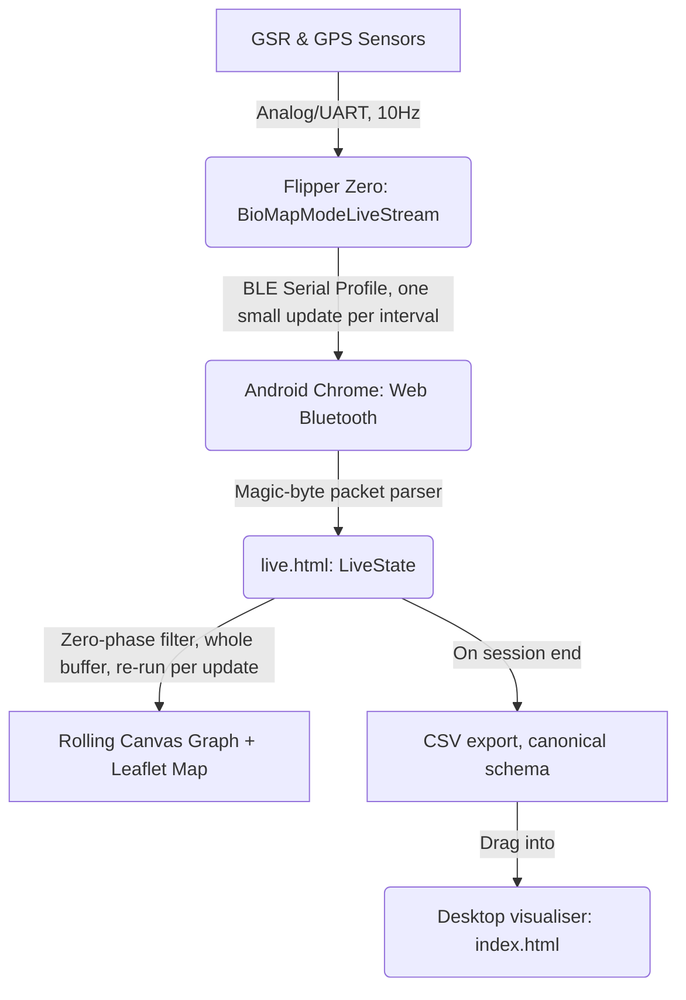

# Bluetooth Live Streaming — Implementation Plan

Real-time streaming of GSR and GPS data from the Flipper Zero to a browser-based live viewer,
for watching a walk unfold on a phone or laptop while it happens. This is the implementation
reference for that feature: confirmed Flipper SDK hooks, firmware and frontend design, known
risks, and a phased build plan. Nothing described here is implemented yet.

---

## 1. Critical Review — Problems and Gotchas

Read this section first. It exists because several of the assumptions below turned out to be
wrong or incomplete on inspection, and the design in the rest of this document is built to
account for them — this isn't a disclaimer, it's load-bearing.

### 1.1 Web Bluetooth does not work on iPhone — at all

**This is the single biggest constraint on "mobile phone accessible."** Web Bluetooth has zero
native support on iOS or iPadOS, in any browser — Safari doesn't implement it, and every other
iOS browser (Chrome, Firefox, Edge) is required by Apple to use WebKit underneath, so they don't
implement it either. As of 2026, global browser support sits around 76%, and the entire gap is
Safari/Firefox on every platform they ship on. The only workaround is a third-party jailbreak-
adjacent Safari extension (`iOSWebBLE`) that bridges to CoreBluetooth — not something to design
around or recommend.

**Practical implication**: the live viewer works on desktop Chrome/Edge and Android Chrome/Edge.
If the phone in question is an iPhone, Web Bluetooth is not an option, full stop — the wired
Web Serial path (§10, Phase 0) works on desktop but has no realistic mobile iOS story either
(Web Serial is a desktop-Chrome feature). Worth confirming which phone this needs to run on
*before* investing in the BLE path at all — if it's an iPhone, this whole plan's mobile framing
doesn't apply, and a different approach (companion native app, or accept desktop-only) would be
needed instead. Android Chrome is the one mobile target this plan actually delivers.

### 1.2 `ble_profile_serial_tx()` can fail and has an undocumented flow-control protocol

The current design's pseudocode treats sending as fire-and-forget. The real signature is
`bool ble_profile_serial_tx(FuriHalBleProfileBase*, uint8_t*, uint16_t)` — it returns a boolean,
meaning it can fail, and the SDK exposes `ble_profile_serial_notify_buffer_is_empty()` plus a
`SerialServiceEventTypeDataSent` event and a `SerialServiceEventTypesBleResetRequest` event.
Together these strongly suggest the BLE stack queues one outstanding send at a time and won't
accept a new one until the previous one completes — calling `tx()` again before that happens is
a plausible failure mode, not a hypothetical one. §3's design treats every failed `tx()` call the
same as a dropped/disconnected interval (count it, move on, never retry synchronously on the
tick thread) rather than assuming success or blocking to retry.

### 1.3 The real connection-status hook is `bt_set_status_changed_callback`, not a made-up query function

`bt_set_status_changed_callback(Bt* bt, BtStatusChangedCallback callback, void* context)` fires
on `BtStatus` transitions (`Unavailable`/`Off`/`Advertising`/`Connected`). This is the actual
mechanism for knowing whether a phone is connected — §3's `bt_stream_is_connected()` is a thin
wrapper over a locally-cached status updated by this callback, not a direct poll. The callback
almost certainly runs on the BLE stack's own thread, not the app's tick thread — the cached
status needs the same `_Atomic` treatment this codebase already gives `GsrSensor`'s
cross-thread flags (`running`/`rf_enabled`/`rf_spi_busy` in `modules/gsr_sensor.c`), not a plain
bool.

### 1.4 GAP config (name, pairing, connection interval) is baked into the stock serial profile

`ble_profile_serial` is a precompiled `FuriHalBleProfileTemplate` — its `GapConfig` (advertised
name, pairing mode, connection-interval range) comes from the profile's own internal
`get_gap_config` callback, not something `bt_profile_start(bt, ble_profile_serial, NULL)` lets
an external `.fap` override. Two concrete consequences:
- **Connection interval isn't something this app controls.** Real-world reports put Flipper's
  typical negotiated interval around 36 units (~45ms) — comfortably faster than any send
  interval this plan proposes, so not expected to be a bottleneck, but not a guarantee either;
  it's whatever the stock profile and the phone's OS negotiate.
- **The advertised name follows the Flipper's configured device name**, which a user can change
  (`Settings > System > Device Name` — this project already reads that name into every CSV via
  `furi_hal_version_get_name_ptr()`, see `docs/csv_schema.md`). A frontend `requestDevice()` call
  filtering on `namePrefix: 'Flipper'` will silently fail to find a renamed device. §7's connect
  flow needs either a documented assumption ("don't rename your Flipper if using Live Stream") or
  a fallback (`acceptAllDevices: true`, showing the OS device picker with everything nearby).

### 1.5 A real, if inconclusive, community report of BLE serial dropping mid-transfer

[flipperdevices/flipperzero-firmware#3174](https://github.com/flipperdevices/flipperzero-firmware/issues/3174):
a developer reported the BLE RPC connection disconnecting with a supervision timeout during
active data transfer, root cause never conclusively identified, closed as not-planned. Not proof
of a firmware bug — could as easily be client-side — but it's real evidence that sustained BLE
serial transfer disconnecting mid-session isn't a hypothetical edge case, corroborating this
plan's decision (§3) to treat disconnects as routine and design for graceful, silent recovery
rather than an exceptional error path.

### 1.6 RX callbacks have a separate reported reliability issue

Unrelated forum reports describe a registered serial RX callback simply not firing despite the
device receiving bytes. This plan is TX-only (Flipper → phone, no command channel back), so it
doesn't depend on RX callback reliability today — noted here so that if a future phone → Flipper
control channel gets added, it should be expected to need real on-device debugging, not assumed
to work from the header alone.

### 1.7 `bt_profile_start()` and `bt_profile_restore_default()` can fail — the design doesn't check that yet

`bt_profile_start()` returns `NULL` on failure (documented in the header); `bt_profile_restore_default()`
returns `bool`. Both must be handled explicitly (§3). A
`NULL` profile pointer must never reach `ble_profile_serial_tx()` — Live Stream mode needs an
explicit "Bluetooth unavailable" screen for this case (also covers: the user has Bluetooth
turned off at the system level, or another part of the OS has claimed the radio) rather than
silently doing nothing or crashing.

### 1.8 No host-test mocks exist yet for any of this

`tests/shims/` has mocks for `furi_hal` (SPI/RF), storage, and GPS UART — nothing for
`Bt`/`FuriHalBleProfileBase`/`ble_profile_serial_*`. The host tests described in §10 Phase 2
require building that mock infrastructure first, the same kind of investment
`tests/shims/furi.h`'s `FuriMessageQueue` upgrade needed for the SD-writer-thread experiment
(§4) — real scoped work, not a given.

### 1.9 Single-core CPU contention is the one lesson this plan is built around

Worth stating plainly here since it drives §4/§5's whole shape: this
codebase already tried moving a blocking hardware call (`sd_logger`'s SD write) onto a dedicated
background thread, built it correctly (double-buffered, race-free, ThreadSanitizer-clean), and
found on real hardware that the main thread still stalled at the exact same instant the writer
thread's call did — the Flipper's app CPU is single-core, and a second thread doesn't help when
the underlying call doesn't yield it. `ble_profile_serial_tx()`'s blocking behavior is
undocumented in exactly the same way the SD/SPI calls were before this was discovered. §5's
design (inline, no dedicated thread, a deliberately bounded interval) exists because of this,
not despite it.

### 1.10 Disconnects are expected, not exceptional — design the recovery path, don't just detect the failure

Given §1.5's real-world disconnect report and BLE's general flakiness over a walk (range, phone
in a pocket, OS power management), this plan treats reconnection as a first-class part of the
design (§8's "Reconnection and gap handling"), not an afterthought. One specific pitfall worth
flagging from checking this against Chrome's own documented behavior: `device.gatt.connect()`
*can* be called again from a `gattserverdisconnected` handler without a new user gesture, which
is what makes automatic reconnection possible at all — but retrying it in a tight, unbounded loop
is a known way to make `navigator.bluetooth.requestDevice()` itself stop responding afterward.
Any auto-reconnect logic needs bounded exponential backoff and a retry cap, not "just keep
trying forever."

---

## 2. Architecture Overview



1. **Firmware** (`biomap` app): a new main-menu mode, `Live Stream`, captures GSR/GPS at 10Hz as
   normal and sends a small packed binary update over Flipper's built-in BLE serial profile
   every `BT_STREAM_INTERVAL_MS` (~300ms proposed) while a phone is connected. No SD write in
   this mode at all.
2. **Frontend**: a single self-contained `visualiser/live.html`, separate from the desktop
   `visualiser` app, using the Web Bluetooth API (Android Chrome/Edge or desktop Chromium only —
   §1.1) to pair, receive, parse, and render.
3. **After the session**: `live.html` exports the accumulated data as a CSV in this project's
   canonical schema, which can be dragged into the real desktop app for full retrospective
   analysis alongside every other track.

---

## 3. Firmware Design — Live Stream Mode

### Confirmed SDK hooks

Every symbol below is confirmed present in the real, versioned API surface this app compiles
against (`~/.ufbt/current/sdk_headers/f7_sdk/targets/f7/api_symbols.csv`, SDK API version
`87.1`) — checked directly against that file, not assumed from headers alone.

```c
#include <bt/bt_service/bt.h>          // Bt, RECORD_BT, BtStatus, bt_set_status_changed_callback,
                                        // bt_profile_start, bt_profile_restore_default
#include <profiles/serial_profile.h>   // ble_profile_serial, ble_profile_serial_tx,
                                        // ble_profile_serial_set_event_callback,
                                        // ble_profile_serial_notify_buffer_is_empty
```

`application.fam` needs `"bt"` added to `requires` (currently
`["gui", "storage", "notification", "expansion"]`; `RECORD_BT` is literally `#define RECORD_BT "bt"`).

### Claiming and releasing the radio

```c
Bt* bt = furi_record_open(RECORD_BT);
bt_set_status_changed_callback(bt, bt_stream_status_cb, ctx);   // §1.3 — before starting the profile

FuriHalBleProfileBase* profile = bt_profile_start(bt, ble_profile_serial, NULL);
if(profile == NULL) {
    // §1.7 — Bluetooth unavailable (off at the system level, radio busy, etc).
    // Show an explicit error screen. Do not proceed as if streaming is active.
}

// ... stream while profile != NULL, session running ...

bt_profile_restore_default(bt);   // always, even on error/back-button/crash paths — see §10 Phase 2
furi_record_close(RECORD_BT);
```

`bt_profile_start()`/`bt_profile_restore_default()` each restart the BLE co-processor's second
core (documented in the SDK's own comment on `bt_profile_start()`) — call these **once per Live
Stream session**, at entry and exit, never per-interval.

### Connection status (§1.3)

```c
static _Atomic(BtStatus) bt_stream_status = BtStatusUnavailable;

static void bt_stream_status_cb(BtStatus status, void* ctx) {
    UNUSED(ctx);
    atomic_store(&bt_stream_status, status);
}

bool bt_stream_is_connected(void) {
    return atomic_load(&bt_stream_status) == BtStatusConnected;
}
```

`bt_stream_status` also drives a small on-screen readout during the session ("Connected" /
"Advertising" / "Disconnected", same lightweight overlay pattern the app already uses for GPS fix
status) — cheap, since the atomic is already tracked for the send/drop logic below, and it means
the person wearing the device isn't left guessing when the phone drops.

**One assumption to confirm on real hardware, not just take on faith (§10 Phase 3)**: that the
stock serial profile automatically resumes advertising after a phone disconnects, without needing
`bt_profile_start()` called again. Standard BLE peripheral behavior, and implicitly already
relied on by Flipper's own companion app's reconnect UX — but this plan hasn't independently
verified it for this specific profile, and the whole "reconnect without leaving the mode" design
in §8 depends on it holding.

### Sending data (§1.2)

```c
uint8_t pkt[45];
// ... pack fields, see §6 ...
bool sent = ble_profile_serial_tx(profile, pkt, sizeof(pkt));
if(!sent) {
    bt_drop_count++;   // treated identically to "not connected" — see §5a's per-interval logic
}
```

### RPC coexistence

Flipper's stock serial profile doubles as the RPC transport used by the companion mobile app and
qFlipper — per `serial_service.h`'s own comment, it "implements RPC over BLE, with flow control."
It's one profile with an RPC-active flag (`ble_svc_serial_set_rpc_active`), not two competing
services. The companion mobile app isn't part of this project's normal workflow, so this is a
low-priority edge case in practice, but worth a defensive check (skip streaming if RPC is
reported active) rather than an assumption it can never happen — qFlipper itself can also open an
RPC session over the same path.

### Live Stream mode's own send interval — no SD, no shared slot

`BioMapModeLiveStream` doesn't allocate an `SdLogger` at all — durability isn't a requirement for
this mode. BLE runs on its own interval, decoupled from anything else in the app:

```c
#define BT_STREAM_INTERVAL_MS 300   // tune in real-hardware testing, see §10 Phase 3

// once per BT_STREAM_INTERVAL_MS, on the tick thread:
if(bt_stream_is_connected()) {
    bool sent = bt_stream_tx_batch(s->bt_stream, s->live_batch, s->live_batch_len);
    if(!sent) bt_drop_count += s->live_batch_len;
} else {
    bt_drop_count += s->live_batch_len;
}
s->live_batch_len = 0;   // cleared either way — no accumulation, no fallback write anywhere
```

A live "Dropped: N" readout on the Flipper's own screen during the session gives honest,
immediate feedback about connection quality rather than a silently degrading experience.

**Gating is implicit in mode selection** (§8) — reaching `BioMapModeLiveStream`'s `session_init()`
at all already means the user picked "Live Stream" off the main menu, the one deliberate act
that stands in for "enable Bluetooth." No other recording mode ever touches any of the code in
this section, so the radio is never claimed anywhere else in the app.

### Module lifecycle

`session_init()`/`session_deinit()` for `BioMapModeLiveStream`: allocates `GpsUart`, `GsrSensor`,
and a new `bt_stream` module — no `SdLogger`. `bt_stream_start()` registers the status callback
and calls `bt_profile_start()` once, at session entry; `bt_stream_stop()` calls
`bt_profile_restore_default()` once, at session exit, on **every** exit path (normal stop, error,
back button — `session_deinit()` is the one path all of these already funnel through in this
codebase's existing modes, so the same guarantee extends here for free).

---

## 4. Threading — no dedicated thread (§1.9)

BLE TX runs inline, on the tick thread, at `BT_STREAM_INTERVAL_MS`. No dedicated background
thread for it, and no queue — a deliberate choice, not an oversight: this codebase already built
and tested a properly-engineered background thread for a structurally identical problem
(`sd_logger`'s blocking SD write) and found it didn't insulate the main thread on real hardware,
because the app CPU is single-core and the underlying call didn't yield it (§1.9). There's no
reason to expect `ble_profile_serial_tx()` — also undocumented for worst-case latency — to behave
better. Running inline, at a small, deliberately bounded interval, with the failure handling in
§3, is the design this project's own history argues for.

A host-mocked delay-injection test can prove "no race, no deadlock" but cannot see single-core
scheduler contention — the SD writer thread was ThreadSanitizer-clean and still failed on real
hardware. The only verification that means anything for tick-thread safety here is a real
on-device recording with per-call timing instrumentation (§10 Phase 3), not a host test.

---

## 5. Packet Format

`BLE_SVC_SERIAL_CHAR_VALUE_LEN_MAX` = 243 bytes per characteristic write;
`BLE_SVC_SERIAL_DATA_LEN_MAX` = 486 bytes (both real SDK constants, `services/serial_service.h`).
A 45-byte packet fits comfortably inside one write — no fragmentation-across-packets concern at
this payload size, though the frontend parser still resyncs on a magic byte pair in case the
underlying transport ever splits a packet across two notifications.

| Offset | Bytes | Field | Type |
| :--- | :--- | :--- | :--- |
| 0 | 2 | `magic` (`0x42 0x4D`, "BM") | — |
| 2 | 4 | `timestamp_ms` | `uint32_t` |
| 6 | 8 | `lat` | `double` |
| 14 | 8 | `lon` | `double` |
| 22 | 4 | `gsr_raw` | `float` |
| 26 | 4 | `hdop` | `float` |
| 30 | 4 | `pdop` | `float` |
| 34 | 4 | `speed_kts` | `float` |
| 38 | 4 | `course_deg` | `float` |
| 42 | 1 | `sats` | `uint8_t` |
| 43 | 1 | `fix_type` | `uint8_t` |
| 44 | 1 | `valid` | `uint8_t` |

---

## 6. Main Menu Integration

`Live Stream` is a sixth main-menu entry, inserted directly before `Options` — not an Options
submenu toggle. Selecting it is the entire "enable Bluetooth" act; there's no separate permission
flag to leave on by accident, and nothing can run in the background after leaving the mode.

**`biomap_types.h`**: `BioMapMode` gains `BioMapModeLiveStream`.

**`biomap.h`**: `MENU_COUNT` 5 → 6. `OPTIONS_COUNT` unchanged — Options gains nothing for this
feature.

**`biomap_render.c`**: `menu_labels[MENU_COUNT]` gains `"Live Stream"`:
```c
static const char* const menu_labels[MENU_COUNT] = {
    "GPS + GSR + RF", "GPS + GSR", "GPS + RF", "GSR Only", "Live Stream", "Options",
};
```
`menu_render()`'s `draw_selection_list(..., MENU_COUNT, menu_labels, 22, 5)` keeps `max_visible=5`
unchanged — it's already the right value for the 128×64 screen (5 rows at 10px from y=22 lands
at y=62, just under the display height; a 6th row would land off-screen at y=72). With
`MENU_COUNT=6 > max_visible=5`, the existing `scroll_window_top()` scrolling mechanism (already
used by the Options screen) now also applies to the main menu: reaching "Options" (now the last
item) needs one Down-press worth of scroll, where today all 5 items are visible at once.

**`biomap.c`**: the main-menu dispatch switch gains a case, and `Options` shifts from index 4 to
index 5:
```c
case 0: run_recording_session(app, BioMapModeGpsGsrRf); break;
case 1: run_recording_session(app, BioMapModeGpsGsr);   break;
case 2: run_recording_session(app, BioMapModeGpsOnly);  break; // "GPS + RF"
case 3: run_recording_session(app, BioMapModeGsrOnly);  break;
case 4: run_recording_session(app, BioMapModeLiveStream); break; // NEW
case 5: run_options_screen(app);                         break; // was case 4
```

---

## 7. Device Safety Analysis

**No plausible path to permanent hardware damage.** Every call this plan uses is a documented,
public SDK entry point, confirmed present in the real API symbol table (§3) — the same class of
API every BLE-using Flipper app already exercises, including Flipper's own companion-app RPC
channel. A custom GATT service (the one approach that would require touching co-processor
firmware) isn't reachable from an external `.fap` at all — grepped the full SDK for a
registration entry point and found none. Nothing here needs a firmware flash beyond the ordinary
`.fap` install.

**Worst realistic failure mode**: the BLE co-processor gets into a stuck state where
`furi_hal_bt_is_alive()` stops returning true, requiring a reboot or, worst case, a firmware
reflash via qFlipper. Bounded and externally recoverable — not data loss, not hardware damage.
Mitigated by using only the documented `bt_profile_start`/`bt_profile_restore_default` pair,
never skipping the restore call (§3), and never calling `bt_profile_start()` outside of session
entry (structurally guaranteed by §6's design, not a discipline to remember).

**Battery** — BLE connected state draws meaningfully more current than this app's normal
radio-idle baseline (GPS UART + GSR ADC + paced SubGHz RF, no BLE). The radio is only ever
claimed inside a `Live Stream` session; a user who never selects that mode never pays the cost,
and it can't be left running in the background. Before calling it "safe for a full walk," this
needs a real on-device A/B (§10 Phase 3) — not asserted here.

**Coexistence** — `Live Stream` mode no longer writes to SD (§3), which removes the one
coexistence question most directly grounded in this project's own bug history
(`furi_hal_bt_lock_core2()`'s existence hints at flash-write/core2 coordination requirements,
now moot for this mode). What's still open: `GsrSensor`'s I2C polling and `GpsUart`'s UART
draining run throughout a `Live Stream` session, now alongside a BLE send every ~300ms — a much
higher-frequency call than anything this project has previously measured, on a call with
undocumented worst-case latency (§4). This project's last three real hardware bugs were each
"assumed independent subsystems, turned out to interact via a shared resource" — treat
BLE-vs-I2C/UART independence the same way, unverified until walked and checked (§10 Phase 3).

---

## 8. Frontend — Live Viewer App

### Why a separate single-file page, not a mode in the existing `visualiser`

The existing desktop app is ~20,500 lines across `map.js` (2,542 lines — contours, OSM
enrichment, spatial clustering, multi-track comparison, map export), `analyzer.js` (1,952 lines
— full-track batch analysis), `ui.js` (1,681 lines), `events.js`, and `renderer.js`, all built
around loading and analyzing a *complete* historical track, none of it built for "watch one
session grow live on a phone." `GSRMapManager.renderData()` is a full heavyweight redraw, not
designed for "append one point every 300ms" — even embedding into the real app would still need a
new incremental-append path built from scratch, while adding real mobile load-time and UX cost
from a desktop-oriented, non-responsive UI (drag-to-zoom timeline, hover tooltips, slider panels).

**One self-contained `visualiser/live.html`** instead — chosen for real mobile portability (one
URL, opens on a phone, movable/hostable on its own with no dependency on the rest of
`visualiser/`) over splitting into several files. The small reusable pieces below are **copied
into `live.html`'s own inline `<script>` blocks**, each with a provenance comment (source file,
date/line range), rather than loaded via `<script src>`:

- [`gsr_filter.js`](../visualiser/gsr_filter.js) — pure filter functions (`applyZeroPhaseEMA`,
  `applyZeroPhaseMovingAverage`, `applyMedianFilter`, `calculateStats`), zero DOM coupling.
- [`geo_utils.js`](../visualiser/geo_utils.js) (`GeoUtils`) — same, pure, no DOM references.
- [`gps_pipeline.js`](../visualiser/gps_pipeline.js) (`GpsPipeline`) — only
  `applyHdopGate`/`applyFixTypeGate` (pure); `reconstructFilteredGps*` are not reusable, they
  take a full `analyzer` object.
- [`map_colors.js`](../visualiser/map_colors.js) (`MapColors`) — `getColorForValue`/
  `getColorForMetric`, pure, for coloring the live trail by GSR value.
- [`file_saver.js`](../visualiser/file_saver.js)'s `Blob` + object-URL download pattern, for the
  CSV export below.

Leaflet loads from the same CDN URL `index.html` already uses — the one genuinely external
dependency either file-structure choice would need.

**Everything else lives in `live.html`'s own inline scripts**: `GSRLiveBluetoothManager` and
`GSRLiveBinaryParser` (§9), a small `LiveState` object (connection status, the full accumulated
array of parsed packets, and the same tiny listener/`emit()` pattern this project's `AppState`
already uses for decoupled reactions to new data — not the object itself), a rolling-canvas
graph renderer, a thin Leaflet wrapper, and the CSV export.

### Web Bluetooth connection (§1.1, §1.4)

```javascript
class GSRLiveBluetoothManager {
  constructor() {
    this.device = null;
    this.characteristic = null;
    this.parser = new GSRLiveBinaryParser(this.onPacket.bind(this));
  }

  async connect() {
    // Service UUID unverified against real hardware — confirm via a live GATT
    // discovery scan, or drop the filter/optionalServices below and enumerate
    // getPrimaryServices() on a connected device to find the real one.
    const SERVICE_UUID = '8fe5b3d5-2e7f-4a98-2a48-7acc60fe0000';
    const TX_CHAR_UUID  = '19ed82ae-ed21-4c9d-4145-228e62fe0000'; // Flipper RX / host write
    const RX_CHAR_UUID  = '19ed82ae-ed21-4c9d-4145-228e61fe0000'; // Flipper TX / host notify

    // namePrefix filter assumes an unrenamed device (§1.4) — if pairing fails,
    // fall back to { acceptAllDevices: true, optionalServices: [SERVICE_UUID] }
    // and show the OS device picker instead.
    this.device = await navigator.bluetooth.requestDevice({
      filters: [{ namePrefix: 'Flipper' }],
      optionalServices: [SERVICE_UUID],
    });

    const server = await this.device.gatt.connect();
    const service = await server.getPrimaryService(SERVICE_UUID);
    this.characteristic = await service.getCharacteristic(RX_CHAR_UUID);

    this.characteristic.addEventListener('characteristicvaluechanged', (e) => {
      this.parser.append(new Uint8Array(e.target.value.buffer));
    });
    await this.characteristic.startNotifications();
  }

  onPacket(pkt) {
    LiveState.addPacket(pkt);   // triggers graph/map redraw via LiveState.emit()
  }
}
```

### Binary parser

```javascript
class GSRLiveBinaryParser {
  constructor(onPacketParsed) {
    this.onPacketParsed = onPacketParsed;
    this.buffer = new Uint8Array(0);
    this.PACKET_SIZE = 45;
  }

  append(newData) {
    const combined = new Uint8Array(this.buffer.length + newData.length);
    combined.set(this.buffer, 0);
    combined.set(newData, this.buffer.length);
    this.buffer = combined;
    this.processQueue();
  }

  processQueue() {
    while (this.buffer.length >= this.PACKET_SIZE) {
      if (this.buffer[0] === 0x42 && this.buffer[1] === 0x4D) {
        this.parsePacket(this.buffer.subarray(0, this.PACKET_SIZE));
        this.buffer = this.buffer.subarray(this.PACKET_SIZE);
      } else {
        let syncIndex = -1;
        for (let i = 1; i < this.buffer.length - 1; i++) {
          if (this.buffer[i] === 0x42 && this.buffer[i + 1] === 0x4D) { syncIndex = i; break; }
        }
        if (syncIndex !== -1) {
          this.buffer = this.buffer.subarray(syncIndex);
        } else {
          this.buffer = this.buffer[this.buffer.length - 1] === 0x42
            ? new Uint8Array([0x42])
            : new Uint8Array(0);
          break;
        }
      }
    }
  }

  parsePacket(bytes) {
    const view = new DataView(bytes.buffer, bytes.byteOffset, bytes.byteLength);
    const valid = view.getUint8(44);
    this.onPacketParsed({
      timestamp: view.getUint32(2, true) / 1000.0,
      lat: valid ? view.getFloat64(6, true) : NaN,
      lon: valid ? view.getFloat64(14, true) : NaN,
      gsrRaw: view.getFloat32(22, true),
      hdop: view.getFloat32(26, true),
      pdop: view.getFloat32(30, true),
      speedKts: view.getFloat32(34, true),
      courseDeg: view.getFloat32(38, true),
      sats: view.getUint8(42),
      fixType: view.getUint8(43),
      valid: !!valid,
    });
  }
}
```

(Uses `subarray()`, the typed-array equivalent of `String.substring()` — `Uint8Array` has no
`substring` method, so an implementation that calls it will throw on the first packet.)

### Reconnection and gap handling

Given §1.5/§1.10, disconnects during a walk are the expected case, not an error path — and per
this project's own priority, the data lost during one is not worth engineering around. What
matters is that the reconnection itself is invisible and the display never lies about
continuity.

**Automatic reconnect, no re-pairing.** Listen for `gattserverdisconnected` on the
`BluetoothDevice` object and, when it fires, call `device.gatt.connect()` again on the same
device reference — no new `requestDevice()` call, no new pairing picker (§1.10). Bounded
exponential backoff (e.g. capped at a handful of attempts over ~30s), not an unbounded retry
loop, per §1.10's finding that indefinite retries can make `requestDevice()` itself stop
responding. If backoff exhausts, fall back to a manual "Reconnect" button rather than retrying
silently forever.

```javascript
class GSRLiveBluetoothManager {
  // ...
  async connect() {
    // ... requestDevice()/gatt.connect() as above ...
    this.device.addEventListener('gattserverdisconnected', () => this.handleDisconnect());
  }

  async handleDisconnect() {
    LiveState.setStatus('reconnecting');
    for (let attempt = 0, delay = 500; attempt < 6; attempt++, delay = Math.min(delay * 2, 8000)) {
      await new Promise(r => setTimeout(r, delay));
      try {
        await this.device.gatt.connect();
        await this.resubscribe();   // re-fetch service/characteristic, re-attach the listener
        LiveState.setStatus('connected');
        return;
      } catch (e) { /* keep retrying within the cap */ }
    }
    LiveState.setStatus('disconnected');   // exhausted — show the manual Reconnect button
  }
}
```

**Non-blocking status, not a modal.** A small badge ("Live" / "Reconnecting…" / "Disconnected —
Reconnect") driven by `LiveState.setStatus()` above — the graph and map keep rendering everything
already received throughout, uninterrupted. The point is that a drop degrades the display
quietly, not that it stops the display.

**Show the gap, don't paper over it.** When a new packet's timestamp is more than
~2×`BT_STREAM_INTERVAL_MS` after the previous one, start a new path segment in both the rolling
graph and the Leaflet polyline instead of drawing a straight line across the missing time — one
conditional in the redraw loop. This keeps the visualization honest about what's real data versus
a gap, without trying to interpolate or recover anything.

**Deliberately not built**: any backfill/catch-up protocol (sequence numbers, "resend what I
missed" requests) for data lost during a disconnect. Given the data isn't crucial, that
complexity would work against the actual priority — smoothness during the connected periods,
not completeness across the whole session. The CSV export downstream (§8's export subsection)
will simply have gaps too, same as the live view.

### Rendering and filtering

Each ~300ms update is complete, finished data by the time it arrives — the firmware only ever
sends samples it has already fully captured, so nothing arrives that later needs revising. That
means the same zero-phase filters the desktop app uses
(`GsrFilter.applyZeroPhaseMovingAverage`/`applyZeroPhaseEMA`) can be re-run over the whole
accumulated buffer on every arrival with no shimmer at the live edge — no separate causal-only
filter needed. Re-running an `O(n)` filter pass a few times a second stays cheap even at a full
~90-minute walk's realistic upper bound (~54,000 samples, using this project's own
`SD_LOGGER_PREALLOC_BYTES` sizing rationale as the reference point).

**Graph**: plain `<canvas>` 2D, not p5.js — the desktop app's `sketch.js` draw loop is built
around zoom/pan/timeline-drag over a complete historical dataset, none of which applies to
"always show the last N minutes of a growing session." Redrawn only on each update, matching the
desktop app's own `noLoop()` + manual-`redraw()` convention rather than a continuous animation
loop.

**Map**: a thin Leaflet wrapper, not `GSRMapManager` — just a CartoDB Dark Matter tile layer
(the ~15-line pattern from `GSRMapManager.initMap()`, copied with the same provenance-comment
treatment), one `L.polyline` extended per update, `MapColors.getColorForValue` for coloring it by
GSR, and one marker moved to the newest valid fix — an "Active SCR" marker shown immediately on
peak spotting (bounded by `BT_STREAM_INTERVAL_MS`, not the sensor's own 100ms tick), enriched
with decay metrics once the signal recovers or times out (2–10s, the real physiological SCR
recovery window, not a software limit).

### CSV export

`LiveState`'s accumulated array formats into this project's canonical schema
(`docs/csv_schema.md`, the same format `analyzer.js`/`csv_parser.js` already read) and triggers a
download via a `Blob` + object-URL link click, the same primitive `file_saver.js` already uses.
The result drags straight into the desktop `index.html` and becomes a normal track — full
contour rendering, retrospective peak analysis, comparison against other walks — without sharing
any runtime state between the two pages.

---

## 9. Alternatives Considered

| Option | Verdict | Why |
| :--- | :--- | :--- |
| **BLE Serial Profile (this plan)** | Chosen | Uses Flipper's real, documented profile-switching API — no custom firmware. |
| **Custom GATT Profile** | Not possible | No app-facing SDK entry point to register a new GATT service from a `.fap` — confirmed by grepping the full SDK, not assumed. |
| **ESP32 Companion Board** | Possible fallback | Adds physical hardware; only worth it if direct Wi-Fi upload becomes a real requirement. |
| **Wired USB-OTG (Web Serial)** | Used for initial testing (§10 Phase 0) | 100% reliable, zero pairing complexity, no iOS-support gap — but desktop-only in practice, not a mobile answer. |

---

## 10. Implementation Plan

Phased, safety-first — each phase has a concrete stop/verify point before the next.

### Phase 0 — Wired validation first (no BLE, no radio risk)
Build `live.html` (§8) against Web Serial over USB-OTG instead of Bluetooth
(`GSRLiveBluetoothManager` swaps in later, Phase 4). Zero radio-safety surface, zero pairing
flakiness — validates the whole rendering pipeline (rolling graph, Leaflet cursor, re-run-filter-
per-update, CSV export) against a 100%-reliable transport first. Exit criterion: a real recorded
walk, streamed live over USB, renders smoothly in the browser, and the exported CSV drags into
`index.html` and loads as a normal track with no schema mismatch.

### Phase 1 — Main menu entry, no functional effect yet
`MENU_COUNT` → 6, `"Live Stream"` label, `biomap.c` dispatch case, new `BioMapModeLiveStream`
value showing an empty placeholder screen — no BLE code yet. Exit criterion: build clean,
"Live Stream" appears as the 5th item and scrolls into view correctly, every existing menu item's
dispatch index still lands on the right mode after the shift.

### Phase 2 — BLE profile lifecycle and send logic
New module `modules/bt_stream.c`/`.h` (same layout convention as `gps_uart`/`gsr_sensor`/
`sd_logger`/`em_scan_rf`):
- `bt_stream_start()`/`bt_stream_stop()` — `bt_profile_start()`/`bt_profile_restore_default()`
  plus `bt_set_status_changed_callback()` registration (§3), called once each from
  `BioMapModeLiveStream`'s `session_init()`/`session_deinit()`, the latter on every exit path.
- `bt_stream_is_connected()` — reads the atomic status cached by the callback (§3).
- `bt_stream_tx_batch()` — calls `ble_profile_serial_tx()`, checks its return value, increments
  `bt_drop_count` on failure exactly like on disconnect (§1.2, §3).
- A `bt_tx_peak_ms`-style lifetime-max counter around the `ble_profile_serial_tx()` call, same
  pattern this codebase already uses for `flush_peak_ms`/`rf_retune_peak_ms` — exposed via the
  existing serial heartbeat log, since this mode has no CSV to add a column to.
- New host-test mocks for `Bt`/`FuriHalBleProfileBase`/`ble_profile_serial_*` (§1.8 — doesn't
  exist yet, real work, not assumed free).
Exit criterion: build clean, host tests cover the connected/disconnected/send-failure branches
and the `bt_profile_start() == NULL` error path (§1.7) — but not a claim that this proves
tick-thread safety at 300ms; that's Phase 3's job.

### Phase 3 — Real hardware validation
Not skippable, not assumable from Phase 2's tests alone (§4). A real Live Stream walk with a
phone connected throughout, checking `tick_dt_ms` against the new `bt_tx_peak_ms` heartbeat log
for the same same-row-correlation signature this project has used to attribute every previous
tick stall to its real cause. If 300ms turns out to be too aggressive, `BT_STREAM_INTERVAL_MS`
is a one-line `#define` to relax — this phase exists to measure that trade-off, not guess at it.
Also: a same-route A/B against a normal SD-only recording mode for battery drain, and a
disconnect stress test (pull the phone out of range mid-session, confirm `bt_drop_count` climbs
cleanly with no frozen app and no tick-timing regression) — this phase also confirms the §3
assumption that the stock profile resumes advertising on its own after a disconnect, by walking
back into range and checking the Flipper's on-screen status returns to "Advertising"/"Connected"
without the app being restarted. Exit criterion: no tick-timing regression attributable to BLE
TX, clean recovery from disconnect at the firmware level, a real measured battery-life delta the
user has seen and accepted.

### Phase 4 — Swap Web Serial for Web Bluetooth
Only after Phase 3 passes. Add `GSRLiveBluetoothManager` into `live.html` in place of the Web
Serial connection from Phase 0 — parser, state, graph, map, and CSV export are unchanged, only
the transport differs. First real point to confirm or replace the unverified service UUID
against actual hardware, and to confirm the `namePrefix` filter actually matches (§1.4). This is
also the first point §8's reconnection design (auto-reconnect via `gattserverdisconnected`,
bounded backoff, gap-segment rendering) can be tested end to end — confirm the page recovers
without a manual re-pair when the phone briefly leaves BLE range, and that the graph/map show a
visible break rather than an interpolated line across the gap.

---

## 11. Summary of Required Modifications

| Target | Action |
| :--- | :--- |
| `application.fam` | Add `"bt"` to `requires`. |
| `biomap_types.h` | New `BioMapModeLiveStream` value in `BioMapMode`. |
| `biomap.h` | `MENU_COUNT` → 6. |
| `biomap.c` | Main-menu dispatch: new `case 4` (Live Stream), `Options` shifts to `case 5`. |
| `biomap_render.c` | `menu_labels[]`: new `"Live Stream"` row before `"Options"`. |
| `biomap_session.c` | `BioMapModeLiveStream`'s `session_init()`/`session_deinit()`/tick handler: `bt_stream_start`/`_stop`, interval-paced send-or-drop logic, no `SdLogger`. Every other mode: unchanged. |
| **New** `modules/bt_stream.c`/`.h` | BLE profile lifecycle, connection-status tracking, `bt_stream_tx_batch()`, `bt_drop_count`. |
| **New** `tests/shims/` mocks | `Bt`/`FuriHalBleProfileBase`/`ble_profile_serial_*` — none exist yet (§1.8). |
| **New** `visualiser/live.html` | Single self-contained live-viewer page. Contains `GSRLiveBluetoothManager`, `GSRLiveBinaryParser`, `LiveState`, rolling-canvas graph, thin Leaflet wrapper, CSV export — all inline. |
| `visualiser/gsr_filter.js`, `geo_utils.js`, `gps_pipeline.js`, `map_colors.js`, `file_saver.js` | Specific logic copied into `live.html` with provenance comments — read, not modified. |
| `visualiser/index.html`, `map.js`, `analyzer.js`, `ui.js`, `app_state.js` | Unchanged — Live Stream is a separate page, not a mode grafted onto the existing app. |
