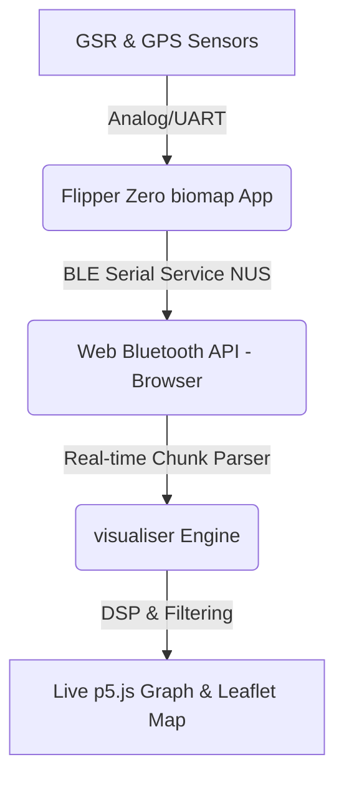

# Investigation Report: Real-Time Bluetooth Serial Data Streaming for GSR/GPS Visualization

This document details the feasibility, hardware/software architecture, API hooks, and implementation steps required to add real-time Bluetooth serial data streaming. This features allows wireless streaming of GSR and GPS data from the Flipper Zero device directly to the browser-based `visualiser` frontend for live mapping and visualization.

---

## 1. Architectural Overview

The proposed live visualization system spans three main layers:



1. **Flipper Zero Firmware (`biomap` C app)**: Captures sensor data at 10 Hz and transmits formatted CSV rows or custom binary packets over Flipper's BLE Serial hardware abstraction layer.
2. **Web Browser Frontend (`visualiser` JS)**: Establishes a wireless link using the browser's Web Bluetooth API, subscribes to Flipper's TX notifications, and reconstructs the data stream.
3. **Data Pipeline & Renderer (p5.js / Leaflet)**: Streams the incoming points into the active `GSRAnalyzer` data structure, triggers real-time filtering, and renders a rolling line graph and moving Leaflet track trail.

---

## 2. Flipper Zero Firmware Implementation

The Flipper Zero's Bluetooth stack runs on its co-processor and exposes a virtual Bluetooth Low Energy (BLE) serial interface using the **Nordic UART Service (NUS)**.

### BLE Service configuration
* **Service UUID**: `8fe5b3d5-2e7f-4a98-2a48-7acc60fe0000` (Flipper Serial Service)
* **TX Characteristic (Flipper RX / Host Write)**: `19ed82ae-ed21-4c9d-4145-228e62fe0000`
* **RX Characteristic (Flipper TX / Host Notify)**: `19ed82ae-ed21-4c9d-4145-228e61fe0000`

### Code Integration Hooks
The main Flipper application runs a 10 Hz ticker inside [biomap_session.c](file:///Users/softhook/Documents/GitHub/BioMapping/biomap_session.c#L604-L605) that triggers the [handle_recording_tick](file:///Users/softhook/Documents/GitHub/BioMapping/biomap_session.c#L522-L564) function.

To stream data over BLE, we would:
1. **Include Bluetooth Serial Headers**:
   ```c
   #include <furi_hal_bt_serial.h>
   #include <furi_hal_bt.h>
   ```
2. **Transmit Data Chunks**:
   Modify `batch_csv_row` in [biomap_session.c:L324](file:///Users/softhook/Documents/GitHub/BioMapping/biomap_session.c#L324) to write directly to the BLE buffer:
   ```c
   static bool batch_csv_row(Session* s, float raw) {
       // ... existing SD logger logging code ...

       if (furi_hal_bt_is_active()) {
           char ble_buf[128];
           int len = snprintf(ble_buf, sizeof(ble_buf), "%.2f,%.7f,%.7f,%.1f,%.1f,%d,%d,%.2f,%.1f,%.1f\n",
                              rel, pos.lat, pos.lon, pos.hdop, pos.pdop, pos.sats, pos.fix_type,
                              pos.speed_kts, pos.course_deg, raw);
           if (len > 0 && len < (int)sizeof(ble_buf)) {
               furi_hal_bt_serial_tx((uint8_t*)ble_buf, len);
           }
       }
       return ret > 0;
   }
   ```

> [!WARNING]
> **RPC Service Interference:** The Flipper's default `BtProfileSerial` profile serves as the transport for Flipper Mobile App RPC commands (which use a protocol buffer format). Sending raw ASCII text while the Flipper Mobile App is connected will cause protocol synchronization errors. 
> To prevent this, live streaming should either:
> - Require the user to turn off the companion app connection and toggle a "Live BLE Stream" setting in the `biomap` app.
> - Respond only to a specific host-initiated handshake command received in the Flipper's RX callback (`furi_hal_bt_serial_set_event_callback`).

---

## 3. Web Visualiser Frontend Implementation

Browsers supporting the **Web Bluetooth API** (such as Chrome, Edge, and Opera) can connect directly to the Flipper Zero without installing native desktop software.

### Web Bluetooth Connection API Setup
In [visualiser/ui.js](file:///Users/softhook/Documents/GitHub/BioMapping/visualiser/ui.js), a new controller class or module (e.g. `GSRLiveBluetoothManager`) would implement the pairing flow:

```javascript
class GSRLiveBluetoothManager {
  constructor() {
    this.device = null;
    this.characteristic = null;
    this.streamBuffer = "";
  }

  async connect() {
    const SERVICE_UUID = '8fe5b3d5-2e7f-4a98-2a48-7acc60fe0000';
    const RX_CHAR_UUID = '19ed82ae-ed21-4c9d-4145-228e61fe0000';

    this.device = await navigator.bluetooth.requestDevice({
      filters: [{ namePrefix: 'Flipper' }],
      optionalServices: [SERVICE_UUID]
    });

    const server = await this.device.gatt.connect();
    const service = await server.getPrimaryService(SERVICE_UUID);
    this.characteristic = await service.getCharacteristic(RX_CHAR_UUID);

    this.characteristic.addEventListener('characteristicvaluechanged', (e) => this.handleData(e));
    await this.characteristic.startNotifications();
    console.log("BLE Live Stream connected successfully.");
  }
}
```

### Stream Parsing & Data Assembly
Because BLE notifications are chunked to fit the MTU size (~20 to ~244 bytes), packets will arrive split. The chunk parser must buffer incoming text and split by newlines:

```javascript
  handleData(event) {
    const decoder = new TextDecoder();
    const textChunk = decoder.decode(event.target.value);
    this.streamBuffer += textChunk;

    let newlineIndex;
    while ((newlineIndex = this.streamBuffer.indexOf('\n')) !== -1) {
      const line = this.streamBuffer.substring(0, newlineIndex).trim();
      this.streamBuffer = this.streamBuffer.substring(newlineIndex + 1);
      if (line.length > 0) {
        this.parseLiveRow(line);
      }
    }
  }
```

---

## 4. Real-time Analysis, Map & Graph Rendering

Currently, [visualiser/analyzer.js](file:///Users/softhook/Documents/GitHub/BioMapping/visualiser/analyzer.js) expects a completed array in [GSRAnalyzer.parseCSV](file:///Users/softhook/Documents/GitHub/BioMapping/visualiser/analyzer.js#L208) to execute the [GSRAnalyzer.analyze](file:///Users/softhook/Documents/GitHub/BioMapping/visualiser/analyzer.js#L628) filter pipelines. 

To adapt this for live plotting:

1. **Incremental Data Feeding**:
   Create a dedicated live analyzer instance inside [AppState](file:///Users/softhook/Documents/GitHub/BioMapping/visualiser/app_state.js):
   ```javascript
   function parseLiveRow(line) {
     const cols = line.split(',');
     const timestamp = parseFloat(cols[0]);
     const lat = parseFloat(cols[1]) || NaN;
     const lon = parseFloat(cols[2]) || NaN;
     const gsrRaw = parseFloat(cols[9]) || 0.0;
     
     // Append to the raw stream array
     AppState.analyzer.raw.push({
       time: timestamp,
       val: gsrRaw,
       lat: lat,
       lon: lon,
       _isGpsFix: !isNaN(lat) && !isNaN(lon)
     });
     
     AppState.totalDuration = timestamp;
     
     // Run incremental filtering or re-run fast LPF/EMA filters on the active slice
     AppState.analyzer.analyze(GSRStorage.readGsrSliderValues());
     
     // Trigger UI refreshes
     if (AppState.viewMode === 'single') {
       // Autoscroll viewport to keep the latest data on screen
       AppState.viewStartTime = Math.max(0, timestamp - AppState.viewDuration);
     }
     
     // Redraw graph & update Leaflet trail
     redraw(); 
     AppState.mapManager.renderData(AppState.analyzer, GSRStorage.readGpsSliderValues());
   }
   ```

2. **Leaflet Live Map Marker**:
   In [visualiser/map.js](file:///Users/softhook/Documents/GitHub/BioMapping/visualiser/map.js), we would render a pulsing cursor at the latest valid coordinates:
   ```javascript
   updateLiveCursor(lat, lon) {
     if (this.liveMarker) {
       this.liveMarker.setLatLng([lat, lon]);
     } else {
       this.liveMarker = L.circleMarker([lat, lon], {
         radius: 8,
         color: '#005bc4',
         fillColor: '#005bc4',
         fillOpacity: 0.8
       }).addTo(this.map);
     }
     this.map.panTo([lat, lon]);
   }
   ```

3. **Graph Rolling Autoscroll**:
   Inside [visualiser/sketch.js](file:///Users/softhook/Documents/GitHub/BioMapping/visualiser/sketch.js#L42), the canvas should dynamically slide the timeline window forward as time progresses, keeping the visual display aligned with a real-time oscilloscope.

---

## 5. Summary of Required Modifications

| Target Component | Action | Description |
| :--- | :--- | :--- |
| **`biomap` (C app)** | Include BLE Serial headers | Reference `<furi_hal_bt_serial.h>` to access the low-level serial Tx buffers. |
| [biomap_session.c](file:///Users/softhook/Documents/GitHub/BioMapping/biomap_session.c) | Add BLE write calls | Output formatted CSV strings via `furi_hal_bt_serial_tx` inside the 10 Hz ticker. |
| [index.html](file:///Users/softhook/Documents/GitHub/BioMapping/visualiser/index.html) | Add Connect Button | Add a "Connect Live" floating button with a pulsing Bluetooth icon. |
| [ui.js](file:///Users/softhook/Documents/GitHub/BioMapping/visualiser/ui.js) | Add Web Bluetooth controller | Implement the Gatt connecting, notification binding, and parsing stream flow. |
| [analyzer.js](file:///Users/softhook/Documents/GitHub/BioMapping/visualiser/analyzer.js) | Support progressive filtering | Optimize the LPF and Phasic filter steps to run progressively on single data points or handle fast periodic re-runs. |
| [map.js](file:///Users/softhook/Documents/GitHub/BioMapping/visualiser/map.js) | Add rolling cursor | Enable centering Leaflet view on the newest coordinates and rendering a real-time trail. |

---

## 6. Critical Problems and Constraints

While building a live wireless GSR streaming feature is feasible, several critical challenges must be addressed:

### A. Filter Lag and Bidirectionality (The Tail-Transient Problem)
* **The Problem:** The current DSP pipeline utilizes zero-phase filters (such as `GsrFilter.applyZeroPhaseMovingAverage` and `GsrFilter.applyZeroPhaseEMA`). These filters perform a forward pass followed by a backward pass. 
* **The Live Impact:** Because a backward pass starts at the latest sample, the filtered value of the most recent samples depends on future data that hasn't arrived yet. Consequently, the last 2 to 5 seconds of the live graph will "shimmer" or fluctuate as new points arrive, making real-time thresholds unstable.
* **The Solution:** 
  1. Use **causal (forward-only) filtering** for the scrolling live edge of the visualization, accepting a phase delay of several hundred milliseconds.
  2. Implement a **sliding window buffer** (e.g., the last 60 seconds) where the zero-phase filters are run repeatedly, but peaks and values are only "finalized" and rendered permanently once they pass out of the transient zone (e.g., are older than 5 seconds).

### B. BLE Throughput and Packet Fragmentation (Binary Serialization)
* **The Problem:** Streaming raw CSV text (e.g., `"123.45,45.1234567,-12.3456789,1.2,1.2,8,3,1.23,45.6,3456.7\n"`) is verbose (~70–80 bytes per sample). This causes packet fragmentation over BLE and can lead to parser failures or lag if packets are dropped.
* **The Solution:** Use a custom packed binary structure on both Flipper Zero and the web frontend. By using a 45-byte packet prefixed with a signature, we fit all high-precision fields into a single BLE MTU block.
* **The Packed Struct Layout (`45 bytes` total, Little Endian):**
  - Offset `0` (2 bytes): `magic` ("BM" signature, `0x42 0x4D`)
  - Offset `2` (4 bytes): `timestamp_ms` (uint32_t relative milliseconds)
  - Offset `6` (8 bytes): `lat` (double)
  - Offset `14` (8 bytes): `lon` (double)
  - Offset `22` (4 bytes): `gsr_raw` (float)
  - Offset `26` (4 bytes): `hdop` (float)
  - Offset `30` (4 bytes): `pdop` (float)
  - Offset `34` (4 bytes): `speed_kts` (float)
  - Offset `38` (4 bytes): `course_deg` (float)
  - Offset `42` (1 byte): `sats` (uint8_t)
  - Offset `43` (1 byte): `fix_type` (uint8_t)
  - Offset `44` (1 byte): `valid` (uint8_t, GPS fix validity flag)

### C. Flipper Zero BLE Coexistence and RPC Bypass
* **The Problem:** The default BLE serial interface is shared with the Flipper Mobile App's RPC connection. However, the user has indicated they **do not use the companion app** and do not require setting guards.
* **The Solution:** We can directly stream raw binary packets over `furi_hal_bt_serial_tx` from the biomap session ticker. The browser client can connect directly to the primary serial characteristic, bypass any RPC handshakes, and interpret the binary stream directly.

---

## 7. Real-Time Peak Analysis Feasibility

**Yes, real-time peak analysis is feasible**, but with key mathematical and physiological constraints:

### A. Confirmation Delay vs. Metric Finalization
We must distinguish between **live peak spotting** and **metric profile completion**:

```
                 Peak Spotting (100ms)
                     |
  Onset (Trough)     v    Half-Recovery Found (2–10 seconds later)
    \               /\        /
     \             /  \      /
______\___________/____\____/___________
      ^           ^
    Onset       Peak
```

1. **Peak Spotting (Local Maxima Check):** A peak is mathematically defined as a local maximum ($curr > prev$ and $curr \ge next$). We can spot a peak with a **1-sample (100ms) latency** as soon as the signal begins to decrease.
2. **Peak Metric Finalization (Width & Decay):** Detailed metrics like *Half-Recovery Time*, *Skewness*, and *Decay Slope* require searching **forward in time** until the phasic signal drops below 50% of the peak amplitude. Since physiological GSR half-recovery times average 2 to 10 seconds, these metrics can only be computed retrospectively.

### B. Implementation Strategy for the Frontend
To show real-time peak indicators on the Leaflet map and graphs without waiting for recovery:
* **Immediate Peak Event:** Emit an unfinalized peak event once a local maximum exceeding the amplitude threshold is spotted. Display a pulsing "Active SCR" marker on the map at the coordinate corresponding to the peak's time.
* **Retrospective Enrichment:** Once the signal decays below the half-recovery threshold (or times out after 10 seconds), compute the decay metrics and update the marker with the final stress quality scores.

---

## 8. Web Bluetooth Live Binary Stream Parser

Below is the JavaScript implementation design to synchronize and parse the 45-byte binary packet stream from the Flipper Zero:

```javascript
class GSRLiveBinaryParser {
  constructor(onPacketParsed) {
    this.onPacketParsed = onPacketParsed;
    this.buffer = new Uint8Array(0);
    this.PACKET_SIZE = 45;
  }

  // Append new data bytes to buffer
  append(newData) {
    const combined = new Uint8Array(this.buffer.length + newData.length);
    combined.set(this.buffer, 0);
    combined.set(newData, this.buffer.length);
    this.buffer = combined;

    this.processQueue();
  }

  processQueue() {
    while (this.buffer.length >= this.PACKET_SIZE) {
      // 1. Look for the "BM" (0x42, 0x4D) magic header
      if (this.buffer[0] === 0x42 && this.buffer[1] === 0x4D) {
        // We have a potential packet
        const packetBytes = this.buffer.slice(0, this.PACKET_SIZE);
        this.parsePacket(packetBytes);
        
        // Remove parsed packet from buffer
        this.buffer = this.buffer.substring(this.PACKET_SIZE);
      } else {
        // Sync issue: search for the next 'B' character (0x42)
        let syncIndex = -1;
        for (let i = 1; i < this.buffer.length; i++) {
          if (this.buffer[i] === 0x42 && i + 1 < this.buffer.length && this.buffer[i + 1] === 0x4D) {
            syncIndex = i;
            break;
          }
        }

        if (syncIndex !== -1) {
          // Discard garbage data before the magic header
          this.buffer = this.buffer.substring(syncIndex);
        } else {
          // No header found, clear buffer except for last byte if it could be 'B'
          if (this.buffer[this.buffer.length - 1] === 0x42) {
            this.buffer = new Uint8Array([0x42]);
          } else {
            this.buffer = new Uint8Array(0);
          }
          break;
        }
      }
    }
  }

  parsePacket(bytes) {
    const view = new DataView(bytes.buffer, bytes.byteOffset, bytes.byteLength);
    
    // Read fields matching C-struct offsets (Little Endian = true)
    const timestampMs = view.getUint32(2, true);
    const lat = view.getFloat64(6, true);
    const lon = view.getFloat64(14, true);
    const gsrRaw = view.getFloat32(22, true);
    const hdop = view.getFloat32(26, true);
    const pdop = view.getFloat32(30, true);
    const speedKts = view.getFloat32(34, true);
    const courseDeg = view.getFloat32(38, true);
    const sats = view.getUint8(42);
    const fixType = view.getUint8(43);
    const valid = view.getUint8(44);

    this.onPacketParsed({
      timestamp: timestampMs / 1000.0,
      lat: valid ? lat : NaN,
      lon: valid ? lon : NaN,
      gsrRaw: gsrRaw,
      hdop: hdop,
      pdop: pdop,
      speedKts: speedKts,
      courseDeg: courseDeg,
      sats: sats,
      fixType: fixType,
      valid: !!valid
    });
  }
}
```

---

## 9. Mobile Live Visualizer & Remote Sync (Android PWA)

Instead of running the heavy, desktop-optimized [GSRMapManager](file:///Users/softhook/Documents/GitHub/BioMapping/visualiser/map.js) (which loads Leaflet tile layers, maps historical tracks, and processes complex OSM geometries), we can build a mobile-first **Progressive Web App (PWA)** optimized for Android.

### A. Why a PWA on Android?
* **Native Web Bluetooth Support:** Android Chrome natively supports Web Bluetooth, meaning a web app can pair directly with the Flipper Zero without installing native Android SDKs or going through the Google Play Store.
* **Add to Home Screen:** A PWA manifest enables installing the web app as a standalone mobile app with fullscreen display and offline support.
* **Hardware Economy:** Bypassing heavy map tiles saves system resources, battery life, and cellular data while on a ride or walk.

### B. Mobile Dashboard Layout Design
The mobile app would feature a responsive, high-contrast portrait layout designed for quick status checks:

```
+------------------------------------------+
|  BioMapping Live                   [x]   |
+------------------------------------------+
|  FLIPPER STATUS: [ Connected (RSSI -65) ] |
+------------------------------------------+
|  GSR RAW            TONIC (SCL)          |
|  [ 3,450 nS ]      [ 3,210 nS ]          |
|                                          |
|  PHASIC (SCR)       LIVE STRESS EVENTS   |
|  [  240 nS ]       [ 12 Peaks Spotted ]  |
+------------------------------------------+
|  REALTIME GRAPH (Last 60 Seconds)        |
|                                          |
|  /\_/\   _/\_________________            |
|     \__\/                                |
+------------------------------------------+
|  GPS: [ 3D FIX ]  SATS: [ 9 ]            |
|  LAT: 51.5074     LON: -0.1278           |
+------------------------------------------+
|  REMOTE SYNC: [ Streaming Active ]       |
|  UPLOADED: [ 1,420 Points ] [ 0 Errors ]  |
+------------------------------------------+
```

### C. Data Upload & Synchronisation Methods
To visualize the live path remotely (e.g. on a desktop monitor back home while the user is outside tracking with their Flipper and phone), the PWA would implement two sync strategies:

#### 1. Real-time Stream Forwarding (WebSockets / HTTP POST)
As each 45-byte BLE packet is received and parsed by the phone:
1. The phone serializes it to a JSON payload or a compact binary message.
2. The phone sends it instantly to a remote backend server via a **WebSocket connection** or highly frequent **fetch HTTP POST requests**.
3. A remote receiver (e.g., the desktop `visualiser` running on a computer at home) listens to this websocket channel, allowing another person to watch the trail grow on the map in real time.

*Example Payload Forwarded to Server:*
```json
{
  "trackId": "live_user_ride_101",
  "time": 123.45,
  "lat": 51.507432,
  "lon": -0.127814,
  "gsr": 3450.2,
  "speed": 12.3,
  "valid": true
}
```

#### 2. Local Buffering and Batch Upload
If cellular connection drops in weak-signal areas:
1. The PWA buffers parsed packets locally in an **IndexedDB store** or a memory array.
2. The app tracks upload status. Once a cellular connection is restored, it flushes the backlog to the server.
3. Upon ending the session, a complete, consolidated CSV containing all coordinates and metadata is uploaded via a single POST request to the archiving backend (e.g. Google Drive, Supabase storage, or a simple Node/Python microservice).

### D. Simplified Visualizer Architecture
This architecture would consist of:
1. `index.html`: A single-page application structure utilizing native CSS Flexbox, modern dark mode/high contrast tokens, and meta tags for mobile web apps.
2. `live_app.js`: A script that imports the `GSRLiveBinaryParser`, orchestrates the Bluetooth connect event, handles the phone's lock screen prevention (using the Screen Wake Lock API), and initiates the upload sync.
3. `live_chart.js`: A lightweight `<canvas>`-based chart renderer using a simple rolling ring-buffer to plot the last 600 points (60 seconds) of Phasic / Raw GSR signal, avoiding heavy dependencies like Chart.js or p5.js.

---

## 10. Bluetooth Alternatives & Community Solutions

When developing sensor systems on the Flipper Zero, utilizing low-level Bluetooth Serial (BLE NUS) is the most immediate path, but it is not the only—or necessarily the most stable—wireless approach. Below is a comparison of alternatives based on community implementations:

### A. Custom BLE GATT Services (Alternative Bluetooth Implementation)
Instead of streaming a raw byte pipe over a virtual serial port, we could implement a native GATT server on the Flipper with dedicated characteristics:
* **How it works:** Register a custom service UUID (e.g., `BtProfileGsr`) containing characteristics like `GSR_READING_CHAR_UUID` (notifying raw/tonic/phasic values) and `GPS_COORDS_CHAR_UUID`.
* **Pros:** Standardized BLE architecture. Clients can subscribe only to the data they need (e.g., subscribing to GSR but skipping GPS to save phone battery). Bypasses serial buffer synchronization issues.
* **Cons (Critical Firmware Limit):** The Flipper Zero's BLE stack runs on a secondary coprocessor core (`STM32WB55`). The GATT services are compiled directly into this radio stack. Registering a custom GATT profile requires recompiling the core system firmware and updating the coprocessor binary, which **cannot be compiled as a standalone external app (.fap)**. 

### B. Hardware Expansion Board (ESP32 Companion Board)
A common pattern in Flipper projects (like WiFi Marauder or GPS mapping systems) is connecting an external **ESP32 development board** to the Flipper's GPIO pins:
* **How it works:** The Flipper app captures GSR and GPS data locally, then writes it over physical UART (GPIO TX/RX pins) to an attached ESP32. The ESP32 (which runs unrestricted Bluetooth Classic SPP, BLE, and Wi-Fi) manages the wireless link.
* **Pros:** 
  1. **Direct Web Uploads:** The ESP32 can connect to a phone's Wi-Fi hotspot and post the GSR data directly to the web server, completely bypassing the need for a custom mobile app or Web Bluetooth.
  2. **Standard Bluetooth Classic SPP:** ESP32 supports legacy Bluetooth Classic SPP, which behaves as a standard COM port on Android and desktop, bypassing Web Bluetooth connection instability.
* **Cons:** Requires extra hardware plugged into the Flipper Zero, increasing bulk, cost, and power draw.

### C. Wired Connection via USB-OTG (WebUSB / CDC Serial)
If the Android phone or laptop is physically close to the Flipper, we can bypass Bluetooth entirely:
* **How it works:** Connect the Flipper Zero directly using a USB-C to USB-C cable. Furi OS automatically exposes a standard USB CDC virtual serial port.
* **Pros:** 100% reliable, zero latency, zero packet loss, high bandwidth, and works immediately in Android Chrome (via Web Serial API) and desktops without any pairing handshakes or custom C firmware modifications.
* **Cons:** Physical cable connection required; not wireless.

---

## 11. Final Recommendations & Reflections

Having evaluated the constraints of the Flipper Zero's hardware stack and compared it to community standards, here is the recommended path:

### Architectural Reflection Table

| Option | Ease of Dev | Hardware Cost | Stability | Portability | Final Verdict |
| :--- | :--- | :--- | :--- | :--- | :--- |
| **Option 1: BLE NUS Serial (Our Plan)** | Medium | $0 | Medium-Low | High | **Recommended for wireless.** Easiest wireless option, but requires packet synchronization logic in JS to handle dropped packets. |
| **Option 2: Custom GATT Profile** | Very Low | $0 | High | High | **Not Recommended.** Requires custom core firmware compilation; too heavy for a standard FAP. |
| **Option 3: ESP32 Companion** | Low | ~$5-$10 | High | Medium-Low | **Good backup.** Best if we need direct Wi-Fi upload, but adds physical bulk. |
| **Option 4: Wired USB-OTG Serial** | Very High | $0 | Very High | Low | **Highly Recommended for testing.** Fastest way to validate real-time visualizers and DSP algorithms before dealing with BLE dropouts. |

### Final Recommendation
1. **Start with Wired USB CDC Serial (Option 4):** Modify the Flipper app to write binary packets to stdout and build the PWA to read it via the **Web Serial API**. This allows us to validate the real-time DSP, rolling chart, Leaflet live cursor, and WebSocket remote uploads with a 100% stable connection first.
2. **Port to BLE Serial (Option 1):** Once the web application logic and upload pipelines are solid, swap the Web Serial connection for Web Bluetooth using the `GSRLiveBinaryParser` class. Since we are bypassing the Flipper Mobile App RPC checks, this transition will be smooth once packet loss sync boundaries are handled.
