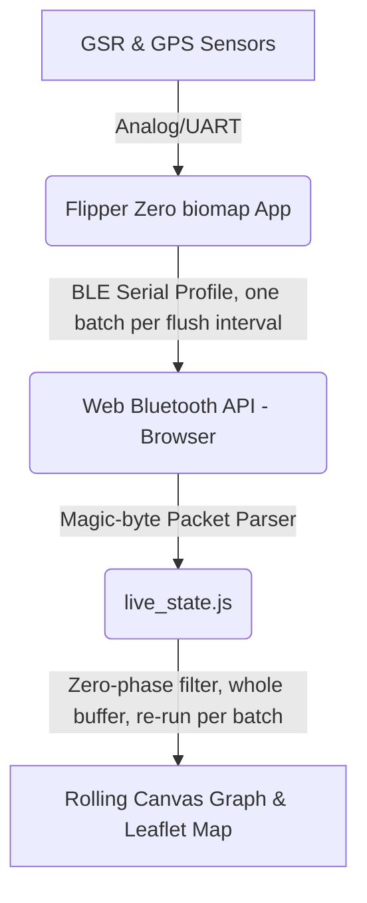

# Investigation Report: Real-Time Bluetooth Serial Data Streaming for GSR/GPS Visualization

This document details the feasibility, hardware/software architecture, API hooks, safety
analysis, and implementation plan for adding real-time Bluetooth streaming of GSR and GPS
data from the Flipper Zero device to a new, small, standalone browser page (§7a/§7b) —
deliberately not a mode grafted onto the existing desktop `visualiser` app.

**Status: planning only, nothing implemented yet.**

---

## 0. 2026-08-14 verification pass — what changed from the original draft

The first draft of this document (sections 1–11 below, mostly preserved) was written before
anyone checked its API claims against the real Flipper SDK. This pass did that, and also adds
the things explicitly requested since: a safety analysis ("make sure this doesn't ruin the
device"), a concrete plan to gate the feature (settled, after iteration, as its own main-menu
mode — see §3), and a real design for the JS-side live viewer app (§7).

**Corrected — the original API names were fabricated, not real Flipper SDK symbols.**
Checked against `~/.ufbt/current/sdk_headers/f7_sdk/` (the actual headers this app compiles
against, same method as the `f_expand()`/`storage_file_get_internal_pointer` check in
[gps_rf_mutex_status.md](gps_rf_mutex_status.md)'s 2026-08-05 pre-allocation entry). There is no
`furi_hal_bt_serial.h` and no `furi_hal_bt_serial_tx()`/`furi_hal_bt_serial_set_event_callback()`
anywhere in the SDK. The real API surface, confirmed present:

| Original doc claimed | Real symbol (verified in SDK headers) | Header |
| :--- | :--- | :--- |
| `furi_hal_bt_serial_tx()` | `ble_profile_serial_tx(profile, data, size)` | `<profiles/serial_profile.h>` |
| `furi_hal_bt_serial_set_event_callback()` | `ble_profile_serial_set_event_callback(profile, buff_size, cb, ctx)` | `<profiles/serial_profile.h>` |
| (not mentioned) | `bt_profile_start(bt, ble_profile_serial, NULL)` — required first, to claim the radio | `<bt/bt_service/bt.h>` |
| (not mentioned) | `bt_profile_restore_default(bt)` — required on stop, to hand it back | `<bt/bt_service/bt.h>` |
| (not mentioned) | `RECORD_BT` + `furi_record_open()`/`_close()` — how you get a `Bt*` at all | `<bt/bt_service/bt.h>` |

Section 2 below is rewritten against these real symbols. This isn't a cosmetic fix — the two
missing calls (`bt_profile_start`/`bt_profile_restore_default`) are the actual mechanism by
which the app takes over and releases the radio, and the SDK's own doc comment on
`bt_profile_start()` says plainly: *"Call of this function leads to 2nd core restart."* That's
a real, non-trivial hardware operation, not a flag flip — it drives the whole safety design in
§4 below (start once per streaming session, never per-tick, never on toggle).

**Confirmed real (not fabricated), via a public third-party Flipper BLE-serial example project
(`maybe-hello-world/fbs`) rather than guessed:** the TX/RX characteristic UUIDs
(`19ed82ae-ed21-4c9d-4145-228e62fe0000` / `...61fe0000`) quoted in §7 below match a working
open-source project using Flipper's built-in serial profile. The parent **service** UUID
(`8fe5b3d5-...`) could not be independently confirmed by search — treat it as unverified until
confirmed by a live GATT discovery scan against real hardware (§7 covers the fallback if it's
wrong: `getPrimaryServices()` with no UUID filter enumerates whatever is actually there).

**New in this pass, not in the original draft:**
- §3 — Main Menu Integration: a concrete plan for gating the feature, matching this codebase's
  existing menu-dispatch conventions (see §3's own revision note for how this evolved from an
  Options-submenu toggle to a first-class main-menu mode).
- §4 — Device Safety Analysis: the direct answer to "will this ruin the device."
- §5 — Threading Architecture: this project has now hit the *same* class of bug twice — RF SPI
  blocking the tick thread, then SD flush blocking the tick thread (both exhaustively documented
  in [gps_rf_mutex_status.md](gps_rf_mutex_status.md)). §5 argues BLE TX must not become the
  third instance, and proposes catching it structurally rather than three tracks later.
- §7 — a concrete design for the JS-side live viewer, checked against the real `visualiser`
  codebase's actual file sizes and architecture rather than sketched from general BLE/JS
  knowledge (see §7's own opening for what that check found).
- §13 — Implementation Plan: phased, safety-first, each phase has a concrete stop/verify point.

Everything else below (peak-analysis feasibility, the mobile PWA sketch, the alternatives
comparison) was reasoning about your own DSP pipeline and general BLE/Flipper architecture
trade-offs, not specific SDK API claims — left largely as-is, flagged where it now needs
updating for the corrected API.

**2026-08-14 third pass — dropped the SD fallback, decoupled BLE from the flush cadence, and
settled the frontend as a single-file mobile-first page with CSV export instead of shared
runtime state with the desktop app.** Three changes from user feedback, all reflected in §5a and
§7a/§7b below:
1. **No SD fallback in Live Stream mode.** The user confirmed durability isn't a requirement for
   this mode ("I don't need an SD card backup") — `BioMapModeLiveStream` no longer allocates an
   `SdLogger` at all, which also removes §5a's earlier "empty SD file" trade-off entirely, since
   there's no SD file in this mode to worry about.
2. **BLE gets its own faster, independent interval (~300ms proposed) instead of sharing the SD
   flush's 10s cadence.** The earlier slot-reuse design traded smoothness for never adding a
   second periodic tick-thread operation; the user wants a smoothly flowing graph, which a 10s
   batch cadence structurally can't deliver. With SD out of the picture per point 1, there's no
   slot left to share anyway — this is now a clean, single, purpose-sized periodic BLE send.
3. **Frontend: a single self-contained `live.html`, not a page split across several files loaded
   from the `visualiser/` directory.** Small reusable pieces (`gsr_filter.js`, `geo_utils.js`,
   two functions from `gps_pipeline.js`, `map_colors.js`) get copied in with a provenance
   comment rather than loaded via `<script src>` — chosen for real mobile portability (one URL,
   opens on a phone, movable/hostable on its own) over avoiding the small risk of the copied
   code drifting from its source if those files change later.

**2026-08-14 follow-up — the dedicated-BLE-thread design in the first version of §5 was wrong,
found by checking this project's own history before building on it.** This project already
tried a dedicated background thread for exactly this class of problem — moving
`sd_logger_batch_flush()`'s blocking SD write off the main thread — twice
(`069e505` "only 2 threads — major change", then a second, fully-built attempt documented in
[sd_writer_thread_investigation_2026-08-03.md](sd_writer_thread_investigation_2026-08-03.md)).
The second attempt was race-free, ThreadSanitizer-clean, properly double-buffered — and still
failed on real hardware: a paired serial-log/CSV capture caught the main thread stalling at the
exact same instant the writer thread's SD call stalled, because Flipper's app CPU is single-core
and the underlying blocking call didn't yield it. A second thread bought no real isolation, just
contention for the same core — and it was reverted. §5 and §13 below are rewritten around that
finding: no dedicated BLE thread — BLE TX runs inline, on its own bounded interval (§5a; the
interval's own history is covered in the "third pass" entry above).

---

## 1. Architectural Overview



1. **Flipper Zero Firmware (`biomap` app)**: captures sensor data at 10 Hz; while a `Live Stream`
   session (§3) is active and a phone is actually connected, transmits a small packed binary
   update over Flipper's built-in BLE serial profile every `BT_STREAM_INTERVAL_MS` (~300ms
   proposed, §5a) — frequent enough to read as smooth motion, not a per-tick (100ms) drip.
2. **Web Browser Frontend** — a new, small, standalone page (`visualiser/live.html`, §7a/§7b),
   not the existing desktop `visualiser` app: uses the Web Bluetooth API to pair with the
   Flipper, subscribes to the serial characteristic's notifications, and reconstructs the
   per-batch stream.
3. **Data Pipeline & Renderer** (§7b): each arriving batch is parsed, appended to `live_state.js`'s
   accumulated buffer, re-filtered as a whole (cheap and shimmer-free, since every sample
   received is already finished data), and rendered as one rolling-canvas-graph and
   Leaflet-trail extension per batch.

---

## 2. Flipper Zero Firmware Implementation (corrected against real SDK)

The Flipper's BLE stack runs on the STM32WB55's second core, exposed to apps as a set of
**profiles** — the app doesn't get a raw radio, it claims one of a small set of firmware-compiled
profiles (Serial, HID, etc.) via `bt_profile_start()`. This is a hard SDK constraint, and it's
also why §12's "Custom GATT Profile" alternative remains rejected: an external `.fap` cannot
register a new GATT service, only switch between the profiles already compiled into the
firmware. Confirmed structurally, not assumed: grepped the full app-facing SDK for any
custom-GATT-registration entry point and found none, same conclusion the original draft reached
by a different (undocumented) route.

### Real headers and calls

```c
#include <bt/bt_service/bt.h>          // Bt, RECORD_BT, bt_profile_start/_restore_default
#include <profiles/serial_profile.h>   // ble_profile_serial, ble_profile_serial_tx, ..._set_event_callback
```

`application.fam` needs `"bt"` added to `requires` — it currently only lists
`["gui", "storage", "notification", "expansion"]`.

### Claiming and releasing the radio

```c
Bt* bt = furi_record_open(RECORD_BT);
FuriHalBleProfileBase* profile = bt_profile_start(bt, ble_profile_serial, NULL);
// ... stream while profile != NULL ...
bt_profile_restore_default(bt);   // hand the radio back — always, even on error paths
furi_record_close(RECORD_BT);
```

`bt_profile_start()`/`bt_profile_restore_default()` each restart the second core per the SDK's
own doc comment — call these **once per streaming session** (session start / session stop),
never per-tick, never as a side effect of entering the menu. See §4/§13.

### Sending data

```c
uint8_t pkt[45];
// ... pack fields, see §6 ...
ble_profile_serial_tx(profile, pkt, sizeof(pkt));
```

`ble_profile_serial_tx()`'s blocking behavior is **not documented** in the header (no timeout
parameter, no stated max latency). Treat that the same way this project has learned to treat
every other undocumented-latency hardware call it has hit — see §5, this is not a hypothetical
concern in this codebase.

### RPC coexistence — corrected understanding

The original draft described the default serial profile as a separate "RPC transport" that raw
streaming would collide with. The real picture, per `serial_service.h`'s own comment (*"Serial
service. Implements RPC over BLE, with flow control"*): the Serial profile **is** the RPC
channel — there's one profile, and `ble_svc_serial_set_rpc_active(active)` toggles whether the
byte stream flowing through it is interpreted as RPC frames or treated as opaque data. The
practical implication is the same as the original draft's conclusion (don't stream raw bytes
while something expects RPC framing on the same connection) but the mechanism is "one profile,
one flag" rather than "two competing services." Per the user's standing note in
[docs/todo.txt](todo.txt) the companion mobile app isn't used, so this is a real but low-priority
edge case — worth a one-line guard (skip streaming if `ble_svc_serial_set_rpc_active` reports
RPC active) rather than an assumption it can never happen (qFlipper itself can also open an RPC
session over the same USB/BLE serial path).

---

## 3. Main Menu Integration — Live Stream as its own mode, no Options toggle

**Revised 2026-08-14, second pass.** The first version of this section put two new rows in the
Options screen (a permission toggle plus a launcher). Simpler and better: put **one** new entry
directly in the main mode-selection menu, right before "Options" — `"Live Stream"` becomes a
sixth first-class mode alongside `GPS + GSR + RF`/`GPS + GSR`/`GPS + RF`/`GSR Only`. Selecting it
*is* the opt-in; there's no separate "enable Bluetooth" switch to flip first or leave on by
accident. This removes the persisted-setting/settings-version-bump machinery the toggle version
needed entirely — one less piece of state to manage, and nothing that can be "left on" between
sessions, since the mode only exists while that screen is open.

**`application.fam`** — add `"bt"` to `requires`.

**`biomap_types.h`**: `BioMapMode` enum (`biomap_types.h:37-42`) gains `BioMapModeLiveStream`
alongside the existing five values.

**`biomap.h`**: `MENU_COUNT` 5 → 6. `OPTIONS_COUNT` stays **9, unchanged** — Options gains
nothing for this feature.

**`biomap_render.c`**: `menu_labels[MENU_COUNT]` ([biomap_render.c:6](../biomap_render.c#L6))
gains `"Live Stream"`, inserted before `"Options"`:
```c
static const char* const menu_labels[MENU_COUNT] = {
    "GPS + GSR + RF", "GPS + GSR", "GPS + RF", "GSR Only", "Live Stream", "Options",
};
```
`menu_render()`'s `draw_selection_list(c, (int)m_ctx->selection, MENU_COUNT, menu_labels, 22, 5)`
([biomap_render.c:573](../biomap_render.c#L573)) — `max_visible` stays `5` unchanged; it's
already the right value for the 128×64 screen (5 rows at 10px from y=22 lands at y=62, just
under the display height — a 6th row would land at y=72, off-screen). With `MENU_COUNT=6 >
max_visible=5`, the existing `scroll_window_top()` mechanism (already exercised by the Options
screen, zero new code) now also applies to the main menu for the first time: all 5 items are
visible without scrolling today; once this lands, reaching "Options" (now the last item) needs
one Down-press worth of scroll. Small, real UX change, not a functional risk — flagged so it's a
known trade-off, not a surprise.

**`biomap.c`**: the main-menu dispatch switch ([biomap.c:82-86](../biomap.c#L82-L86)) gains a
case, and the existing `Options` case shifts from index 4 to index 5:
```c
case 0: run_recording_session(app, BioMapModeGpsGsrRf); break;
case 1: run_recording_session(app, BioMapModeGpsGsr);   break;
case 2: run_recording_session(app, BioMapModeGpsOnly);  break; // "GPS + RF"
case 3: run_recording_session(app, BioMapModeGsrOnly);  break;
case 4: run_recording_session(app, BioMapModeLiveStream); break; // NEW
case 5: run_options_screen(app);                         break; // was case 4
```

**What this means for gating (§5a):** there's no `bluetooth_enabled` flag to check anymore — "is
the user allowed to use Bluetooth" and "is the user in Live Stream mode" collapse into the same
question, answered by which menu item they picked, exactly the same way `GsrOnly` mode not
touching GPS/RF is decided by menu selection rather than a separate toggle. `bt_stream_start()`
(§2) is called unconditionally inside `BioMapModeLiveStream`'s `session_init()` — no permission
check needed, since arriving in that `session_init()` call at all already means the user chose
this specific mode. The live connection check (§5a — send-or-drop, no SD fallback since this
mode never allocates an `SdLogger`) is unaffected by this change and remains the operative
per-interval safety mechanism during the session itself.

---

## 4. Device Safety Analysis — "will this ruin the device?"

Direct answer: **no plausible path to permanent hardware damage**, for reasons specific to how
this SDK exposes BLE (below). The real risks are (a) a stuck/misbehaving radio state requiring a
firmware reflash to clear — annoying, not destructive — and (b) reintroducing this project's
own, already-twice-observed bug class (a slow hardware call blocking the 10 Hz tick thread). (b)
is the one worth real engineering care; (a) is bounded and recoverable.

**Why there's no destructive path from app code:**
- The app never touches BLE coprocessor firmware, flash, or raw radio registers — every call in
  §2 is a documented, public SDK entry point (`bt_profile_start`, `ble_profile_serial_tx`, etc.),
  the same class of API every other BLE-using Flipper app (including Flipper's own official
  companion-app RPC channel) already exercises constantly. This app would not be doing anything
  qualitatively new to the radio subsystem, just something new to *this app*.
- §12's "Custom GATT Profile" route — the one approach that *would* require touching
  co-processor firmware — was independently re-confirmed absent from the SDK in §2 above and is
  not part of this plan. Nothing here needs a firmware flash beyond the ordinary `.fap` install.
- Worst realistic failure mode, based on publicly documented STM32WB55 dual-core behavior: the
  second core (radio co-processor) gets into a state where `furi_hal_bt_is_alive()` stops
  returning true and BLE stops working until the device is rebooted or, in a worse case, the
  firmware is reflashed via qFlipper. That is a known, bounded, externally-recoverable failure —
  not data loss, not hardware damage, not something that "bricks" the device in the permanent
  sense. Mitigation: only use the documented `bt_profile_start`/`_restore_default` pair (never
  skip the restore call, including on error/back-button/crash paths — see §13 Phase 2's teardown
  requirement), and don't call `bt_profile_start()` in a tight loop (it's called exactly once per
  `Live Stream` session, at entry — §3/§5a already make this structurally true, not a discipline
  to remember).

**Battery / power — real, measurable, not marginal.** BLE advertising/connected state draws
meaningfully more current than the radio-idle baseline this app runs today (GPS UART + GSR ADC +
paced SubGHz RF, no BLE). This is a genuine tradeoff to surface to the user, not hand-wave past:
- The radio is only ever claimed inside a `Live Stream` session (§3) — a user who never selects
  that mode never pays this cost, and it can't be left running in the background the way a
  forgotten Options toggle could.
- Before calling this "safe for a full walk," measure it the way this project has measured
  every other resource question in [gps_rf_mutex_status.md](gps_rf_mutex_status.md) — an on-device
  A/B (same route, BLE streaming on vs. off) comparing battery drain and, ideally, an SD-card
  temperature/wear proxy if one becomes available. Not done yet; flagged as a Phase-3 exit
  criterion in §13.

**Coexistence with existing GSR/GPS work — flag, don't assume clean.** §5a's no-SD design
(dropped per the user's confirmation that durability isn't needed for this mode) removes the one
coexistence question that was most directly grounded in this project's own history —
`furi_hal_bt_lock_core2()`/`_unlock_core2()` existing in the SDK hints at some flash-write/core2
coordination requirement, and `Live Stream` sessions no longer write to SD/flash at all, so
there's nothing on that specific axis left to check. What's still genuinely open: `Live Stream`
still runs `GsrSensor`'s I2C-polling worker thread and `GpsUart`'s UART draining exactly like
every other mode, now alongside a BLE send every ~300ms instead of an SD flush every 10s — a much
higher-frequency call than SD's, on a call whose own worst-case latency is undocumented (§5).
Given this project's actual track record — every one of its last three real hardware bugs was
"assumed independent subsystems, turned out to interact via a shared resource" — the honest
position is: don't assume BLE-vs-I2C/UART independence either, until it's been walked and
checked the same way RF-vs-GPS and SD-flush-vs-tick were. §13 Phase 3 makes this an explicit
on-device verification step, not an assumption baked into the design.

---

## 5. Threading Architecture — no dedicated thread, per this project's own hard-won evidence

[gps_rf_mutex_status.md](gps_rf_mutex_status.md) documents exactly one bug shape recurring
twice: a hardware call with undocumented worst-case latency
(`furi_hal_spi_bus_end_txrx()`'s unbounded busy-wait; `storage_file_write()`/`_sync()`'s
occasional 200–950ms SD-housekeeping stall) gets called inline on the 10 Hz tick thread and
degrades GPS/GSR quality. The obvious-looking fix — move the blocking call to a dedicated
background thread — was actually **built and tested** for the SD case
([sd_writer_thread_investigation_2026-08-03.md](sd_writer_thread_investigation_2026-08-03.md)):
double-buffered, message-queue handoff, zero mutex, ThreadSanitizer-clean across repeated runs.
**On real hardware it did not insulate the main thread.** A paired serial-log/CSV capture caught
the main thread's `tick_dt_ms` spiking at the exact same instant the writer thread's own SD call
stalled. Working theory in that doc: the Flipper's app CPU is single-core, and if the underlying
blocking call doesn't yield the CPU (spins instead of sleeping — the same class of problem as
the SPI busy-wait), a second thread gets no real parallelism, just contention for the same core.
The thread was reverted; this project now deliberately runs "only 2 threads" (`069e505`).

`ble_profile_serial_tx()` has the same undocumented-blocking-behavior profile as the calls that
broke that experiment — no timeout documented, an IPC handshake with the BLE co-processor that
may or may not yield the CPU while waiting. There's no basis to assume a dedicated BLE thread
would behave any better here than the SD writer thread did, and adding one brings back exactly
the complexity (double-buffering, queue handoff, thread lifecycle) that bought nothing last time.

**Revised recommendation: no dedicated thread.** BLE TX runs inline, on the same thread and at
the same cadence as the existing SD flush it's replacing for that cycle (§5a) — not a new,
independent periodic operation stacked on top of it. This also sidesteps a subtler problem with
the original host-test-based verification plan: a mocked-delay host test can prove "no race" and
"no deadlock," but it cannot see single-core scheduler contention, because the host machine
isn't single-core and doesn't share this hardware's scheduling behavior. The SD writer thread was
TSan-clean and still failed on real hardware — that gap is exactly what a host test cannot
close. The only verification that actually means anything here is the real on-device,
paired-log methodology from the SD writer thread postmortem (§13 Phase 3), not a host mock.

---

## 5a. Live Stream Mode — no SD, its own fast interval, drop-and-count when disconnected

New `BioMapModeLiveStream` (§3), entered directly from the main menu. Existing recording modes
(`GpsGsrRf`/`GpsGsr`/`GpsOnly`/`GsrOnly`/`Diagnostics`) are **completely untouched** — no BLE
code path in them at all, so their SD-durability guarantee (the one every past investigation in
this project has depended on) is unaffected regardless of what Live Stream does.

**Revised, third pass: no SD fallback.** The earlier design kept an `SdLogger` running as a
Gate-2 fallback whenever BLE wasn't connected, specifically to avoid ever silently losing data.
Confirmed with the user this isn't a requirement for this mode — durability isn't the point of
Live Stream, watching a smooth live graph is. Dropping it simplifies both the safety story and
the cadence problem at once: with no SD write competing for the tick thread's time budget in
this mode at all, there's no slot-sharing question left to answer, and BLE can run on its own
clean, purpose-sized interval instead of inheriting a 10s cadence that was only ever chosen to
avoid adding a second periodic operation.

**Per-interval logic**, a new `BT_STREAM_INTERVAL_MS` (proposed default **300ms** — a `#define`,
easy to retune; see §13 Phase 3 for why this exact number is a starting point, not a final
answer):

```c
if(bt_stream_is_connected(s->bt)) {
    bt_stream_tx_batch(s->bt, s->live_batch, s->live_batch_len);
    s->live_batch_len = 0;             // sent — clear
} else {
    s->bt_drop_count += s->live_batch_len;  // not connected — dropped, counted, not written anywhere
    s->live_batch_len = 0;
}
```

`bt_drop_count` mirrors this codebase's existing drop-counter convention
(`log_overflow_count`/`gps_rx_drops` in `RowDiag`, `biomap_types.h`) — not wired into a CSV this
time (there's no CSV in this mode), but a cheap on-screen "Dropped: N" readout during a Live
Stream session gives the user honest, immediate feedback about connection quality rather than a
silently degrading experience.

**Gating, simplified to one gate:** implicit in mode selection, same as before — reaching
`BioMapModeLiveStream`'s `session_init()` at all already means the user picked "Live Stream" off
the main menu (§3), the single deliberate act that stands in for "enable Bluetooth." No other
mode ever reaches this code, so the radio is never touched anywhere else in the app. The former
"Gate 2" (live connection check) is now just the connected/not-connected branch above — still
checked every interval, still the reason a dropped connection degrades to "no new data arrives"
rather than anything worse, just no longer paired with an SD fallback.

**Module lifecycle** (`session_init()`/`session_deinit()` for `BioMapModeLiveStream`): allocates
`GpsUart`, `GsrSensor`, and the new `bt_stream` module (§2) — **no `SdLogger`**, the first
recording mode that doesn't touch SD at all. `bt_stream_start()` calls `bt_profile_start()` once,
at session entry; `bt_stream_stop()` calls `bt_profile_restore_default()` once, at session exit
(back button, error, or normal stop — `session_deinit()` is the one path all of these already
funnel through, so no separate teardown logic is needed beyond adding the `bt_stream_stop()`
call there). One `bt_profile_start`/`_restore` pair per Live Stream session, not per connection
event — connect/disconnect during a session just changes which branch above runs, not a profile
restart.

---

## 6. Packet Format & BLE Throughput (revised with real SDK constants)

The original draft's 45-byte packed struct is still a reasonable design — verified against the
real SDK limits rather than a guess this time:

- `BLE_SVC_SERIAL_CHAR_VALUE_LEN_MAX` = **243 bytes** (real SDK constant,
  `services/serial_service.h`) — the per-characteristic-write chunk size.
- `BLE_SVC_SERIAL_DATA_LEN_MAX` = **486 bytes** — a higher-level buffer size spanning multiple
  writes.

A 45-byte packet fits comfortably inside a single 243-byte characteristic write — **no
fragmentation-across-packets concern at this payload size**, which simplifies the original
draft's §"B. BLE Throughput and Packet Fragmentation" worry considerably. The frontend chunk
parser (§7) still needs to handle the general case (a BLE notification callback can still hand
back fewer bytes than one full packet if the underlying transport fragments internally), but the
"verbose CSV text risks fragmentation" argument for going binary in the first place remains
valid and unchanged.

**Packed struct layout — unchanged from the original draft, still a sound design:**

| Offset | Bytes | Field | Type |
| :--- | :--- | :--- | :--- |
| 0 | 2 | `magic` (`0x42 0x4D`, "BM") | — |
| 2 | 4 | `timestamp_ms` | `uint32_t` |
| 6 | 8 | `lat` | `double` |
| 14 | 8 | `lon` | `double` |
| 22 | 4 | `gsr_raw` | `float` |
| 26 | 4 | `hdop` | `float` |
| 30 | 4 | `pdop` | `float` |
| 34 | 4 | `speed_kts` | `float` |
| 38 | 4 | `course_deg` | `float` |
| 42 | 1 | `sats` | `uint8_t` |
| 43 | 1 | `fix_type` | `uint8_t` |
| 44 | 1 | `valid` | `uint8_t` |

Sent via `ble_profile_serial_tx(profile, pkt, 45)`, inline on the tick thread at the SD flush's
existing cadence — see §5a, not a dedicated thread.

---

## 7. Web Bluetooth Frontend Implementation

Browsers supporting the Web Bluetooth API (Chrome, Edge, Opera) can connect directly to the
Flipper — no native app needed.

```javascript
class GSRLiveBluetoothManager {
  constructor() {
    this.device = null;
    this.characteristic = null;
    this.parser = new GSRLiveBinaryParser(this.onPacket.bind(this));
  }

  async connect() {
    // Service UUID unverified against real hardware — see §0. If pairing
    // fails with this filter, drop optionalServices/filters and enumerate
    // getPrimaryServices() on a connected device to find the real one.
    const SERVICE_UUID = '8fe5b3d5-2e7f-4a98-2a48-7acc60fe0000';
    const TX_CHAR_UUID  = '19ed82ae-ed21-4c9d-4145-228e62fe0000'; // Flipper RX / host write
    const RX_CHAR_UUID  = '19ed82ae-ed21-4c9d-4145-228e61fe0000'; // Flipper TX / host notify

    this.device = await navigator.bluetooth.requestDevice({
      filters: [{ namePrefix: 'Flipper' }],
      optionalServices: [SERVICE_UUID],
    });

    const server = await this.device.gatt.connect();
    const service = await server.getPrimaryService(SERVICE_UUID);
    this.characteristic = await service.getCharacteristic(RX_CHAR_UUID);

    this.characteristic.addEventListener('characteristicvaluechanged', (e) => {
      this.parser.append(new Uint8Array(e.target.value.buffer));
    });
    await this.characteristic.startNotifications();
  }

  onPacket(pkt) {
    // hand off to AppState's live analyzer — see §8
  }
}
```

### `GSRLiveBinaryParser` — magic-byte-synchronized 45-byte frame parser

```javascript
class GSRLiveBinaryParser {
  constructor(onPacketParsed) {
    this.onPacketParsed = onPacketParsed;
    this.buffer = new Uint8Array(0);
    this.PACKET_SIZE = 45;
  }

  append(newData) {
    const combined = new Uint8Array(this.buffer.length + newData.length);
    combined.set(this.buffer, 0);
    combined.set(newData, this.buffer.length);
    this.buffer = combined;
    this.processQueue();
  }

  processQueue() {
    while (this.buffer.length >= this.PACKET_SIZE) {
      if (this.buffer[0] === 0x42 && this.buffer[1] === 0x4D) {
        this.parsePacket(this.buffer.subarray(0, this.PACKET_SIZE));
        this.buffer = this.buffer.subarray(this.PACKET_SIZE);
      } else {
        let syncIndex = -1;
        for (let i = 1; i < this.buffer.length - 1; i++) {
          if (this.buffer[i] === 0x42 && this.buffer[i + 1] === 0x4D) { syncIndex = i; break; }
        }
        if (syncIndex !== -1) {
          this.buffer = this.buffer.subarray(syncIndex);
        } else {
          this.buffer = this.buffer[this.buffer.length - 1] === 0x42
            ? new Uint8Array([0x42])
            : new Uint8Array(0);
          break;
        }
      }
    }
  }

  parsePacket(bytes) {
    const view = new DataView(bytes.buffer, bytes.byteOffset, bytes.byteLength);
    const valid = view.getUint8(44);
    this.onPacketParsed({
      timestamp: view.getUint32(2, true) / 1000.0,
      lat: valid ? view.getFloat64(6, true) : NaN,
      lon: valid ? view.getFloat64(14, true) : NaN,
      gsrRaw: view.getFloat32(22, true),
      hdop: view.getFloat32(26, true),
      pdop: view.getFloat32(30, true),
      speedKts: view.getFloat32(34, true),
      courseDeg: view.getFloat32(38, true),
      sats: view.getUint8(42),
      fixType: view.getUint8(43),
      valid: !!valid,
    });
  }
}
```

(Fixed a real bug from the original draft's sketch here: it called `this.buffer.substring(...)`
on a `Uint8Array` — `substring` is a `String` method and doesn't exist on typed arrays, so that
code would have thrown at the first packet. Replaced with `subarray()`, the correct typed-array
equivalent, throughout.)

---

## 7a. A single-file live viewer — why not the existing `visualiser`, checked not assumed

The original draft's §8 (now folded into §7b below) assumed the live feed would plug into
`AppState`/`GSRAnalyzer`/`GSRMapManager` — the existing desktop app's own engine, as a third
`AppState.viewMode` alongside today's `'single'`/`'collective'`. Weighed that directly against a
separate page rather than defaulting to either:

| File | Real size | What it's actually built for |
| :--- | :--- | :--- |
| `map.js` (`GSRMapManager`) | 2,542 lines | Contour/isoline rendering, OSM road/building enrichment, spatial clustering, multi-track "collective" comparison, map image export |
| `analyzer.js` (`GSRAnalyzer`) | 1,952 lines | Full-track batch filtering, peak/SCR detection over a *complete* CSV, memorable-event scoring |
| `ui.js` | 1,681 lines | Slider-driven re-filtering, file load/drag-drop, track library management |
| `events.js` | 1,140 lines | DOM event wiring for all of the above |
| `renderer.js` | 1,083 lines | p5.js drawing for the full historical timeline/zoom/pan UI |

~20,500 lines total across Leaflet + p5.js + 3 other CDN libraries, none of it built for "watch
one session grow live on a phone." `GSRMapManager.renderData()`
([map.js:648](../visualiser/map.js#L648)) is a full heavyweight redraw (contours, clustering,
legend, GPS-filter cache) built for "load one complete historical track," not "append one point
every 300ms" — so even embedding into the real app would still need a new incremental-append
path bolted on; folding Live Stream in wouldn't save as much implementation work as it looks
like, while adding real mobile load-time/UX cost from a desktop-oriented, non-responsive UI
(drag-to-zoom timeline, hover tooltips, slider panels) that doesn't fit a phone screen.

**Conclusion: a separate, small, mobile-first page** (`visualiser/live.html`) — not a mode inside
the existing app. The real benefit of "same app" — one unified library you can revisit and
compare tracks in — is recovered a different way: **CSV export.** A `Live Stream` session
accumulates every parsed packet client-side already (§7b); a "Save Track" button formats that
into the canonical schema ([docs/csv_schema.md](csv_schema.md), the same format `analyzer.js`/
`csv_parser.js` already read) and triggers a browser download. Drag the result into the real
`index.html` afterward and it's just another track — full contour rendering, retrospective
peak/SCR analysis, comparison against other walks — without merging two very differently-shaped
codebases at runtime.

**What makes reuse cheap regardless**: `visualiser/package.json` states outright *"No build step
or bundler — the app itself stays plain `<script>`-tag globals"*. That means specific pieces of
logic can be lifted wholesale rather than reimplemented, whether loaded live or copied in (§7b
covers which, and why).

**Checked for real reuse, not assumed:**
- [`gsr_filter.js`](../visualiser/gsr_filter.js) (175 lines) — pure, stateless functions
  (`applyZeroPhaseEMA`, `applyZeroPhaseMovingAverage`, `applyMedianFilter`, `calculateStats`),
  zero DOM or `AppState` coupling.
- [`geo_utils.js`](../visualiser/geo_utils.js) (`GeoUtils`, 169 lines) — same: a plain global
  object, no DOM references (`geo_utils.js:4,166`).
- [`gps_pipeline.js`](../visualiser/gps_pipeline.js) (`GpsPipeline`) — **partially** reusable:
  `applyHdopGate`/`applyFixTypeGate` ([gps_pipeline.js:10,18](../visualiser/gps_pipeline.js#L10))
  are pure, exactly what's needed to filter noisy live fixes. `reconstructFilteredGps*`
  ([gps_pipeline.js:57,104](../visualiser/gps_pipeline.js#L57)) are not — they take a full
  `analyzer` object and don't apply here.
- [`map_colors.js`](../visualiser/map_colors.js) (`MapColors`) — pure
  (`getColorForValue`/`getColorForMetric`, [map_colors.js:34,40](../visualiser/map_colors.js#L34)),
  exactly what a live GSR-colored marker/trail needs.
- `GSRMapManager`, `GSRAnalyzer`, `AppState`, and `sketch.js`'s p5.js draw loop — **not**
  reusable as-is, per the table above.

---

## 7b. Live viewer — single file, own BLE cadence, CSV export

**One self-contained `live.html`**, not a page split across several files — chosen for real
mobile portability (one URL, opens on a phone, movable/hostable on its own with no relative-path
dependency on the rest of `visualiser/`) over avoiding duplication. The reusable pieces from §7a
(`gsr_filter.js`, `geo_utils.js`, `gps_pipeline.js`'s two gate functions, `map_colors.js`) are
**copied into `live.html`'s own `<script>` blocks**, each with a provenance comment (source file,
date/line range copied) so future drift is visible rather than silent — deliberately not loaded
via `<script src>`, since that would make the page depend on being deployed alongside the rest of
`visualiser/` rather than standing alone. Leaflet loads from the same CDN URL `index.html`
already uses ([index.html:19](../visualiser/index.html#L19)) — the one genuinely external
dependency, unavoidable for either file-structure choice.

Everything else lives in this one file's own inline scripts: `GSRLiveBinaryParser` (§7),
`GSRLiveBluetoothManager` (§7), a small `LiveState` object (connection status, the full
accumulated array of parsed packets, and the same tiny listener/`emit()` pattern `AppState`
already uses — [app_state.js:115-121](../visualiser/app_state.js#L115-L121) — reusing a
*pattern*, not the object), a rolling-canvas graph renderer, a thin Leaflet wrapper, and the CSV
export function from §7a.

**BLE cadence — decoupled from any firmware batching, per §5a's revision**: the firmware now
sends a small update every `BT_STREAM_INTERVAL_MS` (~300ms proposed) rather than a large batch
every 10s. At 300ms, updates are frequent enough to read as smooth motion rather than visible
steps — `live_graph.js`/`live_map.js` extend the polyline and move the live marker on every
arrival, no interpolation needed between updates, no "chunky burst" problem to design around.

**Filtering — still reuse the zero-phase filters unmodified, now even more comfortably.** Each
300ms update is still complete, finished data by the time it arrives (the firmware only ever
sends samples it has already fully captured) — nothing arrives that later gets revised, so
§9/§10.A's causal-vs-zero-phase concern still doesn't apply here, for the same reason as before,
just at a faster cadence. Re-running `GsrFilter.applyZeroPhaseMovingAverage`/`applyZeroPhaseEMA`
over the whole accumulated buffer on every arrival (rather than a fixed ring buffer) stays cheap
at this data size — an `O(n)` pass a few times a second, trivial in a browser even at a full
~90-minute walk's worst case (~54,000 rows, using `SD_LOGGER_PREALLOC_BYTES`'s own sizing
rationale from [gps_rf_mutex_status.md](gps_rf_mutex_status.md) as the realistic upper bound,
even though this mode no longer uses SD itself).

**Graph rendering — plain `<canvas>` 2D, not p5.js.** `sketch.js`'s `draw()` loop (366 lines) is
built around zoom/pan/timeline-drag over a complete historical dataset
(`AppState.viewStartTime`/`viewDuration`/`zoomFactor`,
[app_state.js:42-78](../visualiser/app_state.js#L42-L78)) — none of that applies to "always show
the last N minutes of a growing session." A plain `CanvasRenderingContext2D`, redrawn only on
each ~300ms arrival, is simpler and skips pulling in p5.js for a single rolling line — and this
isn't even a new pattern for this codebase: `sketch.js` itself calls `noLoop()`
([sketch.js:47](../visualiser/sketch.js#L47)) and redraws only on demand, the same draw-on-event
model this reuses.

**Map rendering — a thin Leaflet wrapper, not `GSRMapManager`.** `GSRMapManager.initMap()`
([map.js:72](../visualiser/map.js#L72)) sets up a CartoDB Dark Matter tile layer — that specific
~15-line pattern is worth copying directly (with the same provenance-comment treatment as §7a's
other reused pieces). Everything else in the 2,542-line class (contours, clustering, RF-fluid,
multi-track legends) is out of scope. The live map needs only: a tile layer, one `L.polyline`
extended per update, `MapColors.getColorForValue` for coloring it by GSR, and one marker moved to
the newest valid fix per update (§9's "Active SCR" marker, unchanged reasoning).

**CSV export — the "same app" benefit, without the shared runtime.** On session end (or on
demand), format `LiveState`'s accumulated array into the schema `docs/csv_schema.md` defines,
and trigger a download (a `Blob` + object-URL link click — the same primitive
[`file_saver.js`](../visualiser/file_saver.js) already uses for the desktop app's own exports,
worth copying that specific small pattern too rather than reinventing it). The resulting file
drags straight into `index.html` and becomes a normal track — this is how a completed Live
Stream session joins the same library as everything else, deliberately after the fact rather
than through shared live state.

---

## 9. Real-Time Peak Analysis Feasibility

Unchanged from the original draft — this is DSP/physiology reasoning about your existing
zero-phase filter pipeline, not a Flipper SDK claim.

**Yes, feasible, with a real constraint**: peak *spotting* (local-maximum check) has ~100ms
latency; peak *metric finalization* (half-recovery time, decay slope) needs 2–10s of forward
data because that's the real physiological SCR recovery window, not a software limitation.
Recommended UX: emit an unfinalized "Active SCR" marker immediately on spotting, then
retrospectively enrich it with decay metrics once the signal recovers or times out (~10s).

**Revised by this pass's §7b finding**: the original version of this section (and the original
draft's "Critical Problems," now §10.A) argued the live peak spotter needs a *causal*
(forward-only) filter, separate from the zero-phase filters batch analysis uses, to avoid
shimmer as new samples arrive. That assumed a smooth per-sample stream. §5a/§7b establish the
real architecture sends data in small, complete updates every `BT_STREAM_INTERVAL_MS` (~300ms
proposed), each one already finished by the time the frontend sees it — so the existing
zero-phase filters can be reused unmodified, re-run over the whole accumulated buffer per
arrival, with no shimmer (§7b has the full reasoning). Peak-spotting latency is now bounded by
`BT_STREAM_INTERVAL_MS` rather than the sensor's own 100ms tick — at the proposed 300ms, still
fast enough that "Active SCR" markers appear well within the timescale a user could react to
while walking. Metric finalization (half-recovery time, decay slope) still genuinely needs 2–10s
of forward data for real physiological reasons — that constraint is unchanged, just no longer
entangled with a causal-vs-zero-phase filter choice that turned out not to be necessary here.

---

## 10. Critical Problems and Constraints (from the original draft, still valid)

### A. Filter Lag and Bidirectionality — resolved by the batch-arrival architecture, see §7b
Zero-phase filters (`GsrFilter.applyZeroPhaseMovingAverage`/`applyZeroPhaseEMA`) need future
samples for their backward pass, which is a real problem for a smooth per-sample live stream —
the live edge would shimmer as new points arrive. The original draft's fix here (causal-only
filtering for the live edge, zero-phase only once data ages out of a transient window) is no
longer necessary for *this* design: §5a's firmware sends small, complete updates every
`BT_STREAM_INTERVAL_MS` (~300ms proposed), not a true continuous per-sample stream, so every
sample the frontend ever sees is already finished data with nothing left to revise it — §7b has
the full reasoning for why the existing zero-phase filters can be reused directly instead.

### B. BLE Throughput
Superseded by §6 above with real SDK constants — the 45-byte packet fits in one characteristic
write, so this is less of a concern than originally estimated.

### C. RPC Coexistence
Superseded by §2's corrected understanding above (one profile with an RPC-active flag, not two
competing services).

---

## 11. Mobile Live Visualizer & Remote Sync (Android PWA) — unchanged, out of scope for v1

The original draft's PWA sketch (native Web Bluetooth on Android Chrome, WebSocket/HTTP-POST
remote sync, IndexedDB offline buffering) is preserved as a later-phase idea, not part of this
plan. Nothing in it depended on the corrected API, and it's explicitly **not priority** per the
user's own note in [docs/todo.txt](todo.txt) ("not priority - Send realtime data to mobile phone
/ laptop - upload to server"). Revisit only after §13's Phase 1–3 are done and working on a
desktop browser.

---

## 12. Bluetooth Alternatives & Community Solutions (unchanged conclusions, re-verified)

| Option | Verdict | Notes |
| :--- | :--- | :--- |
| **BLE Serial Profile (this plan)** | **Recommended for wireless** | Uses Flipper's real, documented profile-switching API (§2) — not a custom GATT service. |
| **Custom GATT Profile** | **Not possible** | Re-confirmed in §2: no app-facing SDK entry point to register a new GATT service from a `.fap`. |
| **ESP32 Companion Board** | Good backup | Adds physical hardware; only worth it if direct Wi-Fi upload becomes a real requirement. |
| **Wired USB-OTG (Web Serial)** | **Recommended for initial testing** | 100% reliable, zero pairing complexity — validate the DSP/rendering pipeline here before dealing with BLE. |

---

## 13. Implementation Plan

Phased, safety-first. Each phase has a concrete stop/verify point before moving to the next —
matching this project's established pattern (see e.g. [gps_rf_mutex_status.md](gps_rf_mutex_status.md),
where every fix was verified by a host test *and* a real on-device recording before being
called done). Nothing here has been started yet.

### Phase 0 — Wired validation first (no BLE, no radio risk at all)
Build `live.html` (§7b — single file, Web Serial transport for now, the Bluetooth transport
swaps in later in Phase 4). Zero radio-safety surface, zero pairing flakiness — validates the
whole rendering pipeline (rolling `<canvas>` graph, Leaflet live cursor, re-run-zero-phase-per-
update filtering, CSV export) against a 100%-reliable transport first. Exit criterion: a real
recorded walk, streamed live over USB at whatever cadence the test harness sends it, renders
smoothly in the browser, and the exported CSV drags into `index.html` and loads as a normal
track with no schema mismatch.

### Phase 1 — Main menu entry, no functional effect yet
Implement §3's diffs exactly (`MENU_COUNT` → 6, `"Live Stream"` label, `biomap.c` dispatch case,
new `BioMapModeLiveStream` enum value that for now just shows an empty/placeholder screen — no
BLE code yet). Exit criterion: build clean, "Live Stream" appears as the 5th item and scrolls
into view correctly below "GSR Only", selecting it enters and cleanly exits a placeholder screen,
every existing menu item's dispatch index still lands on the right mode after the shift.

### Phase 2 — BLE profile lifecycle, own interval, no SD, no dedicated thread
New module `modules/bt_stream.c`/`.h` (same layout convention as `gps_uart`/`gsr_sensor`/
`sd_logger`/`em_scan_rf`), implementing:
- `bt_stream_start()`/`bt_stream_stop()` — `bt_profile_start()`/`bt_profile_restore_default()`,
  called once each from `BioMapModeLiveStream`'s `session_init()`/`session_deinit()` (§5a) — the
  latter on **every** exit path (normal stop, error, back button), same "no exception, not even
  the rare path" discipline this codebase applied to the `session_deinit()` mutex fix documented
  in [gps_rf_mutex_status.md](gps_rf_mutex_status.md)'s "Other open items #1."
- `bt_stream_is_connected()` — the connected/not-connected check driving §5a's drop-and-count
  branch.
- `bt_stream_tx_batch()` — calls `ble_profile_serial_tx()` directly, inline, on the tick thread,
  at the new `BT_STREAM_INTERVAL_MS` cadence (§5a, proposed 300ms as a `#define`, not the SD
  flush's 10s) — no queue, no second thread.
- `bt_drop_count` — incremented instead of written anywhere when disconnected (§5a) — no SD
  fallback to fall back to in this mode.
- A new `bt_tx_peak_ms`-style lifetime-max counter, timed with `furi_get_tick()` around the
  `ble_profile_serial_tx()` call, same pattern as `flush_peak_ms` — this is the only way Phase 3
  will be able to tell whether BLE TX is the thing that stalled a given tick, the same way
  `flush_peak_ms`/`rf_retune_peak_ms` already do for SD/RF. Since this mode doesn't log a CSV,
  expose it via the existing serial heartbeat log (`handle_second_boundary()`,
  `biomap_session.c`) rather than a new column.
Exit criterion: build clean, host tests cover the connected/disconnected branch and the
drop-counter — but **not** a claim that this proves tick-thread safety at 300ms (see §5's point
about what host tests can't see). That claim is Phase 3's job, not this one's.

### Phase 3 — Real hardware validation (the actual "does this ruin the device" answer, at 300ms)
Not skippable, not assumable from Phase 2's tests alone — the SD writer thread was TSan-clean
and still failed on real hardware (§5), so mechanism-level verification is the *expected*
first-pass state here, not the finish line. Same paired-log methodology as
[sd_writer_thread_investigation_2026-08-03.md](sd_writer_thread_investigation_2026-08-03.md),
now checking a much more frequent call than that investigation ever tested:
- A real Live Stream walk with a phone connected throughout, checking `tick_dt_ms` against the
  new `bt_tx_peak_ms` heartbeat log for the same same-row-correlation signature that confirmed
  the SD flush stall (track 118) and disproved the writer thread's isolation (track 121). If
  `ble_profile_serial_tx()` turns out to also not yield the CPU, this is where that shows up —
  at 3-4 calls/second instead of SD's 1-per-10s, so any real per-call cost compounds fast. If
  300ms turns out to be too aggressive, `BT_STREAM_INTERVAL_MS` is a one-line `#define` to relax
  — the smoothness/safety trade-off this phase exists to actually measure, not guess at.
- Same-route A/B: Live Stream (BLE connected throughout) vs. a normal SD-only recording mode,
  comparing battery drain (§4) and GPS/GSR tick timing — same comparison methodology used
  throughout [gps_rf_mutex_status.md](gps_rf_mutex_status.md).
- Disconnect stress test: pull the phone out of range mid-session, confirm `bt_drop_count`
  climbs cleanly and the app keeps running smoothly (no frozen app, no tick-timing regression) —
  this is the specific behavior that makes "disconnected just means no new data arrives, not
  anything worse" true rather than aspirational, now that there's no SD fallback to catch a bug
  in this path.
Exit criterion: no tick-timing regression attributable to BLE TX at the chosen interval, clean
recovery from disconnect, and a real measured battery-life delta the user has actually seen and
accepted.

### Phase 4 — Swap Phase 0's Web Serial transport for Web Bluetooth
Only after Phase 3 passes. Add `GSRLiveBluetoothManager` (§7) into `live.html` in place of the
Web Serial connection from Phase 0 — the parser, state, graph, map, and CSV export are
unchanged; only the transport (`navigator.bluetooth` vs. `navigator.serial`) differs. First real
point to confirm/replace §0's unverified service UUID against actual hardware (fall back to
`getPrimaryServices()` enumeration if the guessed UUID doesn't match, per §7's connect()
comment).

---

## 14. Summary of Required Modifications

| Target | Action |
| :--- | :--- |
| `application.fam` | Add `"bt"` to `requires`. |
| `biomap.h` | `MENU_COUNT` → 6. `OPTIONS_COUNT` unchanged. |
| `biomap_types.h` | New `BioMapModeLiveStream` value in `BioMapMode` (§3). |
| `biomap.c` | Main-menu dispatch switch: new `case 4` (Live Stream), `Options` shifts to `case 5` (§3). |
| `biomap_render.c` | `menu_labels[]`: new `"Live Stream"` row before `"Options"` (§3). |
| `biomap_session.c` | `BioMapModeLiveStream`'s `session_init()`/`session_deinit()`/tick handler: `bt_stream_start`/`_stop`, `BT_STREAM_INTERVAL_MS`-paced send-or-drop logic, no `SdLogger` (§5a, §13 Phase 2). Every other mode: **unchanged**. |
| **New** `modules/bt_stream.c`/`.h` | BLE profile lifecycle, `bt_stream_is_connected()`, `bt_stream_tx_batch()`, `bt_drop_count` — inline, no dedicated thread, no SD fallback (§5, §5a, §13 Phase 2). |
| **New** `visualiser/live.html` | Single self-contained live-viewer page — not a mode inside the existing app, not split across multiple files (§7a/§7b). Contains: `GSRLiveBinaryParser`, `GSRLiveBluetoothManager` (§7), `LiveState`, rolling-canvas graph, thin Leaflet wrapper, CSV export — all inline. |
| `visualiser/gsr_filter.js`, `geo_utils.js`, `gps_pipeline.js` (two functions), `map_colors.js`, `file_saver.js` | Logic **copied into** `live.html` with provenance comments, not loaded via `<script src>` (§7a/§7b) — kept for reference/reading, not modified. |
| `visualiser/index.html`, `map.js`, `analyzer.js`, `ui.js`, `app_state.js` | **Unchanged** — Live Stream is a separate single-file page, not a mode grafted onto the existing app (§7a). |
