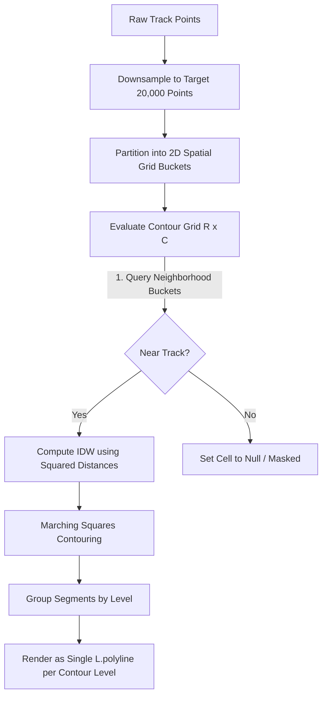

# Collective Mode Map Rendering Optimization

This document outlines the performance bottlenecks in the collective map rendering mode and details the technical implementation for refactoring the contour surface generation, distance math, and Leaflet layer drawing.

---

## 1. Current Architecture & Performance Bottlenecks

In Collective Mode, the BioMapping analyzer aggregates multiple active tracks, projects their galvanic skin response (GSR) metrics onto a spatial grid, and runs the Marching Squares algorithm to extract topographic contour lines.

### Bottleneck A: Brute-Force IDW Interpolation
The continuous surface is built using Inverse Distance Weighting (IDW). For a grid of size $R \times C$ (typically $40 \times 40 = 1600$ cells) and a combined path dataset of $N$ points (capped at $20,000$), the analyzer performs:
* A track-proximity test for every grid cell.
* An IDW interpolation sum over every track point within the neighborhood of each grid cell.

This yields a computational complexity of $\mathcal{O}(N \cdot R \cdot C)$ for each parameter update. At $20,000$ points, this results in **$32,000,000$ iterations** of the inner loop, freezing the browser's UI thread whenever a user adjusts the isolation radius, IDW exponent, or grid resolution.

### Bottleneck B: Expensive Mathematical Operations in Loops
Inside the core IDW loop, the Euclidean distance between a grid node and a track sample is calculated:
$$d = \sqrt{(dx \cdot \text{deg\_to\_m\_lon})^2 + (dy \cdot \text{deg\_to\_m\_lat})^2}$$
This is followed by:
$$w = \frac{1}{d^p}$$
where $p$ is the IDW exponent (typically $2$). 
* Calling `Math.sqrt` and `Math.pow` millions of times per render frame causes significant CPU overhead.

### Bottleneck C: DOM and Layer Overhead in Leaflet
Leaflet's Marching Squares contour lines are returned as a flat array of hundreds of individual two-point line segments. Currently, the analyzer adds each segment as a separate `L.polyline` layer to the Leaflet map. Leaflet must individually track, position, bind events, and render these thousands of SVG path elements, dragging down pan and zoom performance.

---

## 2. Refactored Architecture

The optimized architecture implements spatial indexing, squared distance arithmetic, and vectorized layer rendering.



### 2.1. Spatial Grid Partitioning (Bucketing)
To avoid scanning $N$ points for every grid cell, we partition the downsampled points into a 2D spatial grid corresponding to the bounding box of the tracks. 

1. **Grid Setup**: We use the same $R \times C$ grid resolution for the spatial index.
2. **Bucketing**: Each point $p$ with coordinates $(\text{lat}_p, \text{lon}_p)$ is assigned to cell $(r, c)$ using fast scaling:
   $$r = \text{clamp}\left(0, R-1, \left\lfloor \frac{\text{lat}_p - \text{lat}_{\min}}{\text{lat}_{\max} - \text{lat}_{\min}} \cdot (R - 1) \right\rfloor\right)$$
   $$c = \text{clamp}\left(0, C-1, \left\lfloor \frac{\text{lon}_p - \text{lon}_{\min}}{\text{lon}_{\max} - \text{lon}_{\min}} \cdot (C - 1) \right\rfloor\right)$$
3. **Local Search Query**: For any cell $(r, c)$ being evaluated in the contour grid:
   * Define search ranges $r_{\text{radius}}$ and $c_{\text{radius}}$ matching the isolation radius (plus safe padding).
   * Only iterate through points in buckets within $[r - r_{\text{radius}}, r + r_{\text{radius}}]$ and $[c - c_{\text{radius}}, c + c_{\text{radius}}]$.
   * This reduces the average number of distance checks from $20,000$ to less than $100$.

### 2.2. Sqrt-Free Distance Calculations
Since the isolation radius and IDW influence are threshold-based, we can work entirely in squared space. Let $d^2 = dx^2 + dy^2$:

1. **Proximity Threshold**: Compare $d^2 \le r_{\text{isolation}}^2$ rather than $d \le r_{\text{isolation}}$, eliminating the square root.
2. **IDW Power Scaling**: For the default IDW exponent $p=2$, the weight is:
   $$w = \frac{1}{d^2}$$
   We can use the pre-calculated $d^2$ directly. For exponents other than $2$, we scale using:
   $$w = \frac{1}{(d^2)^{p/2}}$$
   This completely avoids `Math.sqrt` inside the interpolation loop.

### 2.3. Vector Polyline Grouping in Leaflet
Rather than adding hundreds of separate `L.polyline` instances to the map for each contour level:
1. Collect all segment coordinate pairs for a given contour level $L$ into a nested array:
   $$\text{latlngs} = [ [[\text{lat}_{1a}, \text{lon}_{1a}], [\text{lat}_{1b}, \text{lon}_{1b}]], [[\text{lat}_{2a}, \text{lon}_{2a}], [\text{lat}_{2b}, \text{lon}_{2b}]], \dots ]$$
2. Initialize a single multi-polyline with this array:
   ```javascript
   const poly = L.polyline(latlngs, { color: levelColor, weight: 4.5 });
   ```
3. Bind a single tooltip to this multi-polyline. This drastically reduces the Leaflet layer overhead, reducing SVG DOM nodes from thousands to just $10$ (one path per contour level).

---

## 3. Anticipated Performance Gain

| Metric / Stage | Brute-Force (Current) | Refactored (Optimized) | Speedup |
|---|---|---|---|
| **Distance Operations** | $32,000,000$ (with `Math.sqrt`) | $< 150,000$ (no `Math.sqrt`) | **> 200×** |
| **Grid Processing Time** | $250 - 900\text{ ms}$ | $5 - 15\text{ ms}$ | **~50×** |
| **Leaflet Layers Created** | $200 - 1500$ svg paths | $10$ multi-polyline paths | **~100×** |
| **Rendering Cadence** | Heavy UI stuttering | Fluid realtime updates | **Excellent** |
