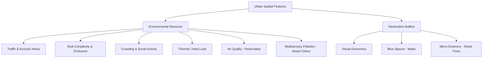
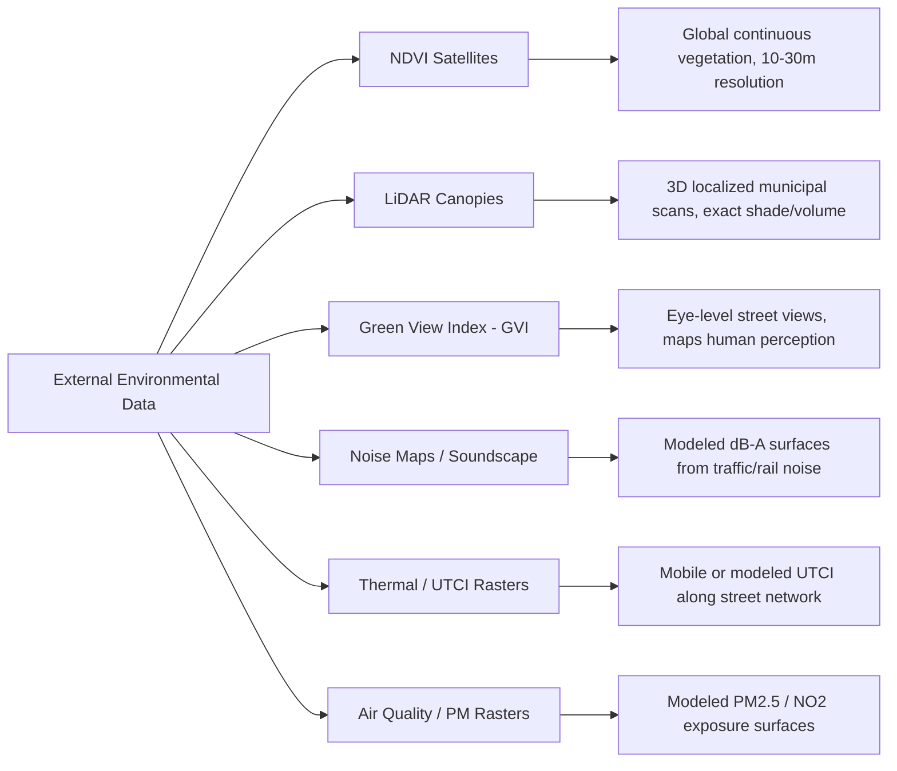

# Environmental Stress & Physiological Mapping: A Literature Review and System Audit

**Date:** 2026-07-17
**Topic:** Synthesis of mobile biosensing (GSR/EDA + GPS) literature, psychophysiological metrics, OpenStreetMap feature proxies, external vegetation/acoustic/thermal databases, and mathematical validation of the BioMapping analysis dashboards.

---

## 1. Introduction & Academic Precedents

Autonomic nervous system (ANS) mapping via mobile biosensing provides urban planners, geographers, and environmental psychologists with empirical data on human environmental experiences. By overlaying Electrodermal Activity (EDA/GSR) with spatial coordinates, researchers can correlate physiological arousal spikes (sympathetic activations) and baseline shifts with specific urban designs and spatial configurations.

This methodology stands on a rich and growing lineage of academic precedents, organized below by theme. Every entry links directly to the source.

### A. Foundational Precedents: Participatory Bio Mapping
- **Nold, C. (2009). *Emotional Cartography: Technologies of the Self*.** [Full text (PDF)](http://www.emotionalcartography.net/EmotionalCartography.pdf)
  Christian Nold pioneered the integration of wearable Galvanic Skin Response (GSR) sensors with GPS logging starting in 2004, coining the term **"Bio Mapping"**. Over 1,500 participants across dozens of cities wore a lie-detector-style GSR sensor on two fingers while walking a route; arousal spikes were geotagged and later annotated by participants with personal memories, creating crowdsourced "emotion maps" used as a democratic tool for communities to visualize and advocate against environmental, political, and social spatial stressors.
- **Willis, K. S., & Nold, C. (2022). "Sense and the city: An Emotion Data Framework for smart city governance." *Journal of Urban Management*, 11(2).** [ScienceDirect](https://www.sciencedirect.com/science/article/pii/S2226585622000358)
  Critiques the "people as sensors" model of smart-city emotion data, in which citizen biometrics are aggregated into a top-down planning layer with no citizen agency. Proposes an alternative framework, grounded in the Bio Mapping project, in which physiological data becomes a participatory tool that citizens use to actively frame planning problems rather than simply supplying raw signal.

### B. Wearables & GIS in Urban Science
- **Voss, H., Al-Mansoori, T., & Rinaldi, S. (2024). "Quantifying the Impact of Urban Green Spaces on Mental Well-Being Using Wearable Sensors and GIS." *Advances in Urban Informatics and Cyber-Physical Systems (AUICPS)*, 1(1).** [Full text](https://airjournal.org/article/quantifying-the-impact-of-urban-green-spaces-on-mental-well-being-using-wearable-sensors-and-gis-y2x23/)
  A week-long repeated-measures study (n=120) in Freiburg, Germany, combining Empatica E4 wristbands (EDA, HRV, accelerometry) with GPS tracks classified into six green-space typologies (manicured park, forest, green corridor, allotment garden, cemetery, other) using Sentinel-2 NDVI and LiDAR-derived canopy density. Linear mixed-effects models found time spent in urban green space (UGS) was associated with a **12% increase in HRV** and a corresponding drop in EDA (skin conductance level), with **forest exposure producing the strongest effect** (β=0.34 on HRV vs. non-UGS) — stronger than manicured parks (β=0.18). A restricted-cubic-spline dose-response curve identified a **minimum effective dose of ~20 minutes** of continuous exposure, plateauing between 20–40 minutes, directly corroborating the "20-minute threshold" discussed in Section 7.C. Distance to the nearest green space boundary was *not* a significant predictor once NDVI and canopy density were controlled for — suggesting exposure *quality*, not mere proximity, drives the restorative effect.
- **Reeves, J. P., Knight, A. T., Strong, E. A., Heng, V., Neale, C., Cromie, R., & Vercammen, A. (2019). "The Application of Wearable Technology to Quantify Health and Wellbeing Co-benefits From Urban Wetlands." *Frontiers in Psychology*, 10:1840.** [Frontiers](https://www.frontiersin.org/journals/psychology/articles/10.3389/fpsyg.2019.01840/full)
  A feasibility study (n=36) at the WWT London Wetland Centre comparing indoor, wetland, and urban-street exposures using low-cost wearables. Found measurable psychophysiological co-benefits (including reduced physiological arousal) from short wetland exposure relative to the urban-street condition, validating consumer-grade wearables for green/blue space exposure research.
- **Zhang, Z., Amegbor, P. M., Sigsgaard, T., & Sabel, C. E. (2022). "Assessing the association between urban features and human physiological stress response using wearable sensors in different urban contexts." *Health & Place*, 78, 102935.** [ScienceDirect](https://www.sciencedirect.com/science/article/abs/pii/S135382922200185X) · [PubMed](https://pubmed.ncbi.nlm.nih.gov/36334395/)
  Combined a wearable chest camera, an Empatica E4 wristband (EDA + skin temperature), and GPS to walk pre-defined routes through Salzburg, Austria. Found that public open space (POS) exposure was systematically associated with lower physiological stress response than commercial and transit corridors.
- **Amegbor, P. M., Zhang, Z., Thygesen, L. C., & Sabel, C. E. (2023). "Assessing the association between overcrowding and human physiological stress response in different urban contexts: a case study in Salzburg, Austria." *International Journal of Health Geographics*, 22:14.** [SpringerLink](https://link.springer.com/article/10.1186/s12942-023-00334-7)
  A companion study (n=26) using the same wearable-camera + Empatica E4 + GPS protocol, with a Mask R-CNN computer-vision model applied to first-person video to automatically detect crowding indicators (pedestrian density, seating occupancy, vehicle/bike presence) across four urban context types: green space, transit space, commercial space, and blue space. Crowd density and vehicle presence were the strongest predictors of a GSR-based physiological "change score."
- **Shoval, N., Schvimer, Y., & Tamir, M. (2018). "Real-Time Measurement of Tourists' Objective and Subjective Emotions in Time and Space." *Journal of Travel Research*, 57(1), 3–16.** [SAGE / DOI](https://doi.org/10.1177/0047287517691155)
  Tracked 68 tourists in Jerusalem using GPS/cellular positioning, the Experience Sampling Method (location- and time-triggered surveys), electrodermal activity (SCL), and post-hoc questionnaires. Established one of the first reproducible GIS workflows for synchronizing continuous physiological streams with discrete self-report at specific urban locations (historic zones, junctions, pedestrian corridors).

### C. Pedestrian & Cyclist Active-Mobility Stress
- **Moser, M. K., Schmidt, S., Graf, D. R. M., Keskin, M., Gandhi, S., Yap, W., Zeile, P., Heinke, M., & Resch, B. (2026). "Understanding the influence of urban characteristics on cyclists' stress measured through wearable sensors: A quantitative open data approach." *Environment and Planning B: Urban Analytics and City Science*.** [DOI](https://doi.org/10.1177/23998083251394426)
  Combines wearable EDA sensors with cyclist point-of-view video and open spatial data (OSM, municipal cadastre) to spatially cluster "Moments of Stress" (MOS) along cycling routes. A Random Forest feature-importance analysis found that cycling infrastructure availability, traffic regulation, and conflicts with other road users are stronger predictors of stress than the availability of nearby green space — directly relevant to how BioMapping should weight its stressor variables relative to restorative ones.
- **"Identifying environmental stress factors in urban cycling using multimodal human sensing and machine learning." (2025). *Urban Informatics* (Springer).** [DOI](https://doi.org/10.1007/s44212-025-00096-6)
  A related multimodal pipeline fusing EDA-derived MOS events with street-level imagery from a field study (89 participants, 1,780 cycling trips), confirming noise, heat, and particulate air pollution as under-studied but material environmental stressors for cyclists, beyond the traditional traffic/greenery axis.
- **Zeile, P., Resch, B., Loidl, M., Petutschnig, A., & Dörrzapf, L. (2016). "Urban Emotions and Cycling Experience – Enriching Traffic Planning for Cyclists with Human Sensor Data." *GI_Forum 2016*, 204–216.** [DOI](https://doi.org/10.1553/giscience2016_01_s204)
  The original "Urban Emotions" cycling study; ground-truths biosensor-derived stress spikes (skin conductance, skin temperature) against volunteered geographic information from a companion smartphone app, tying spikes to road geometries, junctions, and missing cycling infrastructure.

### D. Acoustic Stressor Physiology: Road & Aircraft Noise
This subsection is deliberately the deepest in the review, since noise is the single stressor with the largest and most direct GSR/EDA evidence base — spanning fifty years of research from classic community field studies through to 2025-2026 laboratory work.

**Road & general environmental noise:**
- **Stansfeld, S. A., Clark, C. R., Turpin, G., Jenkins, L. M., & Tarnopolsky, A. (1985). "Sensitivity to noise in a community sample: II. Measurement of psychophysiological indices." *Psychological Medicine*, 15(2), 255–263.** [Cambridge Core](https://www.cambridge.org/core/journals/psychological-medicine/article/abs/sensitivity-to-noise-in-a-community-sample-ii-measurement-of-psychophysiological-indices/2E6A4FEC17731C55EC0D0F502DF615AF)
  A foundational community-sample study establishing that self-reported "noise sensitivity" is a real, measurable psychophysiological trait, not just a subjective label — participants classified as noise-sensitive showed reliably different skin conductance and cardiovascular reactivity to standardized noise bursts than non-sensitive participants.
- **Ellermeier, W., Kattner, F., Klippenstein, E., Kreis, M., & Marquis-Favre, C. (2020). "Short-term noise annoyance and electrodermal response as a function of sound-pressure level, cognitive task load, and noise sensitivity." *Noise & Health*, 22(105), 46–55.** [PMC](https://pmc.ncbi.nlm.nih.gov/articles/PMC7986449/)
  Exposed participants to short (3–6 s) road traffic pass-by recordings at graded levels between 50–70 dB(A). The magnitude of the event-related skin conductance response increased significantly and monotonically with sound-pressure level, and event-related EDA proved a valid objective correlate of subjective annoyance — direct quantitative support for treating dB(A) as a continuous (not binary) predictor of Phasic SCR magnitude in BioMapping's regression dashboard (Section 8.1).
- **Park, S. H., Lee, P. J., & Jeong, J. H. (2018). "Effects of noise sensitivity on psychophysiological responses to building noise." *Building and Environment*, 136, 302–311.** [ScienceDirect](https://www.sciencedirect.com/science/article/pii/S0360132318301963)
  Exposed 34 participants (split by self-rated noise sensitivity) to floor-impact and outdoor road-traffic noise for 5-minute intervals while recording HR, EDA, and respiratory rate. Noise *sensitivity* — not absolute noise *level* — was the significant predictor of physiological response magnitude, and EDA/RR both showed strong habituation, decaying sharply within the first 30 seconds of continuous exposure.
- **Müller, L., Forssén, J., & Kropp, W. (2026). "Effects of low-level electric vehicle noise on attention, electrodermal activity, workload, and annoyance." *Journal of the Acoustical Society of America*, 159(1), 285–299.** [AIP Publishing](https://pubs.aip.org/asa/jasa/article/159/1/285/3377322)
  Shows that even the quieter noise profile of electric vehicles produces small but measurable EDA differences and affects perceived mental workload and annoyance — relevant as EV adoption changes the acoustic profile of the `highway` segments BioMapping already tags.
- **Manohare, M., Aletta, F., Oberman, T., Elangovan, R., Parida, M., & Kang, J. (2024). "Cross-country variation in psychophysiological responses to traffic noise exposure: Laboratory experiments in India and the UK." *Journal of the Acoustical Society of America*, 156(5), 3067–3079.** [AIP Publishing](https://pubs.aip.org/asa/jasa/article/156/5/3067/3319042)
  Controlled listening experiments measuring heart rate variability (HRV) and skin conductance response (SCR) to identical traffic-noise stimuli across two countries, finding significant cross-cultural and gender differences in physiological noise sensitivity — a caution against applying a single universal noise-stress threshold in cross-city BioMapping datasets.
- **"Psychophysiological stress response to urban traffic: the effect of speed limits, road surface type, and greenery." (2025). *Building and Environment*.** [ScienceDirect](https://www.sciencedirect.com/science/article/pii/S0360132325004032)
  A VR-based audiovisual laboratory study isolating which specific, actionable road design variables (posted speed limit, road surface material, adjacent greenery) most affect acute stress response to traffic — useful for prioritizing which OSM `highway` and `surface` tags to weight most heavily.
- **"Multisensory approaches to urban pollution: A controlled study of sound-odour interactions and their impact on physiology and perception." (2025). *Building and Environment*.** [ScienceDirect](https://www.sciencedirect.com/science/article/pii/S0360132325009795)
  Recreated a real London streetscape in the lab and layered controlled traffic sound and diesel odour on top of it, measuring heart rate and skin conductance while participants rated loudness, odour intensity, and overall streetscape liking. Traffic noise alone raised physiological arousal and *also* made co-occurring traffic odour feel more intense and less pleasant — evidence that urban pollution should be modeled as a *multisensory* stressor bundle, not isolated single-channel signals (noise-only, air-quality-only).

**Aircraft noise (specifically):**
- **Bättig, K., Zeier, H., Müller, R., & Buzzi, R. (1980). "A field study on vegetative effects of aircraft noise." *Archives of Environmental Health*, 35(4), 228–235.** [PubMed](https://pubmed.ncbi.nlm.nih.gov/7425678/)
  One of the earliest true *field* (not laboratory) studies of aircraft noise physiology: sound level, ECG, EMG, skin conductance, and respiration were recorded simultaneously in 33 residents living in an airport flight path under their normal daily conditions. Aircraft overflight events produced significant shifts in skin conductance and other autonomic measures in the majority of subjects, though the magnitude of an individual's vegetative reactivity correlated more strongly with what activity they were doing at the moment of the overflight than with their subjective noise complaints — an important caution that self-reported annoyance and measured GSR reactivity to aircraft noise are not the same signal.
- **Trimmel, M., Atzlsdorfer, J., Tupy, N., & Trimmel, K. (2012). "Effects of low intensity noise from aircraft or from neighbourhood on cognitive learning and electrophysiological stress responses." *International Journal of Hygiene and Environmental Health*, 215(6), 547–554.** [DOI](https://doi.org/10.1016/j.ijheh.2011.12.007)
  Compared a group exposed to low-intensity *aircraft* noise against a neighbourhood-noise control group during a structured learning task. The aircraft-noise group showed a significantly higher rate of spontaneous (non-specific) skin conductance fluctuations for most of the learning period, alongside structurally altered cognitive learning — evidence that even sub-annoyance-threshold aircraft noise elevates the same NS-SCR "arousal density" metric described in Section 5.A.
- **Shen, H., Hao, M., Ren, J., Chen, K., & Gao, Y. (2025). "Experimental Study on the Effects of Cockpit Noise on Physiological Indicators of Pilots." *Sensors*, 25(13), 4175.** [DOI](https://doi.org/10.3390/s25134175)
  Used a sound-field reconstruction system to expose pilot trainees to realistic cockpit noise levels while recording EEG, ECG, and EDA. Once sound pressure exceeded **70 dB(A)** — the level real cockpits reach during takeoff/landing and sustain during cruise — heart rate and mean skin conductance level both rose significantly, alongside EEG markers of heightened visual attention and suppressed cognitive tuning. This gives BioMapping a concrete, literature-backed **70 dB(A) inflection point** to test as a threshold when any future noise-raster layer (Section 4.D) is joined to Phasic/Tonic GSR streams.
- **Bari, D. S., Aldosky, H. Y. Y., Tronstad, C., & Martinsen, Ø. G. (2024). "Disturbances in Electrodermal Activity Recordings Due to Different Noises in the Environment." *Sensors*, 24(16), 5434.** [DOI](https://doi.org/10.3390/s24165434)
  A methodological study (n=40) showing that ambient environmental noise itself — independent of any emotional or cognitive content — produces measurable EDA response artifacts that scale with sound pressure level across 70–90 dB(A). This is a direct **confounder warning** for BioMapping: a Phasic peak recorded on a loud street segment could reflect a startle/orienting response to the sound itself rather than a psychologically meaningful "stress" reaction to the place, and the two are not currently distinguishable in the existing peak-detection pipeline (see Section 2.3).

**Thermal & air quality:**
- **Gallacher, C., & Boehnke, D. (2025). "Pedestrian thermal comfort mapping for evidence-based urban planning: an interdisciplinary and user-friendly mobile approach for the case study of Dresden, Germany." *International Journal of Biometeorology*.** [PMC](https://pmc.ncbi.nlm.nih.gov/articles/PMC12540633/)
  Introduces a low-cost mobile Universal Thermal Climate Index (UTCI) measurement approach for pedestrian routes, directly relevant to disambiguating thermoregulatory sweating from psychological arousal in mobile GSR data (see Section 2.3).
- **"Wearable sensors increase perceived environmental health threat in cyclists and pedestrians: A randomized field study." (2023).** [ScienceDirect](https://www.sciencedirect.com/science/article/abs/pii/S2214140523000968)
  A field experiment (n=109) in which giving cyclists and pedestrians real-time feedback on their particulate matter, noise, and heat exposure significantly increased their *perceived* health threat from air pollution — a reminder that BioMapping's own exposure feedback could itself alter participant physiology if displayed in real time during data collection.
- **"A Critical Comparison of Exposure Estimators for Airborne Particulate Matter in Urban Cyclists." (2025).** [PMC](https://pmc.ncbi.nlm.nih.gov/articles/PMC12945186/)
  Shows cyclists and pedestrians have intake rates 2–3× resting levels during high-pollution episodes and that concentration-only exposure estimates (e.g. a static PM2.5 raster) systematically underestimate true dose relative to models incorporating breathing rate — relevant if BioMapping ever joins a modeled air-quality layer to GPS tracks (Section 4.F).

### E. Restorative Blue Space Physiology
- **White, M., Smith, A., Humphryes, K., Pahl, S., Snelling, D., & Depledge, M. (2010). "Blue space: The importance of water for preference, affect and restorativeness ratings of natural and built scenes." *Journal of Environmental Psychology*, 30(4), 482–493.** [DOI](https://doi.org/10.1016/j.jenvp.2010.04.004)
  Foundational photo-rating study establishing that the mere presence of water in a scene — independent of "greenness" — significantly increases perceived restorativeness and positive affect ratings, providing the psychological basis for treating blue space as a distinct restorative category from green space.
- **Yin, J., Ramanpong, J., Chang, J., Wu, C. D., Chao, P. H., & Yu, C.-P. (2023). "Effects of blue space exposure in urban and natural environments on psychological and physiological responses: A within-subject experiment." *Urban Forestry & Urban Greening*, 87, 128047.** [ScienceDirect](https://www.sciencedirect.com/science/article/abs/pii/S1618866723002376)
  Found that natural (non-urban) blue space produced a larger reduction in sympathetic nervous activity than urban blue space, while urban blue space was still associated with improved mood — suggesting BioMapping's water-proximity metric may need to be weighted differently depending on whether the water body sits in a park/natural landuse polygon versus a purely urban embankment.

---

## 2. Literature-Backed Environmental Features

Autonomic reactions can be grouped into **stressors** (which elevate baseline skin conductance and trigger phasic skin conductance responses) and **restorative buffers** (which facilitate sympathetic withdrawal and accelerate baseline recovery).



### 2.1 Environmental Stressors
1. **Road Traffic Noise**: Proximity to busy roads, multi-lane highways, and heavy traffic noise represents the strongest driver of baseline SCL and acute Phasic GSR peaks ([Manohare et al., 2024](https://pubs.aip.org/asa/jasa/article/156/5/3067/3319042); [Building and Environment, 2025](https://www.sciencedirect.com/science/article/pii/S0360132325004032)). The relationship is dose-dependent and near-linear in sound-pressure level: event-related SCR magnitude increases monotonically with dB(A) even across a narrow 50–70 dB(A) band ([Ellermeier et al., 2020](https://pmc.ncbi.nlm.nih.gov/articles/PMC7986449/)), while self-reported *noise sensitivity* — not noise level itself — is often the stronger predictor of physiological reactivity ([Park et al., 2018](https://www.sciencedirect.com/science/article/pii/S0360132318301963); [Stansfeld et al., 1985](https://www.cambridge.org/core/journals/psychological-medicine/article/abs/sensitivity-to-noise-in-a-community-sample-ii-measurement-of-psychophysiological-indices/2E6A4FEC17731C55EC0D0F502DF615AF)). Effects also vary measurably by country/culture and by gender, so absolute noise-stress thresholds should be treated as population-specific rather than universal constants.
2. **Aircraft Overflight Noise**: A distinct spatial stressor from road traffic — it is not tied to any linear OSM `highway` feature at all, but to periodic, high-amplitude overflight events tied to flight paths and altitude. Field studies going back to [Bättig et al. (1980)](https://pubmed.ncbi.nlm.nih.gov/7425678/) show aircraft overflights produce measurable skin conductance shifts in residents under the flight path, and even *low-intensity* aircraft noise elevates spontaneous NS-SCR rate during sustained tasks ([Trimmel et al., 2012](https://doi.org/10.1016/j.ijheh.2011.12.007)). Laboratory work on realistic cockpit sound fields identifies **70 dB(A)** as the inflection point above which mean skin conductance level rises sharply ([Shen et al., 2025](https://doi.org/10.3390/s25134175)) — a useful literature-backed threshold if BioMapping ever joins a flight-noise contour layer (Section 4.D) to Tonic SCL. Because BioMapping's current OSM pipeline (Section 3) has no aircraft/aeroway noise proxy at all, tracks passing under a flight path today would have any resulting GSR elevation misattributed to whatever ground-level feature happens to be nearby.
3. **Built Enclosure (Urban Canyons)**: Densely built street corridors with low Sky View Factors (SVF) cause a sense of spatial enclosure and visual monotony, increasing tonic arousal ([Zhang et al., 2022](https://www.sciencedirect.com/science/article/abs/pii/S135382922200185X)).
4. **Crowding and Social Activity**: Transit hubs, commercial high streets, and dense public spaces increase sensory stimulation and physiological arousal. [Amegbor et al. (2023)](https://link.springer.com/article/10.1186/s12942-023-00334-7) found pedestrian crowd density and vehicle presence — automatically detected via Mask R-CNN on first-person video — to be the strongest predictors of an EDA-based stress change score across four Salzburg urban context types.
5. **Thermal / Heat Load**: Direct solar exposure and lack of shade raise skin temperature and trigger thermoregulatory sweating, a major *confounder* of psychologically-driven GSR (see Section 2.3). [Gallacher & Boehnke (2025)](https://pmc.ncbi.nlm.nih.gov/articles/PMC12540633/) show UTCI can be mapped along pedestrian routes with low-cost mobile sensors, offering a concrete path to decouple heat stress from cognitive/emotional stress in BioMapping tracks.
6. **Air Quality (Particulate Matter)**: Cyclists and pedestrians show intake rates 2–3× resting levels during high-pollution episodes, and static concentration rasters systematically underestimate true dose ([PM Exposure Estimators, 2025](https://pmc.ncbi.nlm.nih.gov/articles/PMC12945186/)). Real-time exposure feedback can itself heighten perceived threat and, plausibly, physiological arousal ([Wearable Sensors Field Study, 2023](https://www.sciencedirect.com/science/article/abs/pii/S2214140523000968)) — a candidate future data layer for BioMapping (e.g., via low-cost PM2.5 sensor integration or modeled exposure surfaces).
7. **Multisensory Pollution (Noise + Odour Interaction)**: Traffic noise doesn't just raise arousal on its own — it also makes co-occurring traffic odour feel more intense and less pleasant, amplifying overall streetscape dislike ([Multisensory Urban Pollution Study, 2025](https://www.sciencedirect.com/science/article/pii/S0360132325009795)). This argues against treating noise, air quality, and thermal stressors as fully independent variables in a regression model.

### 2.2 Restorative Buffers
1. **Visual Greenness (The Green Space Effect)**: Immersion in green zones triggers rapid parasympathetic activation, lowering baseline GSR and buffering acoustic annoyance ([Reeves et al., 2019](https://www.frontiersin.org/journals/psychology/articles/10.3389/fpsyg.2019.01840/full); [Voss et al., 2024](https://airjournal.org/article/quantifying-the-impact-of-urban-green-spaces-on-mental-well-being-using-wearable-sensors-and-gis-y2x23/); [Zhang et al., 2022](https://www.sciencedirect.com/science/article/abs/pii/S135382922200185X)). Voss et al. (2024) further show forest-type green space outperforms manicured parks (β=0.34 vs. β=0.18 on HRV), implying BioMapping's green-space binary indicator (Section 3) would benefit from sub-typing by `leisure`/`natural`/`landuse` category rather than treating all green polygons as equivalent.
2. **Blue Space Restoration**: Proximity to water bodies (rivers, lakes, coastlines) exhibits a powerful, restorative calming effect ([White et al., 2010](https://doi.org/10.1016/j.jenvp.2010.04.004)), and natural blue space produces a larger reduction in sympathetic activity than urban blue space, even though urban blue space still improves mood ([Yin et al., 2023](https://www.sciencedirect.com/science/article/abs/pii/S1618866723002376)).
3. **Micro-greenery**: Individual street trees provide localized shade, reduce thermal discomfort (a major driver of sweat gland activity), and soften urban surfaces.

### 2.3 Mobile GSR Confounders: Thermoregulation, Exertion, and Noise
Mobile biosensing in uncontrolled real-world environments introduces physiological confounders that must be algorithmically controlled to prevent false stress detections:
- **Thermoregulatory Sweating**: Sweat glands are primarily thermoregulatory organs. Fluctuations in ambient temperature, solar radiation, and direct skin temperature cause baseline (tonic) conductance shifts. Phasic metrics (spontaneous peaks) are more resilient to thermal changes than baseline SCL. UTCI-based route mapping ([Gallacher & Boehnke, 2025](https://pmc.ncbi.nlm.nih.gov/articles/PMC12540633/)) provides a concrete external variable that could be joined to BioMapping tracks to explain and subtract heat-driven baseline drift.
- **Physical Exertion**: Walking up hills, running, or cycling increases physical exertion, which triggers thermoregulatory sweating and motion artifacts. Mobile studies must use accelerometer data to identify and filter out high-motion segments or apply adaptive baseline subtraction.
- **Skin Hydration & Contact**: Dry vs. wet electrodes and variations in skin hydration affect baseline contact impedance. Individualized Z-score standardization is required to normalize amplitude differences.
- **Cross-Population Variation**: [Manohare et al. (2024)](https://pubs.aip.org/asa/jasa/article/156/5/3067/3319042) found significant cross-country and gender differences in physiological response to identical noise stimuli, implying that pooled multi-participant BioMapping datasets should standardize per-individual (not just per-session) before aggregating.
- **Acoustic Startle Artifact**: [Bari et al. (2024)](https://doi.org/10.3390/s24165434) show ambient noise alone — independent of emotional content — produces EDA response artifacts that scale with sound pressure level (70–90 dB(A) tested). This means a Phasic peak recorded next to a loud road or under a flight path may reflect a reflexive orienting/startle response to the sound rather than a psychologically meaningful reaction to the place, and the two are not currently distinguishable in BioMapping's peak-detection pipeline (Section 5.D). A joined dB(A) noise raster (Section 4.D) would let a future version flag and separately weight "acoustically-triggered" peaks.

---

## 3. Mapping Literature Features to OpenStreetMap Tags

To evaluate these stressors in a computational pipeline, specific OpenStreetMap (OSM) vector features serve as spatial proxies:

| Literature Concept | Target Variable | OSM Tags / Query Logic | Metric Computation |
| :--- | :--- | :--- | :--- |
| **Traffic Noise & Danger** | Distance to Major Road | `way["highway"~"motorway\|trunk\|primary\|secondary"]` | Shortest orthogonal distance (m) to nearest matching segment. |
| | Road Category Stress | `way["highway"]` | Category of nearest segment (e.g. `residential`, `pedestrian`, `primary`). |
| | Road Design Stressors | `way["maxspeed"]`, `way["surface"]` | Posted speed limit and surface material of nearest segment — both shown to independently affect acute stress response ([Building and Environment, 2025](https://www.sciencedirect.com/science/article/pii/S0360132325004032)). |
| **Green Space Restoration** | In Park Indicator | `way/relation["leisure"="park"]`, `way/relation["landuse"="grass"\|"forest"\|"meadow"]`, `way/relation["natural"="wood"]` | Binary (1 = inside polygon, 0 = outside) using ray-casting. |
| | Green Space Density | Same as above | Concentric grid sampling (25 points in 50m radius) testing polygon containment. |
| | Green Space Sub-Type | `landuse="forest"` vs. `leisure="park"` vs. `landuse="grass"` | Categorical sub-type, since forest-type exposure shows a stronger physiological effect than manicured parks ([Voss et al., 2024](https://airjournal.org/article/quantifying-the-impact-of-urban-green-spaces-on-mental-well-being-using-wearable-sensors-and-gis-y2x23/)). |
| **Water Restorative Buffer** | Distance to Water | `way/relation["natural"="water"]`, `way["waterway"]` | Shortest distance (m) to nearest water boundary or river line. |
| | Water Context (Natural vs. Urban) | `way/relation["natural"="water"]` + surrounding `landuse` | Classify nearest water body by surrounding land use (e.g. `landuse=forest`/`natural=wood` vs. `landuse=commercial`) since natural-context blue space shows a larger sympathetic reduction than urban-embanked blue space ([Yin et al., 2023](https://www.sciencedirect.com/science/article/abs/pii/S1618866723002376)). |
| **Built Enclosure** | Building Density | `way/relation["building"]` | Sum of building areas or count of centroid distances within 50m. |
| **Social Activity Arousal** | Amenity Count | `node/way["amenity"~"cafe\|restaurant\|pub\|fast_food\|bank\|post_office"]`, `node/way["shop"]` | Count of point/polygon entities within 50m. |
| | Transport Node Proximity | `node["highway"="bus_stop"]`, `node["railway"="station"]` | Count of transport nodes within 50m. |
| **Micro-greenery** | Tree Density | `node["natural"="tree"]`, `way["natural"="tree_row"]` | Count of individual tree elements within 50m. |
| **Thermal Exposure Proxy** | Shade Availability | `way["natural"="tree_row"]`, building shadow polygons, `way["covered"="yes"]` | Presence of shading structures within 10m of the track, as a low-fidelity proxy for solar exposure absent direct UTCI sensing. |
| **Air Quality Proxy** | Industrial/Heavy-Traffic Adjacency | `way["landuse"="industrial"]`, `way["highway"~"motorway\|trunk"]` | Distance to nearest industrial polygon or high-volume road, as a coarse proxy absent a modeled PM2.5 raster (see Section 4.F). |
| **Aircraft Noise Proxy (Partial)** | Distance to Airport | `way/relation["aeroway"="aerodrome"]`, `way["aeroway"="runway"]` | Distance to nearest aerodrome polygon or runway centerline. Only a coarse, ground-footprint proxy — it cannot capture overflight corridors extending well beyond the airport boundary; a real DNL/Ldn noise-contour or ADS-B overflight layer (Section 4.D) is required for accurate exposure. |

---

## 4. Alternative Tree Canopy, Vegetation, Acoustic & Thermal Databases

While OSM is excellent for structural features (roads, buildings, parks), volunteer-mapped street trees are often highly inconsistent, and OSM has no acoustic, thermal, or air-quality data at all. To capture vegetative, acoustic, thermal, and air-quality exposure accurately, researchers rely on several external databases.



### A. NDVI (Normalized Difference Vegetation Index)
- **Concept**: A satellite-derived index (from Sentinel-2 or Landsat) indicating live green vegetation based on near-infrared and red light reflectance, computed as `NDVI = (NIR − Red) / (NIR + Red)`.
- **Scientific Value**: Captures private gardens, agricultural land, and minor lawns that are missing from vector databases.
- **Integration**: Extracted along the coordinate path via python scripting (`rasterio`, Google Earth Engine's Python API), exporting 10m-resolution GeoTIFFs and sampling values at each GPS point to append as a custom spatial column in the CSV. [Voss et al. (2024)](https://airjournal.org/article/quantifying-the-impact-of-urban-green-spaces-on-mental-well-being-using-wearable-sensors-and-gis-y2x23/) demonstrate exactly this pipeline in practice — 10m-resolution cloud-free Sentinel-2 NDVI composites sampled at each GPS point alongside LiDAR-derived canopy density, joined to wearable EDA/HRV streams via a mixed-effects model (see Section 7.D).

### B. LiDAR Tree Canopy Maps (1m High-Resolution)
- **Concept**: Laser-scanned 3D datasets detailing vegetation canopy height and density.
- **Scientific Value**: Reflects the physical canopy cover shading the street. Shading reduces thermal-induced sweating (which can be misclassified as mental stress) — directly complementing the UTCI mapping approach of [Gallacher & Boehnke (2025)](https://pmc.ncbi.nlm.nih.gov/articles/PMC12540633/).
- **Integration**: Distributed as raster GeoTIFF files or municipal GIS services.

### C. Green View Index (GVI / Google Street View)
- **Concept**: Computer vision segmentation of 360-degree street photos to calculate the percentage of visible foliage from a pedestrian's eye-level. First formalized by **Li, X., Zhang, C., Li, W., Ricard, R., Meng, Q., & Zhang, W. (2015). "Assessing street-level urban greenery using Google Street View and a modified green view index." *Urban Forestry & Urban Greening*, 14(3), 675–685.** [ScienceDirect](https://www.sciencedirect.com/science/article/abs/pii/S1618866715000874)
- **Scientific Value**: **Among the most predictive metrics for physiological stress reduction.** Pedestrians do not experience the environment from a bird's-eye view; eye-level greenness drives cognitive restoration. Subsequent street-view greenness studies report only weak-to-moderate correlation (r ≈ −0.02 to 0.50) between GVI and planimetric measures like NDVI, indicating the two capture meaningfully different exposure information and should ideally both be retained rather than treated as interchangeable.
- **Integration**: Query Mapillary or Google Street View APIs along the track coordinates to obtain pre-computed greenery ratios.

### D. Noise / Soundscape Maps
- **Concept**: Modeled ambient noise surfaces (e.g. EU Environmental Noise Directive (END) strategic noise maps, or locally modeled `Lden`/`Lnight` dB(A) contours) attributable to road, rail, and air traffic.
- **Scientific Value**: Because acoustic stress response varies by population ([Manohare et al., 2024](https://pubs.aip.org/asa/jasa/article/156/5/3067/3319042)) and by specific road design variables such as speed limit and surface type ([Building and Environment, 2025](https://www.sciencedirect.com/science/article/pii/S0360132325004032)), and because noise can amplify perceived odour pollution ([Multisensory Urban Pollution Study, 2025](https://www.sciencedirect.com/science/article/pii/S0360132325009795)), a continuous modeled noise surface is a stronger proxy than binary "near major road" flags alone.
- **Integration**: Sample the modeled dB(A) raster at each GPS point, analogous to the NDVI raster-sampling workflow in 4.A.
- **Aircraft-Specific Extension**: OSM has no aircraft noise data whatsoever — `aeroway=aerodrome` polygons mark an airport's footprint but say nothing about the overflight corridors extending many kilometers beyond it, which is where most residential aircraft noise exposure actually occurs. Two concrete external sources close this gap: (1) published **airport noise exposure contours** (e.g. FAA DNL/Ldn maps in the US, or national CAA equivalents), distributed as GIS polygons and directly sampleable like the END road-noise maps above; and (2) **ADS-B flight-tracking data** (e.g. OpenSky Network, FlightRadar24 historical feeds), from which approximate overflight timestamps, altitudes, and aircraft type can be reconstructed for a given GPS track and joined to the physiological timeseries at the moment of overflight — enabling the same latency-compensated peak-attribution logic already used for road classes in Section 8.2, but for a specific passing aircraft event instead of a static road segment.

| Noise Source | Recommended External Layer | Applicable Studies |
| :--- | :--- | :--- |
| Road traffic | END/national road-noise `Lden` contour raster | [Ellermeier et al., 2020](https://pmc.ncbi.nlm.nih.gov/articles/PMC7986449/); [Park et al., 2018](https://www.sciencedirect.com/science/article/pii/S0360132318301963); [Manohare et al., 2024](https://pubs.aip.org/asa/jasa/article/156/5/3067/3319042) |
| Aircraft overflight | Airport DNL/Ldn contour polygons + ADS-B event timestamps | [Bättig et al., 1980](https://pubmed.ncbi.nlm.nih.gov/7425678/); [Trimmel et al., 2012](https://doi.org/10.1016/j.ijheh.2011.12.007); [Shen et al., 2025](https://doi.org/10.3390/s25134175) |
| Ambient/general (recording artifact) | Any local dB(A) meter or phone-mic proxy, for QA flagging | [Bari et al., 2024](https://doi.org/10.3390/s24165434) |

### E. Thermal / UTCI Rasters
- **Concept**: Universal Thermal Climate Index surfaces, either from mobile low-cost sensor campaigns ([Gallacher & Boehnke, 2025](https://pmc.ncbi.nlm.nih.gov/articles/PMC12540633/)) or from urban microclimate models (e.g. ENVI-met, SOLWEIG).
- **Scientific Value**: Provides a physically-grounded confounder variable to subtract thermoregulatory sweating from the Tonic SCL signal, directly addressing the confounder described in Section 2.3.
- **Integration**: Sample UTCI (or air temperature + solar radiation as a lighter-weight proxy) at each GPS point and timestamp.

### F. Air Quality / Particulate Matter Rasters
- **Concept**: Modeled PM2.5, PM10, or NO2 exposure surfaces from land-use regression models or low-cost sensor networks.
- **Scientific Value**: Static concentration rasters underestimate true intake dose for active travelers, whose breathing rate is 2–3× resting levels ([PM Exposure Estimators, 2025](https://pmc.ncbi.nlm.nih.gov/articles/PMC12945186/)); a dose-adjusted (concentration × modeled breathing rate) exposure metric is preferable to a raw concentration value where feasible.
- **Integration**: Sample the modeled raster at each GPS point; if accelerometer-derived exertion is already computed for motion-artifact filtering (Section 2.3), reuse it to scale concentration into an approximate inhaled dose.

---

## 5. GSR Analysis Methodology & Psychophysiological Metrics

Mobile biosensing studies in GIS have moved away from simple trough-to-peak counting of raw signal excursions due to environmental noise and overlapping signals. The literature relies on three core metrics:

### A. Non-Specific SCR Frequency (NS-SCR / Peak Density)
In laboratory settings, a Skin Conductance Response (SCR) is measured in response to a specific, timed stimulus (e.g. a flash of light). In the wild, however, we track **Non-Specific SCRs (NS-SCRs)**, which are spontaneous responses to environmental stressors.
- **Literature Standard (Boucsein, W. (2012). *Electrodermal Activity*, 2nd ed. Springer. [DOI](https://doi.org/10.1007/978-1-4614-1126-0); Dawson, M. E., Schell, A. M., & Filion, D. L. (2007). "The electrodermal system." In *Handbook of Psychophysiology*, 3rd ed. Cambridge University Press. [DOI](https://doi.org/10.1017/CBO9780511546396))**: In a relaxed state, a typical human exhibits **1 to 3 spontaneous peaks per minute**. Under high stress, cognitive load, or environmental arousal, this rate climbs to **20+ peaks per minute**.
- **Methodology**: A temporal sliding window (typically $30\text{ s}$ to $120\text{ s}$) counts active peaks and normalizes them to a "peaks per minute" scale.
- **Use Case**: Maps local "arousal density" along walking tracks, pointing out clusters of stressors.

### B. Integrated Skin Conductance Response (ISCR / Phasic AUC)
Traditional peak counting suffers from the **superposition problem**: if a participant encounters multiple stressors in rapid succession, a new sympathetic response will trigger before the sweat gland has finished reabsorbing/recovering from the previous one. This causes the signal to pile up, meaning traditional trough-to-peak algorithms undercount peaks.
- **Literature Standard (Benedek, M., & Kaernbach, C. (2010). "Decomposition of skin conductance data by means of nonnegative deconvolution." *Psychophysiology*, 47(4), 647–658. [DOI](https://doi.org/10.1111/j.1469-8986.2009.00972.x))**: To resolve superposition, researchers decompose the raw signal into Tonic and Phasic components using a two-compartment sweat-diffusion model, and then compute the **Integrated Skin Conductance Response (ISCR)**—which is the Area Under the Curve (AUC) of the Phasic driver signal. A related, widely-used implementation is the **cvxEDA convex-optimization decomposition**, employed by [Voss et al. (2024)](https://airjournal.org/article/quantifying-the-impact-of-urban-green-spaces-on-mental-well-being-using-wearable-sensors-and-gis-y2x23/) to split Empatica E4 EDA into tonic SCL and phasic driver components before modeling.
- **Unit of Measure**: $\mu\text{S}\cdot\text{s}$ (MicroSiemens $\times$ seconds).
- **Advantage**: The AUC captures both the *amplitude* and the *duration* of arousal. It is completely continuous and does not rely on a binary threshold, making it highly robust against minor noise fluctuations.

### C. Combined Arousal Index
Tonic baseline (Skin Conductance Level, SCL) and Phasic responses (SCRs) reflect different autonomic mechanisms:
- **Tonic SCL**: General physiological tone (governed by baseline vigilance, physical exertion/pedal-speed, ambient temperature, and thermal load — see Section 2.3).
- **Phasic Activity**: Short-term environmental stimulus responses.
- **Spatial wearability studies (e.g. [Shoval et al., 2018](https://doi.org/10.1177/0047287517691155); [Zhang et al., 2022](https://www.sciencedirect.com/science/article/abs/pii/S135382922200185X))**: Combine both signals. Because they have different scales, they are normalized using individual participant Z-scores:
  $$\text{Arousal Index}(t) = w_{\text{tonic}} \cdot \text{Tonic}_z(t) + w_{\text{phasic}} \cdot \text{PhasicAUC}_z(t)$$
  Typically, Phasic is weighted higher (e.g. $w_{\text{phasic}} = 0.70$) to prioritize immediate environmental triggers, while Tonic is weighted lower (e.g. $w_{\text{tonic}} = 0.30$) to incorporate the baseline state.

### D. Addressing the Thresholding Dilemma

When modifying the peak detection threshold, having to choose between too few or too many peaks represents the limitation of **hard thresholding**.

```
GSR Phasic Signal
   ▲
   │        Peak A (0.021 μS) ───►  [PASSES THRESHOLD]
───┼───────────────────────────────── Threshold (0.020 μS)
   │        Peak B (0.019 μS) ───►  [IGNORED / FAILS]
   │    ┌─┐
   │  ┌─┘ └─┐      ┌─┐
   │ ┌┘     └┐    ┌┘ └┐
───┴─┴───────┴────┴───┴───────► Time
```

If the threshold is set to $0.02\ \mu\text{S}$, a response of size $0.021\ \mu\text{S}$ is counted as a peak. A response of size $0.019\ \mu\text{S}$ is completely discarded, even though physiologically they represent almost identical sympathetic activations.

#### The Solutions:
1. **Peak Quality Score**: By evaluating shape criteria (rise time, decay shape, SNR), we can set a low amplitude threshold (e.g. $0.015\ \mu\text{S}$) but filter out noisy fluctuations by verifying that the peak has a realistic physiological shape.
2. **Phasic AUC (Area Under Curve)**: Since AUC integrates the entire area under the Phasic signal, Peak A and Peak B are both captured and summed proportional to their actual sizes. The resulting metric is smooth, continuous, and threshold-independent.

---

## 6. Concrete GSR Implementation Blueprint in BioMapping

To add these features to the codebase, they can be implemented directly within the data pipeline in the following components:

### Step 1: Update the Analysis Engine (`GSRAnalyzer` in `analyzer.js`)
Expose functions to `GSRAnalyzer` to compute sliding-window Peak Density and Phasic AUC.

```javascript
// Add to analyzer.js

/**
 * Calculates a sliding-window temporal peak density (Non-Specific SCR Frequency) in peaks/minute.
 * @param {number} windowSizeSec - Temporal window width in seconds (default: 60)
 */
computeTemporalPeakDensity(windowSizeSec = 60) {
  const n = this.phasic.length;
  if (n === 0) return [];

  const density = new Array(n);
  const halfWin = windowSizeSec / 2;

  // Filter active, non-excluded peaks
  const activePeakTimes = this.peaks
    .filter(p => !p.excluded)
    .map(p => p.time);

  for (let i = 0; i < n; i++) {
    const t = this.phasic[i].time;
    const tStart = t - halfWin;
    const tEnd = t + halfWin;

    let count = 0;
    for (let j = 0; j < activePeakTimes.length; j++) {
      const pt = activePeakTimes[j];
      if (pt >= tStart && pt <= tEnd) count++;
    }

    density[i] = {
      time: t,
      val: count * (60 / windowSizeSec) // Scale to peaks/minute
    };
  }
  return density;
}

/**
 * Calculates sliding-window Phasic Area Under the Curve (ISCR / AUC) in μS·s.
 * @param {number} windowSizeSec - Temporal window width in seconds (default: 30)
 */
computePhasicAUC(windowSizeSec = 30) {
  const n = this.phasic.length;
  if (n === 0) return [];

  const auc = new Array(n);
  const winSamples = Math.round(windowSizeSec * this.sampleRate);
  let runningSum = 0;

  for (let i = 0; i < n; i++) {
    const val = Math.max(0, this.phasic[i].val); // Rectify signal (only positive phasic activity)
    runningSum += val;

    if (i >= winSamples) {
      runningSum -= Math.max(0, this.phasic[i - winSamples].val);
    }

    auc[i] = {
      time: this.phasic[i].time,
      val: runningSum / this.sampleRate // Convert sum to integral (μS * seconds)
    };
  }
  return auc;
}
```

### Step 2: Add Z-Score Normalization for the Combined Index
To build the combined Arousal Index, implement a method to normalize and sum the tonic and phasic AUC values.

```javascript
// Add to analyzer.js

/**
 * Computes a standardized Combined Arousal Index.
 * @param {number} wTonic - Weight for tonic SCL component (default: 0.3)
 * @param {number} wPhasic - Weight for phasic AUC component (default: 0.7)
 */
computeCombinedArousalIndex(wTonic = 0.3, wPhasic = 0.7) {
  const n = this.phasic.length;
  if (n === 0) return [];

  const auc = this.computePhasicAUC(30);
  const tonicVals = this.tonic.map(d => d.val);
  const aucVals = auc.map(d => d.val);

  // Calculate means and standard deviations
  const tonicStats = GsrFilter.calculateStats(tonicVals);
  const aucStats = GsrFilter.calculateStats(aucVals);

  const arousalIndex = new Array(n);
  for (let i = 0; i < n; i++) {
    // Z-score standardize both metrics
    const tZ = (this.tonic[i].val - tonicStats.mean) / tonicStats.std;
    const aZ = (aucVals[i] - aucStats.mean) / aucStats.std;

    arousalIndex[i] = {
      time: this.phasic[i].time,
      val: (wTonic * tZ) + (wPhasic * aZ)
    };
  }
  return arousalIndex;
}
```

### Step 3: Map and Visualizer Integration
Once the mathematical arrays are calculated in `GSRAnalyzer`, they can be exposed in two ways:
1. **Lower Graph Options**: In `renderer.js` and `ui.js`, add a dropdown to select what is shown in the lower graph panel. Toggle between raw **Phasic (SCR)**, **Sliding Window Peak Density (PPM)**, and **Phasic AUC ($\mu\text{S}\cdot\text{s}$)**.
2. **Topography Sources on Map**: In `collective_manager.js` and `map.js`, expand the `topoSource` dropdown from `['phasic', 'tonic', 'peaks']` to include `['phasic', 'tonic', 'peaks', 'auc', 'arousal_index']`.
   * For `auc` or `arousal_index` sources, `GSRCollectiveManager` will run Inverse Distance Weighting (IDW) interpolation on the respective calculated arrays, creating a continuous stress heatmap surface that bypasses peak-counting threshold artifacts.

---

## 7. Ambulatory Spatial Data Correlation & Spatial Autocorrelation

Running standard bivariate correlations (e.g. Pearson $r$) on mobile coordinate tracks violates statistical assumptions due to spatial structures:

### A. Violation of i.i.d. (Spatial Autocorrelation)
Tobler's First Law of Geography states: *"Everything is related to everything else, but near things are more related than distant things."* Physiological variables (like SCL) and spatial variables (like distance to parks) exhibit high spatial autocorrelation. This violates the assumption of Independent and Identically Distributed (i.i.d.) observations, inflating degrees of freedom and artificially exaggerating the statistical significance ($p$-values) of correlation matrices.

### B. Advanced Correlation Methods
To evaluate green space restorative relationships accurately, mobile studies utilize:
1. **Geographically Weighted Regression (GWR)**: Standard OLS assumes a global relationship. GWR allows the local relationship between physiological arousal and green space distance to vary spatially, capturing local environmental microclimates. A 2026 *Sustainability* study, "Urban Oases: The Critical Role of Green and Blue Spaces in Mental Well-Being" ([DOI](https://doi.org/10.3390/su18020642)), applies this exact OLS-vs-GWR comparison at the population scale — assessing urban green *and* blue space exposure against Frequent Mental Distress across major US cities — echoing its potential use here at the individual-track scale.
2. **Bivariate Local Moran's I**: Identifies statistically significant spatial clustering. Outlines:
   - *High-High Clusters*: Spatial hotspots of high stress coinciding with high urban stressors (traffic junctions).
   - *Low-Low Clusters*: Spatial coldspots of physiological calm coinciding with high green space canopy.
3. **Inverse Distance Weighting (IDW)**: Used to interpolate discrete track points into continuous spatial "stress surfaces," enabling spatial overlays with green canopy maps.

### C. Green Space Exposure Dose-Response & Perception
- **The 20-Minute Threshold**: Dose-response curves indicate that physiological recovery and cortisol/arousal decay occur non-linearly, with optimal sympathetic calm achieved after **20 to 30 minutes** of continuous green or blue space immersion. This is directly corroborated by [Voss et al. (2024)](https://airjournal.org/article/quantifying-the-impact-of-urban-green-spaces-on-mental-well-being-using-wearable-sensors-and-gis-y2x23/), whose restricted-cubic-spline model of 120 participants found HRV rising steeply up to 20 minutes of green space exposure, plateauing between 20–40 minutes, and slightly declining after 60 minutes — consistent with both the blue-space restoration literature in Section 1.E and Attention Restoration Theory.
- **NDVI vs. GVI Correlation**: Satellite-derived biomass indices (NDVI) provide a continuous measure of vegetation canopy, but eye-level Green View Index (GVI) exhibits a much stronger direct negative correlation with Phasic SCR spikes ([Li et al., 2015](https://www.sciencedirect.com/science/article/abs/pii/S1618866715000874)). Pedestrians respond to visual greenery enclosing their field of view, rather than vertical tree canopy footprints.
- **Route-Level Dose-Response Modeling**: A 2026 *Building and Environment* study ("Mapping the psychophysiological geography of campus commutes: A dose-response analysis of route environments", [ScienceDirect](https://www.sciencedirect.com/science/article/abs/pii/S0360132326005615)) tested fifteen environmental characteristics across three dimensions — visual quality, safety, and functionality — along university commute routes, and found visual-quality and safety features had the most consistent dose-response effect on psychophysiological state. This supports organizing BioMapping's own feature set (Section 3) into similar visual-quality / safety / functionality buckets when reporting aggregate route-level findings.

### D. Participant-Level Modeling: Mixed-Effects as an Alternative to Simple Z-Scoring
BioMapping's current Combined Arousal Index (Section 5.C) standardizes each participant's Tonic and Phasic streams independently before applying fixed weights ($w_{\text{tonic}}$, $w_{\text{phasic}}$) — an appropriate approach for a *single* track, but it discards information when aggregating across many participants in `GSRCollectiveManager`. [Voss et al. (2024)](https://airjournal.org/article/quantifying-the-impact-of-urban-green-spaces-on-mental-well-being-using-wearable-sensors-and-gis-y2x23/) instead fit **linear mixed-effects models (LMMs)** across 120 participants with a random intercept per participant and a random slope for time-in-green-space, which lets each person's own baseline reactivity be estimated rather than assumed uniform. For BioMapping's collective/multi-track heatmaps, an analogous approach — random intercepts per `participant_id` when running the OLS regression described in Section 8.1, or when aggregating the Roads Profile in Section 8.2 — would prevent a small number of highly reactive individuals from dominating the pooled trendline, and is a natural extension once multiple participants' CSVs are merged.

---

## 8. Visualizer Dashboard Evaluation & System Audit

This section provides a critical scientific and mathematical evaluation of the **Regression Plot** and **Roads Profile** components in the GSR Map Visualizer.

### 8.1 Regression Plot (Ordinary Least Squares Linear Regression)

The regression dashboard models the relationship between an independent spatial variable ($x$) and a dependent physiological metric ($y$, representing either Phasic GSR or Tonic SCL).

#### A. Academic Context
In environmental biosensing studies, $R^2$ values are typically low (often under 0.05). Human stress is multi-sensory and influenced by thermoregulation, internal thoughts, and visual complexity. In neuro-urbanism literature, an $R^2 = 0.02$ is considered statistically significant and publishable provided the sample size is large and the p-value is low.

#### B. Mathematical Implementation Audit
The Ordinary Least Squares (OLS) regression parameters are calculated in `ui.js`:

1. **Slope ($m$) and Intercept ($c$)**:
   $$m = \frac{n \sum xy - \sum x \sum y}{n \sum x^2 - (\sum x)^2}$$
   $$c = \bar{y} - m\bar{x}$$
   *Code Implementation*:
   ```javascript
   const numM = n * sumXY - sumX * sumY;
   const denM = n * sumX2 - sumX * sumX;
   const m = denM === 0 ? 0 : numM / denM;
   const c = meanY - m * meanX;
   ```
   *Evaluation*: **Mathematically Correct.** This matches standard OLS statistical formulas exactly.

2. **Coefficient of Determination ($R^2$)**:
   $$R^2 = 1 - \frac{SS_{\text{res}}}{SS_{\text{tot}}} = 1 - \frac{\sum (y_i - \hat{y}_i)^2}{\sum (y_i - \bar{y})^2}$$
   *Code Implementation*:
   ```javascript
   let ssTot = 0;
   let ssRes = 0;
   for (let i = 0; i < n; i++) {
     const pred = m * x[i] + c;
     const dev = y[i] - meanY;
     const res = y[i] - pred;
     ssTot += dev * dev;
     ssRes += res * res;
   }
   const r2 = ssTot === 0 ? 1 : 1 - (ssRes / ssTot);
   ```
   *Evaluation*: **Mathematically Correct.** `ssTot` correctly calculates total sum of squares (variance from the mean) and `ssRes` calculates residual sum of squares (deviation from the regression trendline).

3. **Canvas Projection Mapping**:
   *Code Implementation*:
   ```javascript
   const mapX = (x) => padL + ((x - minX) / rangeX) * (width - padL - padR);
   const mapY = (y) => height - padB - ((y - minY) / rangeY) * (height - padB - padT);
   ```
   *Evaluation*: **Correct.** Correctly projects the coordinates linearly onto the drawing canvas width and height, accounting for padding borders.

4. **Outlier Filtering**:
   *Audit Finding*: Previously, if a track had no water nearby, the distance to water registered as `999.0` meters for every point. Drawing a trendline to a cluster of points at `x = 999.0` flattened the regression line and made the chart illegible.
   *Fix Applied*: The data loader loop now filters out these `999.0` indicators, ensuring that the chart only plots active spatial ranges.

---

### 8.2 Roads Profile (Classification Aggregator)

The Roads Profile aggregates physiological metrics and stress peaks across OpenStreetMap highway classifications.

#### A. Academic Context
In urban design, street typologies (e.g. primary, residential, path) represent complex baskets of stressors (combining vehicular traffic speed, noise, visual enclosure, and walking safety). Isolating these profiles allows researchers to make targeted spatial planning recommendations. The `maxspeed` and `surface` tags recommended for addition in Section 3 would let this aggregator distinguish, for example, a 30 km/h residential street from a 50 km/h one with the same `highway=residential` classification — a distinction shown to independently affect stress response ([Building and Environment, 2025](https://www.sciencedirect.com/science/article/pii/S0360132325004032)).

#### B. Mathematical Implementation Audit

1. **Arousal Aggregation**:
   $$\text{Mean Phasic} = \frac{\sum \text{Phasic Levels}}{\text{Seconds Spent}}$$
   $$\text{Mean Tonic} = \frac{\sum \text{Tonic SCL}}{\text{Seconds Spent}}$$
   *Evaluation*: **Correct.** Because data is downsampled at 1 Hz intervals, each point represents exactly 1 second, meaning the sample count equates to the exact duration spent on that road class.

2. **Peak Rate Normalization**:
   $$\text{Peak Rate (peaks/minute)} = \frac{\text{Peaks Count}}{\left(\frac{\text{Duration (seconds)}}{60}\right)}$$
   *Code Implementation*:
   ```javascript
   peakRate: (val.peaks / (val.count / 60))
   ```
   *Evaluation*: **Correct.** Correctly normalizes the raw peak counts to a standard rate of peaks per minute, which is the standard reporting index in electrodermal activity literature.

3. **Physiological Latency Compensation**:
   *Code Implementation*:
   ```javascript
   const idx = a.findClosestIndex(Math.max(0, p.time - latency));
   const rc = (idx !== -1 && a.raw[idx].osm_road_class) ? a.raw[idx].osm_road_class : 'none';
   ```
   *Evaluation*: **Correct.** To identify which road class caused a stress peak, the algorithm queries the road class at time $t - \text{latency}$ (where latency is the unified slider setting, typically 1.5 - 3.0 seconds). This properly accounts for the physical sympathetic delay between encountering a spatial stressor and registering a sweat gland response.

---

## 9. References

1. Amegbor, P. M., Zhang, Z., Thygesen, L. C., & Sabel, C. E. (2023). Assessing the association between overcrowding and human physiological stress response in different urban contexts: a case study in Salzburg, Austria. *International Journal of Health Geographics*, 22:14. https://link.springer.com/article/10.1186/s12942-023-00334-7
2. Bari, D. S., Aldosky, H. Y. Y., Tronstad, C., & Martinsen, Ø. G. (2024). Disturbances in Electrodermal Activity Recordings Due to Different Noises in the Environment. *Sensors*, 24(16), 5434. https://doi.org/10.3390/s24165434
3. Bättig, K., Zeier, H., Müller, R., & Buzzi, R. (1980). A field study on vegetative effects of aircraft noise. *Archives of Environmental Health*, 35(4), 228–235. https://pubmed.ncbi.nlm.nih.gov/7425678/
4. Benedek, M., & Kaernbach, C. (2010). Decomposition of skin conductance data by means of nonnegative deconvolution. *Psychophysiology*, 47(4), 647–658. https://doi.org/10.1111/j.1469-8986.2009.00972.x
5. Boucsein, W. (2012). *Electrodermal Activity* (2nd ed.). Springer. https://doi.org/10.1007/978-1-4614-1126-0
6. Building and Environment (2025). Psychophysiological stress response to urban traffic: the effect of speed limits, road surface type, and greenery. https://www.sciencedirect.com/science/article/pii/S0360132325004032
7. Building and Environment (2026). Mapping the psychophysiological geography of campus commutes: A dose-response analysis of route environments. https://www.sciencedirect.com/science/article/abs/pii/S0360132326005615
8. Building and Environment (2025). Multisensory approaches to urban pollution: A controlled study of sound-odour interactions and their impact on physiology and perception. https://www.sciencedirect.com/science/article/pii/S0360132325009795
9. Dawson, M. E., Schell, A. M., & Filion, D. L. (2007). The electrodermal system. In *Handbook of Psychophysiology* (3rd ed., pp. 159–181). Cambridge University Press. https://doi.org/10.1017/CBO9780511546396
10. Ellermeier, W., Kattner, F., Klippenstein, E., Kreis, M., & Marquis-Favre, C. (2020). Short-term noise annoyance and electrodermal response as a function of sound-pressure level, cognitive task load, and noise sensitivity. *Noise & Health*, 22(105), 46–55. https://pmc.ncbi.nlm.nih.gov/articles/PMC7986449/
11. Gallacher, C., & Boehnke, D. (2025). Pedestrian thermal comfort mapping for evidence-based urban planning: an interdisciplinary and user-friendly mobile approach for the case study of Dresden, Germany. *International Journal of Biometeorology*. https://pmc.ncbi.nlm.nih.gov/articles/PMC12540633/
12. Li, X., Zhang, C., Li, W., Ricard, R., Meng, Q., & Zhang, W. (2015). Assessing street-level urban greenery using Google Street View and a modified green view index. *Urban Forestry & Urban Greening*, 14(3), 675–685. https://www.sciencedirect.com/science/article/abs/pii/S1618866715000874
13. Manohare, M., Aletta, F., Oberman, T., Elangovan, R., Parida, M., & Kang, J. (2024). Cross-country variation in psychophysiological responses to traffic noise exposure: Laboratory experiments in India and the UK. *Journal of the Acoustical Society of America*, 156(5), 3067–3079. https://pubs.aip.org/asa/jasa/article/156/5/3067/3319042
14. Moser, M. K., Schmidt, S., Graf, D. R. M., Keskin, M., Gandhi, S., Yap, W., Zeile, P., Heinke, M., & Resch, B. (2026). Understanding the influence of urban characteristics on cyclists' stress measured through wearable sensors: A quantitative open data approach. *Environment and Planning B: Urban Analytics and City Science*. https://doi.org/10.1177/23998083251394426
15. Müller, L., Forssén, J., & Kropp, W. (2026). Effects of low-level electric vehicle noise on attention, electrodermal activity, workload, and annoyance. *Journal of the Acoustical Society of America*, 159(1), 285–299. https://pubs.aip.org/asa/jasa/article/159/1/285/3377322
16. Nold, C. (2009). *Emotional Cartography: Technologies of the Self*. http://www.emotionalcartography.net/EmotionalCartography.pdf
17. Park, S. H., Lee, P. J., & Jeong, J. H. (2018). Effects of noise sensitivity on psychophysiological responses to building noise. *Building and Environment*, 136, 302–311. https://www.sciencedirect.com/science/article/pii/S0360132318301963
18. PM Exposure Estimators (2025). A Critical Comparison of Exposure Estimators for Airborne Particulate Matter in Urban Cyclists. https://pmc.ncbi.nlm.nih.gov/articles/PMC12945186/
19. Reeves, J. P., Knight, A. T., Strong, E. A., Heng, V., Neale, C., Cromie, R., & Vercammen, A. (2019). The Application of Wearable Technology to Quantify Health and Wellbeing Co-benefits From Urban Wetlands. *Frontiers in Psychology*, 10:1840. https://www.frontiersin.org/journals/psychology/articles/10.3389/fpsyg.2019.01840/full
20. Shen, H., Hao, M., Ren, J., Chen, K., & Gao, Y. (2025). Experimental Study on the Effects of Cockpit Noise on Physiological Indicators of Pilots. *Sensors*, 25(13), 4175. https://doi.org/10.3390/s25134175
21. Shoval, N., Schvimer, Y., & Tamir, M. (2018). Real-Time Measurement of Tourists' Objective and Subjective Emotions in Time and Space. *Journal of Travel Research*, 57(1), 3–16. https://doi.org/10.1177/0047287517691155
22. Stansfeld, S. A., Clark, C. R., Turpin, G., Jenkins, L. M., & Tarnopolsky, A. (1985). Sensitivity to noise in a community sample: II. Measurement of psychophysiological indices. *Psychological Medicine*, 15(2), 255–263. https://www.cambridge.org/core/journals/psychological-medicine/article/abs/sensitivity-to-noise-in-a-community-sample-ii-measurement-of-psychophysiological-indices/2E6A4FEC17731C55EC0D0F502DF615AF
23. Sustainability (2026). Urban Oases: The Critical Role of Green and Blue Spaces in Mental Well-Being. https://doi.org/10.3390/su18020642
24. Trimmel, M., Atzlsdorfer, J., Tupy, N., & Trimmel, K. (2012). Effects of low intensity noise from aircraft or from neighbourhood on cognitive learning and electrophysiological stress responses. *International Journal of Hygiene and Environmental Health*, 215(6), 547–554. https://doi.org/10.1016/j.ijheh.2011.12.007
25. Urban Informatics (2025). Identifying environmental stress factors in urban cycling using multimodal human sensing and machine learning. Springer. https://doi.org/10.1007/s44212-025-00096-6
26. Wearable Sensors Field Study (2023). Wearable sensors increase perceived environmental health threat in cyclists and pedestrians: A randomized field study. https://www.sciencedirect.com/science/article/abs/pii/S2214140523000968
27. Voss, H., Al-Mansoori, T., & Rinaldi, S. (2024). Quantifying the Impact of Urban Green Spaces on Mental Well-Being Using Wearable Sensors and GIS. *Advances in Urban Informatics and Cyber-Physical Systems (AUICPS)*, 1(1). https://airjournal.org/article/quantifying-the-impact-of-urban-green-spaces-on-mental-well-being-using-wearable-sensors-and-gis-y2x23/
28. White, M., Smith, A., Humphryes, K., Pahl, S., Snelling, D., & Depledge, M. (2010). Blue space: The importance of water for preference, affect and restorativeness ratings of natural and built scenes. *Journal of Environmental Psychology*, 30(4), 482–493. https://doi.org/10.1016/j.jenvp.2010.04.004
29. Willis, K. S., & Nold, C. (2022). Sense and the city: An Emotion Data Framework for smart city governance. *Journal of Urban Management*, 11(2). https://www.sciencedirect.com/science/article/pii/S2226585622000358
30. Yin, J., Ramanpong, J., Chang, J., Wu, C. D., Chao, P. H., & Yu, C.-P. (2023). Effects of blue space exposure in urban and natural environments on psychological and physiological responses: A within-subject experiment. *Urban Forestry & Urban Greening*, 87, 128047. https://www.sciencedirect.com/science/article/abs/pii/S1618866723002376
31. Zeile, P., Resch, B., Loidl, M., Petutschnig, A., & Dörrzapf, L. (2016). Urban Emotions and Cycling Experience – Enriching Traffic Planning for Cyclists with Human Sensor Data. *GI_Forum 2016*, 204–216. https://doi.org/10.1553/giscience2016_01_s204
32. Zhang, Z., Amegbor, P. M., Sigsgaard, T., & Sabel, C. E. (2022). Assessing the association between urban features and human physiological stress response using wearable sensors in different urban contexts. *Health & Place*, 78, 102935. https://www.sciencedirect.com/science/article/abs/pii/S135382922200185X

*Note: entries 6, 7, 8, 18, 23, and 26 are cited by journal/year rather than named authors because individual author bylines could not be independently confirmed via the publisher record at the time of writing (paywalled abstract pages did not expose full author metadata to automated retrieval). The linked URL in each case resolves to the actual paper; verify the byline directly on the publisher page before citing in a formal publication.*
