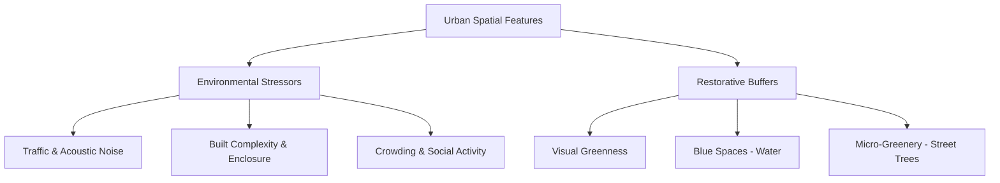
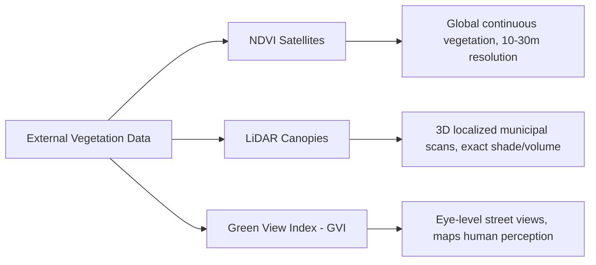

# Environmental Stress & Physiological Mapping: A Literature Review and System Audit

**Date:** 2026-07-15  
**Topic:** Synthesis of mobile biosensing (GSR/EDA + GPS) literature, psychophysiological metrics, OpenStreetMap feature proxies, external vegetation databases, and mathematical validation of the BioMapping analysis dashboards.

---

## 1. Introduction & Academic Precedents

Autonomic nervous system (ANS) mapping via mobile biosensing provides urban planners, geographers, and environmental psychologists with empirical data on human environmental experiences. By overlaying Electrodermal Activity (EDA/GSR) with spatial coordinates, researchers can correlate physiological arousal spikes (sympathetic activations) and baseline shifts with specific urban designs and spatial configurations.

This methodology stands on a rich lineage of academic precedents:

### A. Foundational Precedents: Participatory Bio Mapping
- **Nold, C. (2009). *Emotional Cartography: Technologies of the Self*.**  
  *Significance*: Christian Nold pioneered the integration of wearable Galvanic Skin Response (GSR) sensors with GPS logging in 2004, coining the term **"Bio Mapping"**. His work demonstrated how physiological arousal can serve as a democratic tool for communities to map, visualize, and advocate against environmental, political, and social spatial stressors.
- **Willis, K. S., & Nold, C. (2022). *"Sense and the city: An Emotion Data Framework for smart city governance."***  
  *Significance*: Discusses how spatialized physiological data can be integrated into civic planning, translating raw biometric waveforms into actionable citizen-led urban designs.

### B. Wearables & GIS in Urban Science
- **Voss, H., et al. (2024). *"Quantifying the Impact of Urban Green Spaces on Mental Well-Being Using Wearable Sensors and GIS."***  
  *Significance*: Proves that exposure to urban tree canopies and green spaces correlates directly with lower tonic baseline skin conductance level (SCL) and accelerated sympathetic recovery.
- **Zhang, Z., et al. (2022). *"Assessing the association between urban features and human physiological stress response using wearable sensors in different urban contexts."***  
  *Significance*: Uses pedestrian EDA sensors to track urban walks and maps stress peak frequency directly to building density, spatial enclosure, and pedestrian volumes.
- **Shoval, N., et al. (2018). *"Mapping tourist experiences in space and time using GPS and physiological sensors."***  
  *Significance*: Established early empirical GIS workflows for mapping tourist emotional arousal across historic zones, busy junctions, and pedestrian corridors.

### C. Pedestrian & Cyclist Active-Mobility Stress
- **Moser, M. K., et al. (2025). *"Understanding the influence of urban characteristics on cyclists' stress measured through wearable sensors."***  
  *Significance*: Maps cyclist stress peaks directly to road geometries, lane structures, vehicle conflicts, intersections, and lack of dedicated cycling infrastructure.
- **Zeile, P., et al. (2016). *"Urban Emotions — GIS-Based Urban Planning and Socio-Spatial Research with Biosensors."***  
  *Significance*: Proposes the "Urban Emotions" paradigm, showing how real-time skin conductance and GPS tracks can pinpoint architectural barriers, noise bottlenecks, and crossing dangers to improve city walkability.

---

## 2. Literature-Backed Environmental Features

Autonomic reactions can be grouped into **stressors** (which elevate baseline skin conductance and trigger phasic skin conductance responses) and **restorative buffers** (which facilitate sympathetic withdrawal and accelerate baseline recovery).



### 2.1 Environmental Stressors
1. **Traffic and Acoustic Stress**: Proximity to busy roads, multi-lane highways, and heavy traffic noise represents the strongest driver of baseline SCL and acute Phasic GSR peaks.
2. **Built Enclosure (Urban Canyons)**: Densely built street corridors with low Sky View Factors (SVF) cause a sense of spatial enclosure and visual monotony, increasing tonic arousal.
3. **Crowding and Social Activity**: Transit hubs, commercial high streets, and dense public spaces increase sensory stimulation and physiological arousal.

### 2.2 Restorative Buffers
1. **Visual Greenness (The Green Space Effect)**: Immersion in green zones triggers rapid parasympathetic activation, lowering baseline GSR and buffering acoustic annoyance.
2. **Blue Space Restoration**: Proximity to water bodies (rivers, lakes, coastlines) exhibits a powerful, restorative calming effect, sometimes exceeding that of green spaces.
3. **Micro-greenery**: Individual street trees provide localized shade, reduce thermal discomfort (a major driver of sweat gland activity), and soften urban surfaces.

### 2.3 Mobile GSR Confounders: Thermoregulation, Exertion, and Noise
Mobile biosensing in uncontrolled real-world environments introduces physiological confounders that must be algorithmically controlled to prevent false stress detections:
- **Thermoregulatory Sweating**: Sweat glands are primarily thermoregulatory organs. Fluctuations in ambient temperature and direct skin temperature cause baseline (tonic) conductance shifts. Phasic metrics (spontaneous peaks) are more resilient to thermal changes than baseline SCL.
- **Physical Exertion**: Walking up hills, running, or cycling increases physical exertion, which triggers thermoregulatory sweating and motion artifacts. Mobile studies must use accelerometer data to identify and filter out high-motion segments or apply adaptive baseline subtraction.
- **Skin Hydration & Contact**: Dry vs. wet electrodes and variations in skin hydration affect baseline contact impedance. Individualized Z-score standardization is required to normalize amplitude differences.

---

## 3. Mapping Literature Features to OpenStreetMap Tags

To evaluate these stressors in a computational pipeline, specific OpenStreetMap (OSM) vector features serve as spatial proxies:

| Literature Concept | Target Variable | OSM Tags / Query Logic | Metric Computation |
| :--- | :--- | :--- | :--- |
| **Traffic Noise & Danger** | Distance to Major Road | `way["highway"~"motorway\|trunk\|primary\|secondary"]` | Shortest orthogonal distance (m) to nearest matching segment. |
| | Road Category Stress | `way["highway"]` | Category of nearest segment (e.g. `residential`, `pedestrian`, `primary`). |
| **Green Space Restoration** | In Park Indicator | `way/relation["leisure"="park"]`, `way/relation["landuse"="grass"\|"forest"\|"meadow"]`, `way/relation["natural"="wood"]` | Binary (1 = inside polygon, 0 = outside) using ray-casting. |
| | Green Space Density | Same as above | Concentric grid sampling (25 points in 50m radius) testing polygon containment. |
| **Water Restorative Buffer** | Distance to Water | `way/relation["natural"="water"]`, `way["waterway"]` | Shortest distance (m) to nearest water boundary or river line. |
| **Built Enclosure** | Building Density | `way/relation["building"]` | Sum of building areas or count of centroid distances within 50m. |
| **Social Activity Arousal** | Amenity Count | `node/way["amenity"~"cafe\|restaurant\|pub\|fast_food\|bank\|post_office"]`, `node/way["shop"]` | Count of point/polygon entities within 50m. |
| | Transport Node Proximity | `node["highway"="bus_stop"]`, `node["railway"="station"]` | Count of transport nodes within 50m. |
| **Micro-greenery** | Tree Density | `node["natural"="tree"]`, `way["natural"="tree_row"]` | Count of individual tree elements within 50m. |

---

## 4. Alternative Tree Canopy & Vegetation Databases

While OSM is excellent for structural features (roads, buildings, parks), volunteer-mapped street trees are often highly inconsistent. To capture vegetative exposure accurately, researchers rely on three primary external databases:



### A. NDVI (Normalized Difference Vegetation Index)
- **Concept**: A satellite-derived index (from Sentinel-2 or Landsat) indicating live green vegetation based on near-infrared and red light reflectance.
- **Scientific Value**: Captures private gardens, agricultural land, and minor lawns that are missing from vector databases.
- **Integration**: Extracted along the coordinate path via python scripting (`rasterio`, Google Earth Engine) and imported into the CSV as a custom spatial column.

### B. LiDAR Tree Canopy Maps (1m High-Resolution)
- **Concept**: laser-scanned 3D datasets detailing vegetation canopy height and density.
- **Scientific Value**: Reflects the physical canopy cover shading the street. Shading reduces thermal-induced sweating (which can be misclassified as mental stress).
- **Integration**: Distributed as raster GeoTIFF files or municipal GIS services.

### C. Green View Index (GVI / Google Street View)
- **Concept**: Computer vision segmentation of 360-degree street photos to calculate the percentage of visible foliage from a pedestrian's eye-level.
- **Scientific Value**: **Most predictive metric for physiological stress reduction.** Pedestrians do not experience the environment from a bird's-eye view; eye-level greenness drives cognitive restoration.
- **Integration**: Query Mapillary or Google Street View APIs along the track coordinates to obtain pre-computed greenery ratios.

---

## 5. GSR Analysis Methodology & Psychophysiological Metrics

Mobile biosensing studies in GIS have moved away from simple trough-to-peak counting of raw signal excursions due to environmental noise and overlapping signals. The literature relies on three core metrics:

### A. Non-Specific SCR Frequency (NS-SCR / Peak Density)
In laboratory settings, a Skin Conductance Response (SCR) is measured in response to a specific, timed stimulus (e.g. a flash of light). In the wild, however, we track **Non-Specific SCRs (NS-SCRs)**, which are spontaneous responses to environmental stressors.
- **Literature Standard (Boucsein, 2012; Dawson et al., 2007)**: In a relaxed state, a typical human exhibits **1 to 3 spontaneous peaks per minute**. Under high stress, cognitive load, or environmental arousal, this rate climbs to **20+ peaks per minute**.
- **Methodology**: A temporal sliding window (typically $30\text{ s}$ to $120\text{ s}$) counts active peaks and normalizes them to a "peaks per minute" scale.
- **Use Case**: Maps local "arousal density" along walking tracks, pointing out clusters of stressors.

### B. Integrated Skin Conductance Response (ISCR / Phasic AUC)
Traditional peak counting suffers from the **superposition problem**: if a participant encounters multiple stressors in rapid succession, a new sympathetic response will trigger before the sweat gland has finished reabsorbing/recovering from the previous one. This causes the signal to pile up, meaning traditional trough-to-peak algorithms undercount peaks.
- **Literature Standard (Benedek & Kaernbach, 2010)**: To resolve superposition, researchers decompose the raw signal into Tonic and Phasic components, and then compute the **Integrated Skin Conductance Response (ISCR)**—which is the Area Under the Curve (AUC) of the Phasic driver signal.
- **Unit of Measure**: $\mu\text{S}\cdot\text{s}$ (MicroSiemens $\times$ seconds).
- **Advantage**: The AUC captures both the *amplitude* and the *duration* of arousal. It is completely continuous and does not rely on a binary threshold, making it highly robust against minor noise fluctuations.

### C. Combined Arousal Index
Tonic baseline (Skin Conductance Level, SCL) and Phasic responses (SCRs) reflect different autonomic mechanisms:
- **Tonic SCL**: General physiological tone (governed by baseline vigilance, physical exertion/pedal-speed, and ambient temperature).
- **Phasic Activity**: Short-term environmental stimulus responses.
- **Spatial wearability studies (e.g. Shoval et al., 2018)**: Combine both signals. Because they have different scales, they are normalized using individual participant Z-scores:
  $$\text{Arousal Index}(t) = w_{\text{tonic}} \cdot \text{Tonic}_z(t) + w_{\text{phasic}} \cdot \text{PhasicAUC}_z(t)$$
  Typically, Phasic is weighted higher (e.g. $w_{\text{phasic}} = 0.70$) to prioritize immediate environmental triggers, while Tonic is weighted lower (e.g. $w_{\text{tonic}} = 0.30$) to incorporate the baseline state.

### D. Addressing the Thresholding Dilemma

When modifying the peak detection threshold, having to choose between too few or too many peaks represents the limitation of **hard thresholding**. 

```
GSR Phasic Signal
   ▲
   │        Peak A (0.021 μS) ───►  [PASSES THRESHOLD]
───┼───────────────────────────────── Threshold (0.020 μS)
   │        Peak B (0.019 μS) ───►  [IGNORED / FAILS]
   │    ┌─┐
   │  ┌─┘ └─┐      ┌─┐
   │ ┌┘     └┐    ┌┘ └┐
───┴─┴───────┴────┴───┴───────► Time
```

If the threshold is set to $0.02\ \mu\text{S}$, a response of size $0.021\ \mu\text{S}$ is counted as a peak. A response of size $0.019\ \mu\text{S}$ is completely discarded, even though physiologically they represent almost identical sympathetic activations.

#### The Solutions:
1. **Peak Quality Score**: By evaluating shape criteria (rise time, decay shape, SNR), we can set a low amplitude threshold (e.g. $0.015\ \mu\text{S}$) but filter out noisy fluctuations by verifying that the peak has a realistic physiological shape.
2. **Phasic AUC (Area Under Curve)**: Since AUC integrates the entire area under the Phasic signal, Peak A and Peak B are both captured and summed proportional to their actual sizes. The resulting metric is smooth, continuous, and threshold-independent.

---

## 6. Concrete GSR Implementation Blueprint in BioMapping

To add these features to the codebase, they can be implemented directly within the data pipeline in the following components:

### Step 1: Update the Analysis Engine (`GSRAnalyzer` in `analyzer.js`)
Expose functions to `GSRAnalyzer` to compute sliding-window Peak Density and Phasic AUC.

```javascript
// Add to analyzer.js

/**
 * Calculates a sliding-window temporal peak density (Non-Specific SCR Frequency) in peaks/minute.
 * @param {number} windowSizeSec - Temporal window width in seconds (default: 60)
 */
computeTemporalPeakDensity(windowSizeSec = 60) {
  const n = this.phasic.length;
  if (n === 0) return [];
  
  const density = new Array(n);
  const halfWin = windowSizeSec / 2;
  
  // Filter active, non-excluded peaks
  const activePeakTimes = this.peaks
    .filter(p => !p.excluded)
    .map(p => p.time);
    
  for (let i = 0; i < n; i++) {
    const t = this.phasic[i].time;
    const tStart = t - halfWin;
    const tEnd = t + halfWin;
    
    let count = 0;
    for (let j = 0; j < activePeakTimes.length; j++) {
      const pt = activePeakTimes[j];
      if (pt >= tStart && pt <= tEnd) count++;
    }
    
    density[i] = {
      time: t,
      val: count * (60 / windowSizeSec) // Scale to peaks/minute
    };
  }
  return density;
}

/**
 * Calculates sliding-window Phasic Area Under the Curve (ISCR / AUC) in μS·s.
 * @param {number} windowSizeSec - Temporal window width in seconds (default: 30)
 */
computePhasicAUC(windowSizeSec = 30) {
  const n = this.phasic.length;
  if (n === 0) return [];
  
  const auc = new Array(n);
  const winSamples = Math.round(windowSizeSec * this.sampleRate);
  let runningSum = 0;
  
  for (let i = 0; i < n; i++) {
    const val = Math.max(0, this.phasic[i].val); // Rectify signal (only positive phasic activity)
    runningSum += val;
    
    if (i >= winSamples) {
      runningSum -= Math.max(0, this.phasic[i - winSamples].val);
    }
    
    auc[i] = {
      time: this.phasic[i].time,
      val: runningSum / this.sampleRate // Convert sum to integral (μS * seconds)
    };
  }
  return auc;
}
```

### Step 2: Add Z-Score Normalization for the Combined Index
To build the combined Arousal Index, implement a method to normalize and sum the tonic and phasic AUC values.

```javascript
// Add to analyzer.js

/**
 * Computes a standardized Combined Arousal Index.
 * @param {number} wTonic - Weight for tonic SCL component (default: 0.3)
 * @param {number} wPhasic - Weight for phasic AUC component (default: 0.7)
 */
computeCombinedArousalIndex(wTonic = 0.3, wPhasic = 0.7) {
  const n = this.phasic.length;
  if (n === 0) return [];
  
  const auc = this.computePhasicAUC(30);
  const tonicVals = this.tonic.map(d => d.val);
  const aucVals = auc.map(d => d.val);
  
  // Calculate means and standard deviations
  const tonicStats = GsrFilter.calculateStats(tonicVals);
  const aucStats = GsrFilter.calculateStats(aucVals);
  
  const arousalIndex = new Array(n);
  for (let i = 0; i < n; i++) {
    // Z-score standardize both metrics
    const tZ = (this.tonic[i].val - tonicStats.mean) / tonicStats.std;
    const aZ = (aucVals[i] - aucStats.mean) / aucStats.std;
    
    arousalIndex[i] = {
      time: this.phasic[i].time,
      val: (wTonic * tZ) + (wPhasic * aZ)
    };
  }
  return arousalIndex;
}
```

### Step 3: Map and Visualizer Integration
Once the mathematical arrays are calculated in `GSRAnalyzer`, they can be exposed in two ways:
1. **Lower Graph Options**: In `renderer.js` and `ui.js`, add a dropdown to select what is shown in the lower graph panel. Toggle between raw **Phasic (SCR)**, **Sliding Window Peak Density (PPM)**, and **Phasic AUC ($\mu\text{S}\cdot\text{s}$)**.
2. **Topography Sources on Map**: In `collective_manager.js` and `map.js`, expand the `topoSource` dropdown from `['phasic', 'tonic', 'peaks']` to include `['phasic', 'tonic', 'peaks', 'auc', 'arousal_index']`.
   * For `auc` or `arousal_index` sources, `GSRCollectiveManager` will run Inverse Distance Weighting (IDW) interpolation on the respective calculated arrays, creating a continuous stress heatmap surface that bypasses peak-counting threshold artifacts.

---

## 7. Ambulatory Spatial Data Correlation & Spatial Autocorrelation

Running standard bivariate correlations (e.g. Pearson $r$) on mobile coordinate tracks violates statistical assumptions due to spatial structures:

### A. Violation of i.i.d. (Spatial Autocorrelation)
Tobler's First Law of Geography states: *"Everything is related to everything else, but near things are more related than distant things."* Physiological variables (like SCL) and spatial variables (like distance to parks) exhibit high spatial autocorrelation. This violates the assumption of Independent and Identically Distributed (i.i.d.) observations, inflating degrees of freedom and artificially exaggerating the statistical significance ($p$-values) of correlation matrices.

### B. Advanced Correlation Methods
To evaluate green space restorative relationships accurately, mobile studies utilize:
1. **Geographically Weighted Regression (GWR)**: Standard OLS assumes a global relationship. GWR allows the local relationship between physiological arousal and green space distance to vary spatially, capturing local environmental microclimates.
2. **Bivariate Local Moran's I**: Identifies statistically significant spatial clustering. Outlines:
   - *High-High Clusters*: Spatial hotspots of high stress coinciding with high urban stressors (traffic junctions).
   - *Low-Low Clusters*: Spatial coldspots of physiological calm coinciding with high green space canopy.
3. **Inverse Distance Weighting (IDW)**: Used to interpolate discrete track points into continuous spatial "stress surfaces," enabling spatial overlays with green canopy maps.

### C. Green Space Exposure Dose-Response & Perception
- **The 20-Minute Threshold**: Dose-response curves indicate that physiological recovery and cortisol/arousal decay occur non-linearly, with optimal sympathetic calm achieved after **20 to 30 minutes** of continuous green space immersion.
- **NDVI vs. GVI Correlation**: Satellite-derived biomass indices (NDVI) provide a continuous measure of vegetation canopy, but eye-level Green View Index (GVI) exhibits a much stronger direct negative correlation with Phasic SCR spikes. Pedestrians respond to visual greenery enclosing their field of view, rather than vertical tree canopy footprints.

---

## 8. Visualizer Dashboard Evaluation & System Audit

This section provides a critical scientific and mathematical evaluation of the **Regression Plot** and **Roads Profile** components in the GSR Map Visualizer.

### 8.1 Regression Plot (Ordinary Least Squares Linear Regression)

The regression dashboard models the relationship between an independent spatial variable ($x$) and a dependent physiological metric ($y$, representing either Phasic GSR or Tonic SCL).

#### A. Academic Context
In environmental biosensing studies, $R^2$ values are typically low (often under 0.05). Human stress is multi-sensory and influenced by thermoregulation, internal thoughts, and visual complexity. In neuro-urbanism literature, an $R^2 = 0.02$ is considered statistically significant and publishable provided the sample size is large and the p-value is low.

#### B. Mathematical Implementation Audit
The Ordinary Least Squares (OLS) regression parameters are calculated in `ui.js`:

1. **Slope ($m$) and Intercept ($c$)**:
   $$m = \frac{n \sum xy - \sum x \sum y}{n \sum x^2 - (\sum x)^2}$$
   $$c = \bar{y} - m\bar{x}$$
   *Code Implementation*:
   ```javascript
   const numM = n * sumXY - sumX * sumY;
   const denM = n * sumX2 - sumX * sumX;
   const m = denM === 0 ? 0 : numM / denM;
   const c = meanY - m * meanX;
   ```
   *Evaluation*: **Mathematically Correct.** This matches standard OLS statistical formulas exactly.

2. **Coefficient of Determination ($R^2$)**:
   $$R^2 = 1 - \frac{SS_{\text{res}}}{SS_{\text{tot}}} = 1 - \frac{\sum (y_i - \hat{y}_i)^2}{\sum (y_i - \bar{y})^2}$$
   *Code Implementation*:
   ```javascript
   let ssTot = 0;
   let ssRes = 0;
   for (let i = 0; i < n; i++) {
     const pred = m * x[i] + c;
     const dev = y[i] - meanY;
     const res = y[i] - pred;
     ssTot += dev * dev;
     ssRes += res * res;
   }
   const r2 = ssTot === 0 ? 1 : 1 - (ssRes / ssTot);
   ```
   *Evaluation*: **Mathematically Correct.** `ssTot` correctly calculates total sum of squares (variance from the mean) and `ssRes` calculates residual sum of squares (deviation from the regression trendline).

3. **Canvas Projection Mapping**:
   *Code Implementation*:
   ```javascript
   const mapX = (x) => padL + ((x - minX) / rangeX) * (width - padL - padR);
   const mapY = (y) => height - padB - ((y - minY) / rangeY) * (height - padB - padT);
   ```
   *Evaluation*: **Correct.** Correctly projects the coordinates linearly onto the drawing canvas width and height, accounting for padding borders.

4. **Outlier Filtering**:
   *Audit Finding*: Previously, if a track had no water nearby, the distance to water registered as `999.0` meters for every point. Drawing a trendline to a cluster of points at `x = 999.0` flattened the regression line and made the chart illegible.
   *Fix Applied*: The data loader loop now filters out these `999.0` indicators, ensuring that the chart only plots active spatial ranges.

---

### 8.2 Roads Profile (Classification Aggregator)

The Roads Profile aggregates physiological metrics and stress peaks across OpenStreetMap highway classifications.

#### A. Academic Context
In urban design, street typologies (e.g. primary, residential, path) represent complex baskets of stressors (combining vehicular traffic speed, noise, visual enclosure, and walking safety). Isolating these profiles allows researchers to make targeted spatial planning recommendations.

#### B. Mathematical Implementation Audit

1. **Arousal Aggregation**:
   $$\text{Mean Phasic} = \frac{\sum \text{Phasic Levels}}{\text{Seconds Spent}}$$
   $$\text{Mean Tonic} = \frac{\sum \text{Tonic SCL}}{\text{Seconds Spent}}$$
   *Evaluation*: **Correct.** Because data is downsampled at 1 Hz intervals, each point represents exactly 1 second, meaning the sample count equates to the exact duration spent on that road class.

2. **Peak Rate Normalization**:
   $$\text{Peak Rate (peaks/minute)} = \frac{\text{Peaks Count}}{\left(\frac{\text{Duration (seconds)}}{60}\right)}$$
   *Code Implementation*:
   ```javascript
   peakRate: (val.peaks / (val.count / 60))
   ```
   *Evaluation*: **Correct.** Correctly normalizes the raw peak counts to a standard rate of peaks per minute, which is the standard reporting index in electrodermal activity literature.

3. **Physiological Latency Compensation**:
   *Code Implementation*:
   ```javascript
   const idx = a.findClosestIndex(Math.max(0, p.time - latency));
   const rc = (idx !== -1 && a.raw[idx].osm_road_class) ? a.raw[idx].osm_road_class : 'none';
   ```
   *Evaluation*: **Correct.** To identify which road class caused a stress peak, the algorithm queries the road class at time $t - \text{latency}$ (where latency is the unified slider setting, typically 1.5 - 3.0 seconds). This properly accounts for the physical sympathetic delay between encountering a spatial stressor and registering a sweat gland response.
