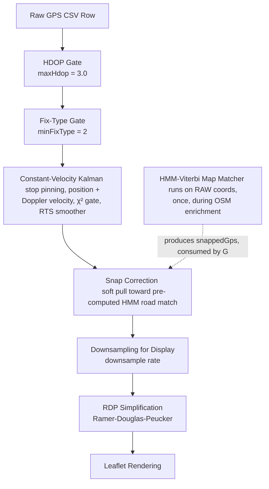

# GPS Pipeline & Filter Architecture

**Written:** 2026-07-15 · **Last checked against code:** 2026-09-25
**Scope:** Complete overview of the GPS processing pipeline, from firmware-level quality gating through to downstream spatial analysis filters.
**Files:** `firmware/modules/gps_uart.c`, `firmware/biomap_types.h`, `firmware/biomap_session.c`, `visualiser/src/gps/gps_cv_kalman.mjs`, `visualiser/src/gps/gps_pipeline.mjs`, `visualiser/src/gps/map_match.mjs`, `visualiser/src/map/manager/process.mjs`

> The filter stages and their order still match the code as of the
> last-checked date. For the authoritative, versioned CSV column list see
> [`csv_schema.md`](csv_schema.md) — the abbreviated history in §4 below is
> kept only for the context it gives the pipeline discussion.
>
> A review of the filter — what was fixed, what was tested and left, and the
> harness used to test changes — is in
> [`gps_filter_review.md`](gps_filter_review.md).

---

## 1. Overview & Pipeline Order

The BioMapping GPS pipeline ingests raw NMEA data from the u-blox SAM-M10Q GPS chip on the Flipper Zero hardware, performs light validity checking (NaN guards, fix-validity flags), logs every reported fix to an SD card, and then applies a multi-stage post-processing filter pipeline in the web-based analyzer.

The sequence of filters applied to the track data is ordered as follows:



Note the map matcher (`M`) is *not* part of the per-render filter chain above it — it runs once during OSM enrichment, directly on raw GPS coordinates (never on filtered/Kalman output, to avoid a feedback loop where a prior render's snap bias would pull the next enrichment pass toward the wrong road — see `osm_enrichment.js`'s `getCoordinates(i, true)` call). Its output, `analyzer.snappedGps`, is then consumed by step `G` on every render.

---

## 2. Firmware-Level Gating & Parsing

### 2.1 NaN Guarding & Validity Checks (`modules/gps_uart.c`)
- **DOP Safety**: `minmea_tofloat` returns `NaN` for missing fields. During fix acquisition, GSA/GGA sentences may omit DOP. The firmware uses temporary floats and only overwrites coordinates/DOPs if the values are valid (non-NaN) real numbers.
- **GLL Validity Flag**: The firmware verifies `gll_frame.status == MINMEA_GLL_STATUS_DATA_VALID` before updating coordinates from GLL, preventing void coordinates from overwriting good ones.
- **Satellite fixes only**: After losing the satellites the receiver keeps reporting its own estimate from its motion model — GGA quality `6`, RMC/GLL mode `E` — including estimates it flags as invalid (M10 interface description §2.5.5; the integration manual says fixes not marked valid should not be used). RMC, GGA and GLL all ignore these, so they never move the stored position (`gps_quality_is_gnss_fix()` in `gps_uart.h`).

### 2.2 Quality Gating (`biomap_session.c`)
- **No HDOP gate**: The firmware applies no record-time HDOP threshold. `get_gps_position()` marks a row's coordinates valid on `gps_status_has_fix()` (RMC valid and not estimated, or GGA quality 1–5) plus non-NaN lat/lon, and every satellite fix the receiver reports is logged — all quality filtering is left to the visualiser, so urban-canyon data is never permanently discarded.
- **Speed and course logged independently**: The receiver leaves course empty when nearly still (integration manual §2.2.6) but still reports speed. Recordings before 2026-09-25 dropped the speed too whenever course was empty — about a third of u-blox fixes, mostly at stops.
- **Empty Rows**: Ticks with no fix write empty coordinates (`timestamp,,,,,,,,,gsr_raw,`) to maintain column counts and temporal continuity.

### 2.3 CSV Header Layout
The current CSV log format consists of 11 columns:
```csv
timestamp,lat,lon,hdop,pdop,sats,fix_type,speed_kts,course_deg,gsr_raw,hacc_m
```
`hacc_m` is the u-blox M10Q's own EKF-computed horizontal accuracy in meters, from `$PUBX,00` Field 9. It is `99.9` (unknown) before the first such sentence arrives.

---

## 3. Visualiser Processing Pipeline

Every stage lives in `gps_pipeline.mjs` (the filter itself in `gps_cv_kalman.mjs`); `GSRMapManager._getOrBuildDrawPoints` (`map/manager/process.mjs`) runs them in order and caches the result: `collectFixes` → `filterFixes` (§3.1 gates, §3.2 filter, §3.4 snap) → `reconstructFilteredGps` (10 Hz) → `buildDrawPoints` + `applyRDP` (§3.5). The characterisation test harness calls the same functions, so it cannot drift from the app.

### 3.1 Quality Gates (`gps_pipeline.mjs`)
1. **HDOP Gate (`applyHdopGate`)**: Rejects points with `hdop > maxHdop` (user-adjustable in UI, default `3.0`). Points lacking HDOP are kept.
2. **Fix-Type Gate (`applyFixTypeGate`)**: Filters out points with `fix_type == 1` (no fix). Retains 2D/3D fixes (`fix_type >= 2`).

### 3.2 Constant-velocity Kalman + RTS (`gps_cv_kalman.mjs`)
The app's only GPS filter. It replaced an earlier chain (stop averaging, speed filter, velocity-aided smoothing, position-only Kalman + RTS with a displacement clamp), removed 2026-09-25:
- **State** east/north position and velocity on a local flat plane; continuous white-noise acceleration model (Bar-Shalom §6.2), acceleration noise `0.5 m²/s³` scaled by `(maxSpeed/3)²`.
- **Measurements**: each position fix (noise from `hacc_m`, else DOP — `GpsCvKalman.measurementVarianceM2`), and the chip's Doppler speed + course as a velocity (0.3 m/s along track, 15° across; below 0.6 m/s only "about this slow" is used, since course is noise there).
- **Linked fixes**: the chip outputs 10 fixes/s already smoothed by its own filter, so their errors are shared. Position noise is scaled by `3 s / fix spacing` (Groves' variance inflation), so 3 s of fixes weigh as one independent fix.
- **Outliers**: a 2-DOF χ² gate (11.83) skips a disagreeing measurement. When the rejected fixes span 10 s the track restarts — from the first of them, so a real jump is drawn where it happened; a signal gap of more than 1 s between rejected fixes starts a new stretch, so a lone bad fix before a gap is never restarted on. A bad stretch shorter than that is skipped whole; the earlier rule (restart after 5 fixes = 0.5 s, on the current fix) drew any bad stretch over 0.5 s in full. The smoother runs per stretch between restarts.
- **Stops**: before filtering, the fixes of each stop are pinned to the stop's mean position, so a stop draws as one dot. Over a long stop the chip's position drifts several metres while its speed stays near zero, and the filter alone reads that as slow walking (biomap_032b: a 3½-minute stop drew a 10 m loop). The rule copies the receiver's own "static hold" (M10 integration manual §2.2.5), which we leave switched off in the chip so the recording keeps the raw wander and the dot can be the mean of the whole stop:
  - starts at Doppler speed ≤ 0.5 kt (≈ 0.26 m/s), ends only above 1.0 kt (2×, as the chip does), so a shuffle doesn't split a stop;
  - also ends if the fixes move more than 2 m within 5 s (walking off slower than the chip's speed shows), cut back to where the movement began, or stray more than 10 m from the stop's mean (safety net);
  - only stops lasting 5 s or more are pinned (the chip's "wait" stage), so slow walking is never pinned in short steps.
  
  Chosen by A/B on the u-blox walks: none of the variants changed street distance; exiting at 3× pinned real walking and caused filter restarts; 1.5 m / 5 s split real stops; a tight zero-velocity measurement instead of pinning still left a 4 m line. Fixes without a speed are never pinned, so this only acts on recordings from 2026-09-25 on (§2.2).
- **Smoother**: exact RTS backward pass — `tests/test_gps_cv_kalman.js` checks it against a brute-force least-squares solve of the same model.
- **Evaluation** (2026-09-25, against the earlier chain, scoring the drawn path by its distance to the nearest mapped street): on the 31 u-blox walks median 3.17 m vs 3.32 m, worst 1 % 21.0 m vs 22.9 m, 0 vs 6 spikes. Robust Student-t smoothing, Gauss-Markov error states and velocity-noise inflation were tried and not adopted. Later the same day, against the raw fixes on the 32 u-blox walks with cached street data: median 3.23 m vs 3.47 m, worst 10 % 11.0 m vs 13.1 m; stop pinning did not change these. Individual walks can still come out slightly worse than raw — on biomap_032b the chip's course read 12–23° off the fixes' own direction for 40 s and the filter cut a bend by up to 8 m.

### 3.3 HMM Map Matching — computed once, outside the render pipeline (`map_match.js` & `osm_enrichment.js`)
3. **HMM-Viterbi Map Matcher (`MapMatcher.match`)**:
   - **Purpose**: Global sequence map matching to snap trajectories to real road segments.
   - **Emission Probability**: Models a Gaussian distribution based on orthogonal distance $d$ to the candidate road segment:
     $$\log p(z \mid r) = -0.5 \cdot \left(\frac{d}{\sigma}\right)^2 - \log(\sigma \sqrt{2\pi})$$
   - **Transition Probability**: Models an exponential penalty on the difference between straight-line GPS distance and approximate routing distance between candidates:
     $$\log p(r_j \mid r_i) = -\frac{|d_{\text{GPS}} - d_{\text{route}}|}{\beta} - \log\beta$$
     Jumping parallel streets or traversing disconnected roads results in huge penalties.
   - **Viterbi Selection**: Computes the globally most likely candidate path.
   - Runs once, during OSM enrichment, on **raw** GPS coordinates only — deliberately never on filtered/Kalman output, to avoid a feedback loop where a prior render's snap bias would pull the next enrichment pass further toward the wrong road. Its result is cached on `analyzer.snappedGps` and consumed by step 4 on every subsequent render.

### 3.4 Snap Correction — applied AFTER the Kalman filter (`gps_pipeline.mjs`)
4. **Snap Correction (`applySnapCorrection`)**:
   - Blends the Kalman/RTS output toward the pre-computed road match, based on a confidence value $\alpha$ stored in `snappedGps`.
   - **Why after, not before (fixed 2026-09-18):** snapping used to run before the Kalman filter, so a wrong parallel-street snap became the "measurement" the χ² gate judged — the gate would then reject subsequent *good* raw fixes for disagreeing with the bad snap. Running it after treats the road match as a cosmetic pull on an already-gated, already-smoothed estimate, never as evidence the filter itself has to trust.

### 3.5 Post-Processing & Display (`gps_pipeline.mjs`)
5. **Downsampling for Display (`buildDrawPoints`)**: Retains every $N$-th point (sample rate, e.g. downsampling from 10 Hz recording down to 1 Hz) for Leaflet performance.
6. **Ramer-Douglas-Peucker (`applyRDP`)**: Reduces track vertices within a physical distance tolerance to keep page rendering lightweight.

---

## 4. Parameter Guidelines & Tuning

The Kalman filter's own constants are fixed in `gps_cv_kalman.mjs`. The settings that reach it:
- **Max Speed**: scales the acceleration noise as $(\text{maxSpeed}/3)^2$ — faster activities turn and speed up harder. Default `3.0` m/s.
- **Measurement noise ($R$)**: a fixed base position variance of `10` $m^2$ (`GpsCvKalman.DOP_BASE_VARIANCE_M2`), scaled by DOP² — not a setting. On M10Q hardware with `$PUBX,00`, it is replaced by $(hacc\_m)^2$.
- **RDP Tolerance**: Trajectory simplification distance. Default `0` (off).

---

## 5. Direct Spatial Error (`hAcc`) Integration

Measurement noise variance $R$ in the Kalman filter ([`gps_cv_kalman.mjs`](../visualiser/src/gps/gps_cv_kalman.mjs)) prefers the physical accuracy estimate over DOP-scaling when it's available:

$$R_{\text{effective}} = \begin{cases} (\text{hacc\_m})^2 & \text{if hacc\_m valid} \\ R_{\text{base}} \times \text{DOP}^2 & \text{otherwise (before the first \$PUBX,00)} \end{cases}$$

### The `hAcc` Spatial Error Advantage
The u-blox SAM-M10Q calculates **`hAcc`**—the actual physical horizontal position error in meters—via its internal extended Kalman filter covariance matrix, transmitted in the `$PUBX,00` NMEA sentence. The Flipper firmware (`modules/gps_uart.c`) extracts `hAcc` for live OLED display and, as of CSV schema v1.2, logs it as `hacc_m`.

1. **Direct Kalman Variance Assignment:** When `hacc_m` is valid (not the `99.9` sentinel), the visualiser's Kalman filter (via `GpsCvKalman.measurementVarianceM2()` — the canonical hacc/DOP² noise model) assigns physical measurement variance directly instead of scaling by DOP².
2. **Urban Canyon Multipath Rejection:** In urban canyons or under wet tree canopies, satellite geometry often remains acceptable ($\text{HDOP } 1.2$), causing DOP-based estimation to under-estimate measurement noise. However, physical multipath reflections cause true `hAcc` to spike from $1.5\text{ m} \longrightarrow 15.0\text{ m}$. With $R = 15^2 = 225$, the Kalman filter immediately de-weights the multipath outlier and dead-reckons smoothly past the anomaly.
3. **DOP fallback:** before the first `$PUBX,00` sentence of a walk arrives, `hacc_m` stays at its `99.9` sentinel and the filter falls back to DOP-based scaling — so HDOP/PDOP are still needed.
4. **True Ground Error Heatmaps** (not yet implemented): visualizer tooltips/overlays showing exact ground uncertainty bounds ($\pm X.X\text{ m}$) per sample remain a future enhancement.
