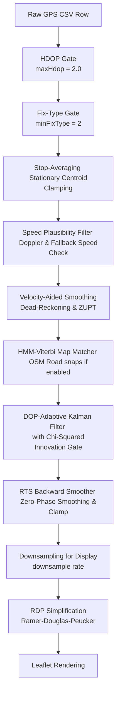

# GPS Pipeline & Filter Architecture

**Date:** 2026-07-15  
**Scope:** Complete overview of the GPS processing pipeline, from firmware-level quality gating through to downstream spatial analysis filters.
**Files:** `modules/gps_uart.c`, `biomap_types.h`, `biomap_session.c`, `gsr-map-analyzer/gps_filter.js`, `gsr-map-analyzer/gps_pipeline.js`, `gsr-map-analyzer/map_match.js`, `gsr-map-analyzer/map.js`

---

## 1. Overview & Pipeline Order

The BioMapping GPS pipeline ingests raw NMEA data from the GPS chip (typically Quectel L76K or u-blox M10Q) on the Flipper Zero hardware, performs initial quality filtering, logs it to an SD card, and then applies a multi-stage post-processing filter pipeline in the web-based analyzer.

The sequence of filters applied to the track data is ordered as follows:



---

## 2. Firmware-Level Gating & Parsing

### 2.1 NaN Guarding & Validity Checks (`modules/gps_uart.c`)
- **DOP Safety**: `minmea_tofloat` returns `NaN` for missing fields. During fix acquisition, GSA/GGA sentences may omit DOP. The firmware uses temporary floats and only overwrites coordinates/DOPs if the values are valid (non-NaN) real numbers.
- **GLL Validity Flag**: The firmware verifies `gll_frame.status == MINMEA_GLL_STATUS_DATA_VALID` before updating coordinates from GLL, preventing void coordinates from overwriting good ones.

### 2.2 Quality Gating (`biomap_types.h` & `biomap_session.c`)
- **`GPS_HDOP_GATE = 5.0`**: The firmware filters out coordinates with `hdop >= 5.0` at record time. This is a permissive gate designed to allow urban canyon data to be logged for advanced post-processing, while filtering out extreme positional drift.
- **Empty Rows**: Sub-gate ticks write empty coordinates (`timestamp,,,,,,,,,gsr_raw`) to maintain column counts and temporal continuity.

### 2.3 CSV Header Layout
The current CSV log format consists of 10 columns:
```csv
timestamp,lat,lon,hdop,pdop,sats,fix_type,speed_kts,course_deg,gsr_raw
```

---

## 3. Analyzer Processing Pipeline

### 3.1 Quality Gates (`gps_pipeline.js`)
1. **HDOP Gate (`applyHdopGate`)**: Rejects points with `hdop > maxHdop` (user-adjustable in UI, default `2.0`). Points lacking HDOP are kept.
2. **Fix-Type Gate (`applyFixTypeGate`)**: Filters out points with `fix_type == 1` (no fix). Retains 2D/3D fixes (`fix_type >= 2`).

### 3.2 Pre-Kalman Cleaning & Smoothing (`gps_filter.js`)
3. **Stop-Averaging (`applyStopAveraging`)**:
   - **Purpose**: Eliminates the positional jitter circle drawn by GPS chips when stationary.
   - **Mechanism**: Groups consecutive points where the Doppler speed is below `stationaryKts` (default `0.5` knots) into clusters of size $\ge$ `minClusterPoints` (default `3`).
   - **Centroid Locking**: Locks the coordinates of all points in the cluster to the centroid of the cluster. This preserves temporal index mapping and avoids interpolation drift during pauses.

4. **Speed Plausibility Filter (`applySpeedFilter`)**:
   - **Mechanism**: Checks speed between points. It prefers Doppler-derived `speedKts` (knots converted to m/s, accurate to ~10× over position derivation) for true GPS epochs ($dt \ge 0.15$ s). For sub-epoch steps ($dt < 0.15$ s) caused by 10 Hz interpolation, it falls back to position-derived speed (haversine distance divided by $dt$).
   - **Recovery Latch**: If 10 consecutive points are rejected, the filter recovers by committing the last known coordinates but advancing the time, ensuring a spatial lock while preventing timeline gaps.

5. **Velocity-Aided Position Smoothing (`applyVelocitySmoothing`)**:
   - **Mechanism**: Dead-reckons a predicted position from the prior coordinate using Doppler speed and course:
     $$\text{pred\_pos} = \text{prev\_pos} + \text{speed\_ms} \times dt \times \begin{bmatrix} \cos(\theta) \\ \sin(\theta) \end{bmatrix}$$
   - **Unit Vector Heading Smoothing**: Converts the heading angle into a 2D unit vector, blends it with the previous direction using an Exponential Moving Average (EMA) to filter noise, and re-normalizes it. This avoids the $360^\circ$ boundary wrap-around bug.
   - **Zero-Velocity Update (ZUPT)**: If the speed $\le 1.2$ knots, heading vectors become erratic. The algorithm sets displacement to 0 (freezing the prediction) and overrides the GPS trust weight to a minimum ($0.05$).
   - **DOP-Adaptive Blending**: Blends the dead-reckoned prediction with the raw GPS coordinate using a trust weight $\alpha$ scaled by DOP:
     $$\alpha_{\text{effective}} = \text{clamp}\left(\frac{\alpha_{\text{base}}}{\text{DOP}}, 0.05, 0.98\right)$$
     $$\text{blended\_pos} = \alpha_{\text{effective}} \times \text{GPS\_fix} + (1 - \alpha_{\text{effective}}) \times \text{predicted\_pos}$$
     This de-weights the GPS fix during high-DOP intervals (e.g. multipath).

### 3.3 Map Snapping (`map_match.js` & `gps_pipeline.js`)
6. **HMM-Viterbi Map Matcher (`MapMatcher.match`)**:
   - **Purpose**: Global sequence map matching to snap trajectories to real road segments.
   - **Emission Probability**: Models a Gaussian distribution based on orthogonal distance $d$ to the candidate road segment:
     $$\log p(z \mid r) = -0.5 \cdot \left(\frac{d}{\sigma}\right)^2 - \log(\sigma \sqrt{2\pi})$$
   - **Transition Probability**: Models an exponential penalty on the difference between straight-line GPS distance and approximate routing distance between candidates:
     $$\log p(r_j \mid r_i) = -\frac{|d_{\text{GPS}} - d_{\text{route}}|}{\beta} - \log\beta$$
     Jumping parallel streets or traversing disconnected roads results in huge penalties.
   - **Viterbi Selection**: Computes the globally most likely candidate path.
7. **Snap Correction (`applySnapCorrection`)**:
   - Blends raw and snapped coordinates based on a confidence value $\alpha$ stored in `snappedGps`.

### 3.4 Kalman Filter & Zero-Phase Smoothing (`gps_filter.js`)
8. **DOP-Adaptive Kalman Filter (`applyKalman`)**:
   - **DOP Scaling**: Base measurement noise variance $R$ is scaled by $\text{DOP}^2$, preferring chip-computed `pdop` over `hdop`, clamped to $[0.5, 10.0]$:
     $$R_{\text{effective}} = R_{\text{base}} \times \text{DOP}^2$$
   - **Chi-Squared Innovation Gate**: Inside the forward Kalman pass, measurement innovation is checked:
     $$\chi^2_{\text{lat}} = \frac{(\text{lat}_{\text{meas}} - \text{lat}_{\text{pred}})^2}{P_{\text{pred}} + R_{\text{effective}}}$$
     Rejects coordinates whose innovation exceeds $\chi^2 = 9.0$ ($3\sigma$ threshold for 1 DOF, representing $99.7\%$ confidence). Upon rejection, the process covariance $P$ is multiplied by $5.0$ to expand the search radius and prevent filter lockout.

9. **Rauch-Tung-Striebel (RTS) Smoother (`applyKalman` backward pass)**:
   - Performs a zero-phase backward smoothing pass using the forward covariance histories to resolve delay lags.
   - **Displacement Clamp**: Clamps the final smoothed position to be within $3\sqrt{R_{\text{base}}}$ meters of the raw coordinate, preventing the smoother from pulling corners or straightaways too far from actual coordinates. Scales degrees to meters using $\cos(\text{lat})$ for longitudinal displacements to prevent clamp bias.

### 3.5 Post-Processing & Display (`gps_pipeline.js` & `gps_filter.js`)
10. **Downsampling for Display (`downsampleForDisplay`)**: Retains every $N$-th point (sample rate, e.g. downsampling from 10 Hz recording down to 1 Hz) for Leaflet performance.
11. **Ramer-Douglas-Peucker (`applyRDP`)**: Reduces track vertices within a physical distance tolerance to keep page rendering lightweight.

---

## 4. CSV Version History

| Version | Date | Columns | Notes |
|---|---|---|---|
| **v1.0** | 2026-06 | `timestamp,lat,lon,alt,sats,fix,gsr_raw` | Initial version; no DOP values. |
| **v1.1** | 2026-07 | `timestamp,lat,lon,hdop,pdop,sats,fix_type,speed_kts,course_deg,gsr_raw` | Removed `alt`. Added `hdop`, `pdop`, `speed_kts`, `course_deg`. Renamed `fix` to `fix_type`. |

---

## 5. Parameter Guidelines & Tuning

The filters can be tuned in the analyzer interface:
- **Smoothing ($\alpha_{\text{base}}$)**: Controls velocity-aided smoothing. Default `0.5`. Lower values trust dead-reckoning more; higher values trust the raw GPS coordinate.
- **Process Noise ($Q$)**: Kalman process variance. Default `0.5` $m^2$.
- **Measurement Noise ($R$)**: Kalman measurement variance. Default `10.0` $m^2$.
- **RDP Tolerance**: Trajectory simplification distance. Default `0.5` meters.
- **Stationary Threshold**: Stop-averaging speed gate. Default `0.5` knots.

---

## 6. Future Enhancement: Direct Spatial Error (`hAcc`) Integration

Currently, measurement noise variance $R$ in the Kalman filter ([`gps_filter.js`](file:///Users/softhook/Documents/GitHub/BioMapping/gsr-map-analyzer/gps_filter.js#L120-L125)) is estimated from unitless geometry by scaling a base constant by $\text{DOP}^2$:
$$R_{\text{effective}} = R_{\text{base}} \times \text{DOP}^2$$

### The `hAcc` Spatial Error Advantage
The u-blox SAM-M10Q calculates **`hAcc`**—the actual physical horizontal position error in meters—via its internal extended Kalman filter covariance matrix, transmitted in the `$PUBX,00` NMEA sentence. The Flipper firmware (`modules/gps_uart.c`) extracts `hAcc` for live OLED screen display.

If `hAcc` (in meters) is logged to CSV in a future schema revision (e.g. as an optional `hacc_m` column):

1. **Direct Kalman Variance Assignment:** Downstream filters can assign physical measurement variance directly:
   $$R_{\text{effective}} = (\text{hAcc}_{\text{meters}})^2$$
2. **Urban Canyon Multipath Rejection:** In urban canyons or under wet tree canopies, satellite geometry often remains acceptable ($\text{HDOP } 1.2$), causing the current filter to under-estimate measurement noise. However, physical multipath reflections cause true `hAcc` to spike from $1.5\text{ m} \longrightarrow 15.0\text{ m}$. With $R = 15^2 = 225$, the Kalman filter immediately de-weights the multipath outlier and dead-reckons smoothly past the anomaly.
3. **True Ground Error Heatmaps:** Enables visualizer tooltips and map overlays displaying exact ground uncertainty bounds ($\pm X.X\text{ m}$) for every recorded biometric sample.
