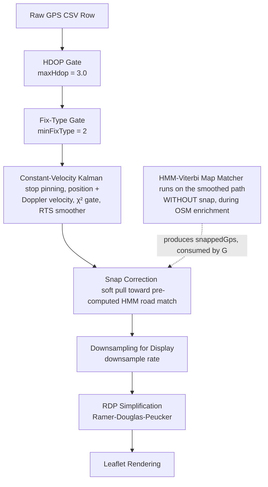

# GPS Pipeline & Filter Architecture

**Written:** 2026-07-15 · **Last checked against code:** 2026-10-01 (§3.3–3.4 and §6 rewritten for the road-snapping review)
**Scope:** Complete overview of the GPS processing pipeline, from firmware-level quality gating through to downstream spatial analysis filters.
**Files:** `firmware/modules/gps_uart.c`, `firmware/biomap_types.h`, `firmware/biomap_session.c`, `visualiser/src/gps/gps_cv_kalman.mjs`, `visualiser/src/gps/gps_pipeline.mjs`, `visualiser/src/gps/map_match.mjs`, `visualiser/src/map/manager/process.mjs`

> The filter stages and their order still match the code as of the
> last-checked date. For the authoritative, versioned CSV column list see
> [`csv_schema.md`](csv_schema.md) — the abbreviated history in §4 below is
> kept only for the context it gives the pipeline discussion.
>
> A review of the filter — what was fixed, what was tested and left, and the
> harness used to test changes — is in
> [`gps_filter_review.md`](gps_filter_review.md).

---

## 1. Overview & Pipeline Order

The BioMapping GPS pipeline ingests raw NMEA data from the u-blox SAM-M10Q GPS chip on the Flipper Zero hardware, performs light validity checking (NaN guards, fix-validity flags), logs every reported fix to an SD card, and then applies a multi-stage post-processing filter pipeline in the web-based analyzer.

The sequence of filters applied to the track data is ordered as follows:


```mermaid
graph TD
    A[Raw GPS CSV Row] --> B[HDOP Gate <br/> maxHdop = 3.0]
    B --> C[Fix-Type Gate <br/> minFixType = 2]
    C --> CV[Constant-Velocity Kalman <br/> stop pinning, position + Doppler velocity, χ² gate, RTS smoother]
    CV --> G[Snap Correction <br/> soft pull toward pre-computed HMM road match]
    G --> J[Downsampling for Display <br/> downsample rate]
    J --> K[RDP Simplification <br/> Ramer-Douglas-Peucker]
    K --> L[Leaflet Rendering]

    M[HMM-Viterbi Map Matcher <br/> runs on the smoothed path WITHOUT snap, during OSM enrichment] -.->|produces snappedGps, consumed by G| G
```

Note the map matcher (`M`) is *not* part of the per-render filter chain above it — it runs during OSM enrichment on the Kalman-smoothed path *before* any road snap (`GpsPipeline.unsnappedPath`, falling back to the raw row where that path is blank; see `_enrichmentPositions` in `osm_enrichment.mjs`). It never sees the drawn (snapped) path, because that path's snap pull came from the previous enrichment, and re-matching it would entrench a wrong snap (e.g. onto a parallel street). Its output, `analyzer.snappedGps`, is then consumed by step `G` on every render. Releasing the Max HDOP or Max Speed slider changes the smoothed path, so it re-runs enrichment from the already-loaded OSM data.

---

## 2. Firmware-Level Gating & Parsing

### 2.1 NaN Guarding & Validity Checks (`modules/gps_uart.c`)
- **DOP Safety**: `minmea_tofloat` returns `NaN` for missing fields. During fix acquisition, GSA/GGA sentences may omit DOP. The firmware uses temporary floats and only overwrites coordinates/DOPs if the values are valid (non-NaN) real numbers.
- **GLL Validity Flag**: The firmware verifies `gll_frame.status == MINMEA_GLL_STATUS_DATA_VALID` before updating coordinates from GLL, preventing void coordinates from overwriting good ones.
- **Satellite fixes only**: After losing the satellites the receiver keeps reporting its own estimate from its motion model — GGA quality `6`, RMC/GLL mode `E` — including estimates it flags as invalid (M10 interface description §2.5.5; the integration manual says fixes not marked valid should not be used). RMC, GGA and GLL all ignore these, so they never move the stored position (`gps_quality_is_gnss_fix()` in `gps_uart.h`).

### 2.2 Quality Gating (`biomap_session.c`)
- **No HDOP gate**: The firmware applies no record-time HDOP threshold. `get_gps_position()` marks a row's coordinates valid on `gps_status_has_fix()` (RMC valid and not estimated, or GGA quality 1–5) plus non-NaN lat/lon, and every satellite fix the receiver reports is logged — all quality filtering is left to the visualiser, so urban-canyon data is never permanently discarded.
- **Speed and course logged independently**: The receiver leaves course empty when nearly still (integration manual §2.2.6) but still reports speed. Recordings before 2026-09-25 dropped the speed too whenever course was empty — about a third of u-blox fixes, mostly at stops.
- **Empty Rows**: Ticks with no fix write empty coordinates (`timestamp,,,,,,,,,gsr_raw,`) to maintain column counts and temporal continuity.

### 2.3 CSV Header Layout
The current CSV log format consists of 11 columns:
```csv
timestamp,lat,lon,hdop,pdop,sats,fix_type,speed_kts,course_deg,gsr_raw,hacc_m
```
`hacc_m` is the u-blox M10Q's own EKF-computed horizontal accuracy in meters, from `$PUBX,00` Field 9. It is `99.9` (unknown) before the first such sentence arrives.

---

## 3. Visualiser Processing Pipeline

Every stage lives in `gps_pipeline.mjs` (the filter itself in `gps_cv_kalman.mjs`); `GpsPipeline.ensureFilteredGps` runs `collectFixes` → `filterFixes` (§3.1 gates, §3.2 filter, §3.4 snap) → `reconstructFilteredGps` (10 Hz) and leaves the result on `analyzer.filteredGps`; `GSRMapManager._getOrBuildDrawPoints` (`map/manager/process.mjs`) then adds `buildDrawPoints` + `applyRDP` (§3.5) and caches the result. The scrub dot, Arousal Places, NDVI sampling and the Environmental dashboard all read the same `filteredGps`, so every analysis uses the path the map draws. The characterisation test harness calls the same functions, so it cannot drift from the app.

### 3.1 Quality Gates (`gps_pipeline.mjs`)
1. **HDOP Gate (`applyHdopGate`)**: Rejects points with `hdop > maxHdop` (user-adjustable in UI, default `3.0`). Points lacking HDOP are kept.
2. **Fix-Type Gate (`applyFixTypeGate`)**: Filters out points with `fix_type == 1` (no fix). Retains 2D/3D fixes (`fix_type >= 2`).

### 3.2 Constant-velocity Kalman + RTS (`gps_cv_kalman.mjs`)
The app's only GPS filter. It replaced an earlier chain (stop averaging, speed filter, velocity-aided smoothing, position-only Kalman + RTS with a displacement clamp), removed 2026-09-25:
- **State** east/north position and velocity on a local flat plane; continuous white-noise acceleration model (Bar-Shalom §6.2), acceleration noise `0.5 m²/s³` scaled by `(maxSpeed/3)²`.
- **Measurements**: each position fix (noise from `hacc_m`, else DOP — `GpsCvKalman.measurementVarianceM2`), and the chip's Doppler speed + course as a velocity (0.3 m/s along track, 15° across; below 0.6 m/s only "about this slow" is used, since course is noise there).
- **Linked fixes**: the chip outputs 10 fixes/s already smoothed by its own filter, so their errors are shared. Position noise is scaled by `3 s / fix spacing` (Groves' variance inflation), so 3 s of fixes weigh as one independent fix.
- **Outliers**: a 2-DOF χ² gate (11.83) skips a disagreeing measurement. When the rejected fixes span 10 s the track restarts — from the first of them, so a real jump is drawn where it happened; a signal gap of more than 1 s between rejected fixes starts a new stretch, so a lone bad fix before a gap is never restarted on. A bad stretch shorter than that is skipped whole; the earlier rule (restart after 5 fixes = 0.5 s, on the current fix) drew any bad stretch over 0.5 s in full. The smoother runs per stretch between restarts.
- **Stops**: before filtering, the fixes of each stop are pinned to the stop's mean position, so a stop draws as one dot. Over a long stop the chip's position drifts several metres while its speed stays near zero, and the filter alone reads that as slow walking (biomap_032b: a 3½-minute stop drew a 10 m loop). The rule copies the receiver's own "static hold" (M10 integration manual §2.2.5), which we leave switched off in the chip so the recording keeps the raw wander and the dot can be the mean of the whole stop:
  - starts at Doppler speed ≤ 0.5 kt (≈ 0.26 m/s), ends only above 1.0 kt (2×, as the chip does), so a shuffle doesn't split a stop;
  - also ends if the fixes move more than 2 m within 5 s (walking off slower than the chip's speed shows), cut back to where the movement began, or stray more than 10 m from the stop's mean (safety net);
  - only stops lasting 5 s or more are pinned (the chip's "wait" stage), so slow walking is never pinned in short steps.
  
  Chosen by A/B on the u-blox walks: none of the variants changed street distance; exiting at 3× pinned real walking and caused filter restarts; 1.5 m / 5 s split real stops; a tight zero-velocity measurement instead of pinning still left a 4 m line. Fixes without a speed are never pinned, so this only acts on recordings from 2026-09-25 on (§2.2).
- **Smoother**: exact RTS backward pass — `tests/test_gps_cv_kalman.js` checks it against a brute-force least-squares solve of the same model.
- **Evaluation** (2026-09-25, against the earlier chain, scoring the drawn path by its distance to the nearest mapped street): on the 31 u-blox walks median 3.17 m vs 3.32 m, worst 1 % 21.0 m vs 22.9 m, 0 vs 6 spikes. Robust Student-t smoothing, Gauss-Markov error states and velocity-noise inflation were tried and not adopted. Later the same day, against the raw fixes on the 32 u-blox walks with cached street data: median 3.23 m vs 3.47 m, worst 10 % 11.0 m vs 13.1 m; stop pinning did not change these. Individual walks can still come out slightly worse than raw — on biomap_032b the chip's course read 12–23° off the fixes' own direction for 40 s and the filter cut a bend by up to 8 m.

### 3.3 HMM Map Matching — computed during enrichment, outside the render pipeline (`map_match.mjs` & `osm_enrichment.mjs`)
3. **HMM-Viterbi Map Matcher (`MapMatcher.match`)** (Newson & Krumm 2009):
   - **Purpose**: Global sequence map matching to snap trajectories to real road segments.
   - **Input**: "eval points" — the smoothed path sampled at ≥ 1 s and thinned to one per 3 m (`_selectEvaluationPoints`, `_thinPoints`). Only these are matched; §3.4 fills in every other row.
   - **Candidates** (`_getCandidates`): up to 10 segments within the snap radius, pre-ranked by distance, road type (footways favoured, main roads penalised) and heading. Roads whose pavements are mapped as their own ways (`sidewalk=separate`, or `sidewalk:left/right/both=separate` with no other pavement — `_pavementsMappedSeparately`) are never candidates: a walker beside them is on the mapped pavement. They stay in the path network for routing.
   - **Emission Probability**: a Gaussian on the distance $d$ to the segment, minus a heading penalty when the segment runs across the direction of travel (10° dead zone, then Gaussian with σ 20°, capped at 6 log units — a road at right angles must be ~14 m nearer to win):
     $$\log p(z \mid r) = -0.5 \cdot \left(\frac{d}{\sigma}\right)^2 - \log(\sigma \sqrt{2\pi}) - \text{headingPenalty}$$
     Heading is the "chord": the bearing from the eval point ≥ 6 m behind to the one ≥ 6 m ahead (`_chordBearingDeg`), with the chip's reported course only as a fallback when the walker has barely moved. Below 0.3 m/s reported speed heading is ignored.
   - **Transition Probability**: exponential in three mismatches between consecutive candidates:
     $$\log p(r_j \mid r_i) = -\frac{|d_{\text{GPS}} - d_{\text{route}}| + |\vec{\Delta}_{\text{GPS}} - \vec{\Delta}_{\text{snap}}| + \max(0,\ d_{\text{route}} - d_{\text{allowed}})}{\beta} - \log\beta$$
     - $d_{\text{route}}$ is the shortest walk through the **path network** (`_buildGraph`, `_routesFrom`, `_routeDist`): every highway way near the track, joined wherever ways share a node — at their ends *or part-way along* (crossings, footpaths joining a pavement, T-junctions) — plus dangling way ends joined to another way's node within 5 m. Routes longer than the GPS step + both candidates' offsets + 20 m count as no route (1000 m penalty).
     - $|\vec{\Delta}_{\text{GPS}} - \vec{\Delta}_{\text{snap}}|$ (`_stepMismatchM`) is how far the snapped step differs, as a vector, from the GPS step. Distance alone can't tell a snap point that stands still, or steps back as far as the walker stepped forward, from one that follows the walker; the step's direction can. Zero when the snap moves with the walker (e.g. a road parallel to the walk at a constant offset).
     - $d_{\text{allowed}}$ (`_allowedStepM`) is a walking-speed limit: the chip's mean Doppler speed between the two eval points, plus 1 m/s, times the time between them, plus 5 m (`SPEED_MARGIN_MS`, `SPEED_SLACK_M`; Max Speed 3 m/s where the chip gave no speed). Doppler speed comes from the signal's frequency, not the position, so it stays sound where buildings throw the positions out. A walk through the network beyond it — the snap swapping to a path tens of metres away while the walker strolled — costs the overrun.
   - **Chain breaks**: the Viterbi chain restarts (emission only) after a gap of more than 30 s **and** more than 30 m of movement (`MAX_GAP_S`, `MAX_GAP_MOVE_M`). GPS dropouts are bridged in the smoothed path, so in practice only a jump leaves such a gap; a walker standing still does not restart it.
   - **Viterbi Selection**: Computes the globally most likely candidate path. There is no post-pass: the side-road "excursion" filter was removed on 2026-10-01 (§6.3).
   - Runs during OSM enrichment on the smoothed path **without** the snap pull (`GpsPipeline.unsnappedPath`, built with the walk's own GPS settings) — never on the drawn, snapped path, to avoid a feedback loop where a prior enrichment's snap would pull the next pass further toward the wrong road. Enrichment metrics (distance to green, road class, etc.) are computed at the positions it snaps to. Its result is cached on `analyzer.snappedGps` and consumed by step 4 on every subsequent render.

### 3.4 Snap Correction — applied AFTER the Kalman filter (`gps_pipeline.mjs`)
4. **Snap Correction (`applySnapCorrection`)**:
   - Blends the Kalman/RTS output toward the pre-computed road match, based on a confidence value $\alpha$ stored in `snappedGps` ($\alpha$ = 1 on the road, cosine roll-off to 0 at the snap radius).
   - **Filling in between eval points (`OSMEnricher._interpolateSnappedGps`)**: each matched eval point carries a *shift* — its road point minus its smoothed position. Every row in between takes the shift and $\alpha$ linearly from the matched points either side, applied to its own smoothed position. The snapped path is therefore the smoothed path plus a gradually changing shift, so it cannot jump at a row the matcher never looked at. (It used to place each in-between row on a road by its own rules — §6.1.)
   - **Why after, not before (fixed 2026-09-18):** snapping used to run before the Kalman filter, so a wrong parallel-street snap became the "measurement" the χ² gate judged — the gate would then reject subsequent *good* raw fixes for disagreeing with the bad snap. Running it after treats the road match as a cosmetic pull on an already-gated, already-smoothed estimate, never as evidence the filter itself has to trust.

### 3.5 Post-Processing & Display (`gps_pipeline.mjs`)
5. **Downsampling for Display (`buildDrawPoints`)**: Retains every $N$-th point (sample rate, e.g. downsampling from 10 Hz recording down to 1 Hz) for Leaflet performance.
6. **Ramer-Douglas-Peucker (`applyRDP`)**: Reduces track vertices within a physical distance tolerance to keep page rendering lightweight.

---

## 4. Parameter Guidelines & Tuning

The Kalman filter's own constants are fixed in `gps_cv_kalman.mjs`. The settings that reach it:
- **Max Speed**: scales the acceleration noise as $(\text{maxSpeed}/3)^2$ — faster activities turn and speed up harder. Default `3.0` m/s.
- **Measurement noise ($R$)**: a fixed base position variance of `10` $m^2$ (`GpsCvKalman.DOP_BASE_VARIANCE_M2`), scaled by DOP² — not a setting. On M10Q hardware with `$PUBX,00`, it is replaced by $(hacc\_m)^2$.
- **RDP Tolerance**: Trajectory simplification distance. Default `0` (off).

---

## 5. Direct Spatial Error (`hAcc`) Integration

Measurement noise variance $R$ in the Kalman filter ([`gps_cv_kalman.mjs`](../visualiser/src/gps/gps_cv_kalman.mjs)) prefers the physical accuracy estimate over DOP-scaling when it's available:

$$R_{\text{effective}} = \begin{cases} (\text{hacc\_m})^2 & \text{if hacc\_m valid} \\ R_{\text{base}} \times \text{DOP}^2 & \text{otherwise (before the first \$PUBX,00)} \end{cases}$$

### The `hAcc` Spatial Error Advantage
The u-blox SAM-M10Q calculates **`hAcc`**—the actual physical horizontal position error in meters—via its internal extended Kalman filter covariance matrix, transmitted in the `$PUBX,00` NMEA sentence. The Flipper firmware (`modules/gps_uart.c`) extracts `hAcc` for live OLED display and, as of CSV schema v1.2, logs it as `hacc_m`.

1. **Direct Kalman Variance Assignment:** When `hacc_m` is valid (not the `99.9` sentinel), the visualiser's Kalman filter (via `GpsCvKalman.measurementVarianceM2()` — the canonical hacc/DOP² noise model) assigns physical measurement variance directly instead of scaling by DOP².
2. **Urban Canyon Multipath Rejection:** In urban canyons or under wet tree canopies, satellite geometry often remains acceptable ($\text{HDOP } 1.2$), causing DOP-based estimation to under-estimate measurement noise. However, physical multipath reflections cause true `hAcc` to spike from $1.5\text{ m} \longrightarrow 15.0\text{ m}$. With $R = 15^2 = 225$, the Kalman filter immediately de-weights the multipath outlier and dead-reckons smoothly past the anomaly.
3. **DOP fallback:** before the first `$PUBX,00` sentence of a walk arrives, `hacc_m` stays at its `99.9` sentinel and the filter falls back to DOP-based scaling — so HDOP/PDOP are still needed.
4. **True Ground Error Heatmaps** (not yet implemented): visualizer tooltips/overlays showing exact ground uncertainty bounds ($\pm X.X\text{ m}$) per sample remain a future enhancement.

---

## 6. Road-snapping review (2026-10-01)

Why the snap was rebuilt, what was decided, what was tried and left out, and how it was measured. Triggered by "straight diversions that ping back" on the demo track, then a zig-zag at the George Street / St Andrew Square crossing on its return leg.

### 6.1 What was wrong

The visible zig-zags had three layers of cause:

1. **Filling in between eval points.** The matcher only places one point every ~3 m. Every row in between was then placed on a road by one of several separate rules: project the *raw* fix onto the matched way (a raw fix can sit ~9 m off the smoothed path, so it lands further along the road); take the nearest segment of the whole way (a sidewalk's sideways jog at a crossing could win); blend projections onto two ways; or — if the eval points were more than 30 s apart — leave the rows unsnapped. Wherever neighbouring rows fell under different rules the drawn path jumped out and back. The 30 s rule fired whenever the walker stood still (3 m thinning leaves no eval points), so one snapped point sat among unsnapped neighbours: a straight line out to the road and back.
2. **The matcher's picture of the network.** Two ways counted as connected only if their *ends* were within 5 m. In OSM, crossings, footpaths and side streets usually join part-way along another way, so the matcher treated them as unreachable (1000 m penalty) and clung to the wrong path until it couldn't, then jumped — e.g. pinned at a pavement corner for three points while the walker used the George Street crossing. A closed way (a loop round a square) was measured the long way round across its shared end node.
3. **Distance without direction.** The transition compared only *how far* the snap moved with how far the GPS moved, never *which way*. A snap point standing still, or stepping back as far as the walker stepped forward, scored as well as one following the walker.

A side effect for the analysis: the old zig-zag made the snapped track (which the Junction Turns analysis measures along) on average **2.07×** the real walk length — 15× on biomap_044 — inflating along-track distances, control-passage counts and duplicate junction visits.

### 6.2 What was decided (in the code now)

| Decision | Where | Why |
|---|---|---|
| Fill in by **shift**, not by re-projecting each row | `_interpolateSnappedGps` | One rule; the snapped path is the smoothed path plus a smoothly varying shift, so it can't jump. Long gaps (standing still) are filled like any other. |
| **Path network** routing over shared OSM nodes | `_buildGraph`, `_routesFrom`, `_routeDist` | Ways join wherever they share a node, not just at their ends; closed loops route the short way round. Built from all highway ways near the track, so roads that aren't candidates still link the paths around them. |
| **Step-direction** term in the transition | `_stepMismatchM` | Uses the direction of travel the GPS already gives: a snapped step that doesn't go the way the walker went is penalised. Routing alone was mixed (§6.3); routing + this term beat every other variant. |
| **Walking-speed limit** on snapped steps | `_allowedStepM` | In 77 places the drawn path moved faster than a run (median 9 m in one step, up to 40 m on the road point) while the chip said ~1.3 m/s — the matcher swapping between paths. Now 58; sideways out-and-back jumps 95 → 72. Most of the rest are corner catch-ups the slack is meant to allow, or walks off the mapped network (§6.6). |
| **No restart while standing still** | `MAX_GAP_MOVE_M` | The 30 s chain break only ever fired at pauses (91 times across 31 walks) and flipped the road at 14 of them. Now also needs > 30 m of movement. |
| **Never snap to a road whose pavements are mapped separately** | `_pavementsMappedSeparately` | OSM `sidewalk=separate`: the walker is on the mapped pavement, not in the carriageway (~130 points moved onto pavements, Edinburgh and Stoke Newington). |
| **Distance to major road measured to the kerb** | `_halfCarriagewayM` in `osm_enrichment.mjs`; label "Distance to Major Road (kerb)" | Beside a main road, a walker snapped to the centre line read 0.1 m and one on a mapped pavement 6.8 m — the same experience, two mapping styles. Half the carriageway (from `width`, else `lanes` × 3.25 m, else 2 lanes two-way / 1 lane one-way, 2 for one-way motorway/trunk) is now taken off; a point inside the carriageway reads 0. Now 0 vs 2.5 m — the remainder is real (pavement width), since a centre-line walker's side is unknown. |
| Remove the side-road **excursion post-pass** (`_removeSideRoadExcursions`) | — | With routing and the step term it made no difference to the counts and did harm at crossings: on biomap_012 it moved a walker on the pavement onto the A10 carriageway 7 m away; on biomap_019 it threw a walker off a crossing. Its own scenario tests (steady-heading junction pass, acute Y-junction, real turn onto a short link) still pass without it. |

### 6.3 Tried and not adopted

- **Patching the old fill-in case by case** (project from the smoothed path instead of the raw fix; keep rows on the matched stretch of the way): fixed the demo's 10 spikes but made cross-way switches worse (rows pinned to one segment's end, then swept diagonally to the next way). Replaced by the shift fill-in.
- **Network routing without the step term**: fixed real mismatches (biomap_024) but added about as many (10 m turn-backs 5 → 10) and fought the excursion post-pass at crossings.
- **Heading from the GPS chip's course or the Kalman velocity instead of the chord**: on straight roads (walker < 3 m from a ≥ 30 m segment, moving > 0.8 m/s) the chord is the most accurate — median error 3.4° (90th percentile 22°) vs course 5.1° (27°) and Kalman velocity 4.6° (25°).
- **Separate behind/ahead headings at corners** (accept a road matching either half-chord): about 7 % of matched points pay a small heading penalty near corners because the chord points diagonally across them. The split halved those but was mixed on the walks (3 m turn-backs 40 → 48, 10 m 5 → 4), so not adopted.
- **A tighter speed limit** (margin 0.3–0.5 m/s, slack 2–3 m): more drawn-path jumps, not fewer (60–64 vs 58) — at a corner the snap genuinely has to catch up.
- **Snap strength from GPS quality ("Kalman gain")**: the chip's hAcc, the Kalman filter's own covariance, local fix scatter, HDOP and satellite count all barely predict how far a fix is from the mapped pavement it was on (rank correlation 0.09–0.17; the Kalman covariance lowest), and the 8–10 m errors occur as often when they all look good — multipath leaves the receiver confidently wrong. Today the snap strength depends only on distance, so poor fixes (further off) are pulled *less*. Walks do differ (median 1.4–7.2 m off mapped pavements), so a per-walk σ is the workable version (§6.6).
- **The chip's course in bad stretches**: no better than the chord where positions are > 6 m off a mapped pavement (90th percentile 40° vs 39°).
- **Checked and left alone**: the step term against 5–9 m of sideways GPS drift next to a parallel path 10 m away (it stays on the right path); the candidate pre-ranking that drops the nearest way in 165 eval points (118 are trunk carriageways with separately mapped pavements — the right call).

### 6.4 Pavements in OSM

OSM records pavements two ways: as their own ways (`highway=footway` + `footway=sidewalk`), which the matcher snaps to directly, or as tags on the road (`sidewalk=both/left/right/no/separate`), which give no line to snap to. Road `width` is almost never tagged (44 of ~4,000 points); `lanes` sometimes. Share of matched points on a vehicle-road centre line after §6.2: St Andrews 98 %, Sussex 63 %, Stoke Newington 52 %, Edinburgh 17 %.

**Not built — virtual pavements**: for roads tagged with pavements, give the matcher two offset lines (half the estimated carriageway + ~1.5 m either side) and let it choose the side. That would put the drawn line and the analysis on the pavement everywhere, but GPS error (3–5 m) is comparable to the offset (5–8 m), so the side could flip; it would need the step term to hold it and an A/B on the walks first. Road-type labelling doesn't need it: `osm_road_class` already prefers the nearest vehicle road within 25 m, so pavement and centre-line walkers get the same class.

### 6.5 Evidence

Measured on 31 u-blox walks with cached Overpass data (`visualiser/tests/manual/.cache/`), running the app's own `snapTrackGps` + `ensureFilteredGps`. **Hairpin**: the drawn path turns more than 135° with legs of at least L m each side, where the unsnapped path has no turn-back within ±6 s.

| | Before (2026-10-01 morning) | After |
|---|---|---|
| Snap-made hairpins, L ≥ 3 / 6 / 10 m | 655 / 336 / 181 | 46 / 20 / 5 |
| Demo track hairpins (L ≥ 3 m) | 12 | 0 |
| Drawn path to nearest road, median / 90th pct | 0.93 / 11.7 m | 0.67 / 8.8 m |
| Snapped-track length ÷ walk length (Junction Turns input) | 2.07 | 1.04 |
| Junction passages (turn / straight / ambiguous / reverse / control) | 99 / 270 / 146 / 7 / 401 | 112 / 247 / 80 / 12 / 144 |

The remaining hairpins are mostly real turn-backs or wander while standing, folded onto a road. **Junction Turns results made before this change will differ** — the old counts were inflated by the zig-zag.

The harness scripts (hairpin counter, offset-spike classifier, before/after renderer, heading audit) were run from a session scratchpad and are not in the repo; the definitions above are enough to rebuild them. Fit to roads is not ground truth: a wrong-but-close path would still look fine.

### 6.6 Open ideas

- Virtual pavements (§6.4).
- Per-walk calibration: estimate the walk's GPS σ from its points on mapped pavements (Newson & Krumm's 1.4826 × median), then set the snap strength Kalman-style (σ_gps² against the corridor width) and fade the snap when a point is further off than that σ allows, instead of the fixed 25 m roll-off. Must not calibrate on walks that are off the network.
- An explicit "off-network" state for walks 12–17 m from any mapped way (biomap_040, 039, 032, 044 — also listed in `junction_turn_analysis.md` §4).
- Corner heading (§6.3) if corner mis-snaps show up on the map.
- Move the harness into `visualiser/tests/manual/` so changes can be re-checked from a clean checkout.
