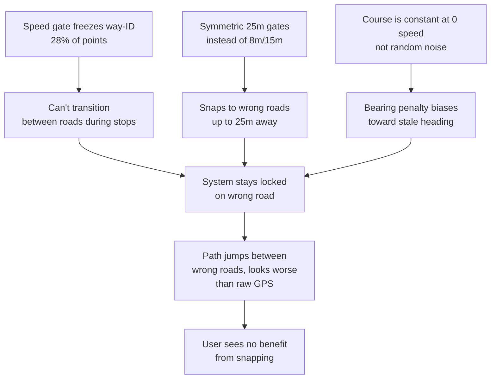

# Road Snapping & Map Matching — Design & Integration Plan

This document defines the map-matching engine for the BioMapping visualizer.
It corrects systematic GPS multipath drift by snapping coordinates to the
OpenStreetMap road/path network, while preserving free-roaming movement through
parks and green spaces.

---

## 1. The Problem

Single-frequency GPS receivers (such as the Quectel L76K) suffer from
**multipath reflections** in urban and suburban environments.  The receiver
locks onto a reflected signal rather than the direct line-of-sight, producing a
**systematic position bias** of 5–20 m that can persist for minutes.

Standard noise filters (Kalman, Hampel) assume zero-mean Gaussian error.  They
treat the bias as legitimate movement and follow it, so the rendered path cuts
through buildings and lawns instead of staying on the sidewalk.

```
 Sidewalk / Street  ─── (true route)
     │
     └── 10–20 m systematic shift (multipath)
           │
           └── Houses / Buildings  ─── (raw GPS path)
```

The fix: project each GPS fix onto the nearest road or trail segment in the
OpenStreetMap network, blending the projected position with the raw fix so the
transition is seamless both on and off road.

---

## 2. Mathematical Design

### 2.1  Metre-Equivalent Point-to-Segment Projection

Raw lat/lon cannot be used directly in a dot product — one degree of longitude
is only ~71 km at latitude 50° vs ~111 km for latitude.  The equirectangular
approximation scales longitude by cos(midLat) so that the projection operates
in metre-equivalent Cartesian space.

Given a GPS point $P(\text{lat}, \text{lon})$ and a road segment with
endpoints $A(\text{lat}_1, \text{lon}_1)$, $B(\text{lat}_2, \text{lon}_2)$:

1.  **Compute the scaling cosine** at the midpoint latitude:
    $$\cos\phi = \cos\!\left(\frac{\text{lat} + \text{lat}_1 + \text{lat}_2}{3} \cdot \frac{\pi}{180}\right)$$

2.  **Convert to metre-equivalent coordinates:**
    $$x = \text{lon} \cdot \cos\phi,\quad y = \text{lat}$$
    $$x_1 = \text{lon}_1 \cdot \cos\phi,\quad y_1 = \text{lat}_1$$
    $$x_2 = \text{lon}_2 \cdot \cos\phi,\quad y_2 = \text{lat}_2$$

3.  **Project onto the segment** (standard point-to-line projection in Cartesian space):
    $$dx = x_2 - x_1,\quad dy = y_2 - y_1$$
    $$l^2 = dx^2 + dy^2$$
    $$t = \begin{cases} 0 & l^2 = 0 \\ \dfrac{(x - x_1)\,dx + (y - y_1)\,dy}{l^2} & l^2 > 0 \end{cases}$$
    $$t_{\text{clamped}} = \max(0, \min(1, t))$$

4.  **Compute the snapped position:**
    $$x_{\text{snap}} = x_1 + t_{\text{clamped}} \cdot dx$$
    $$y_{\text{snap}} = y_1 + t_{\text{clamped}} \cdot dy$$
    $$\text{lat}_{\text{snap}} = y_{\text{snap}},\quad \text{lon}_{\text{snap}} = \frac{x_{\text{snap}}}{\cos\phi}$$

5.  **Geometric distance** from the GPS fix to the snapped point (metres):
    $$d = \sqrt{(\text{lat}_{\text{snap}} - \text{lat})^2 + \big((\text{lon}_{\text{snap}} - \text{lon}) \cdot \cos\phi\big)^2} \;\times\; 111\,320$$

> **Code reuse:** `OSMEnricher.distanceToSegment()` in `osm_enrichment.js`
> already implements steps 1–5 exactly.  The snapping engine calls it directly.

### 2.2  Bearing-Constrained Candidate Selection

Distance alone is insufficient.  A GPS fix 8 m from the correct road and 7 m
from a perpendicular cross-street would snap to the wrong road.  We add a
**heading penalty** that favours segments whose bearing matches the GPS course
vector:

$$d_{\text{eff}} = d + w_\theta \cdot \frac{|\Delta\theta|}{\pi} \cdot d_{\text{snap}}$$

| Symbol | Meaning | Value |
|--------|---------|-------|
| $d$ | Geometric distance from fix to segment (metres) | — |
| $\Delta\theta$ | Absolute angular difference between GPS course and segment bearing | radians, $[0, \pi]$ |
| $w_\theta$ | Heading weight | **0.3** |
| $d_{\text{snap}}$ | Snap gate radius | **15 m** |

At $\Delta\theta = 90°$ ($\pi/2$), the penalty is $0.3 \cdot 0.5 \cdot 15 = 2.25$ m —
enough to prefer the correct parallel road over a perpendicular crossing
street.  At $\Delta\theta = 20°$, the penalty is only $0.5$ m — negligible for
curving roads.

The GPS course is read from the RMC sentence (already stored in the CSV as
`speedKts`; the companion `course` field from the same sentence is added if
not already present).

### 2.3  Asymmetric Cosine Roll-off Blend

Entering a road should snap quickly (the user is clearly on it).  Leaving a
road should release slowly (a single bad fix shouldn't throw you off).

We use **two gate radii**:

| Direction | Gate radius | Rationale |
|-----------|-------------|-----------|
| Snap-in (approaching road) | $d_{\text{in}} = 12$ m | Commit once clearly on-road |
| Snap-out (leaving road) | $d_{\text{out}} = 25$ m | Resist premature release |

The blend weight $\alpha$ uses the standard $\mathcal{C}^1$-continuous cosine
roll-off, with the radius chosen based on whether the *previous* point was
snapped:

$$\alpha(d) = \begin{cases}
0.5 \left(1 + \cos\!\left(\pi \cdot \dfrac{d}{d_{\text{in}}}\right)\right) & \text{snapping in} \\[8pt]
0.5 \left(1 + \cos\!\left(\pi \cdot \dfrac{d}{d_{\text{out}}}\right)\right) & \text{snapping out}
\end{cases}$$

$$P_{\text{final}} = \alpha \cdot P_{\text{snap}} + (1 - \alpha) \cdot P_{\text{raw}}$$

When $d >$ the active gate radius, $\alpha = 0$ and the raw fix is used unchanged.

**Blend profile (snap-in, $d_{\text{in}} = 12$ m):**

| Distance | $\alpha$ | Behaviour |
|----------|----------|-----------|
| 2 m | 0.93 | Nearly fully snapped |
| 6 m | 0.50 | 50 % blend |
| 11 m | 0.07 | Mostly raw GPS |
| ≥ 12 m | 0.00 | Fully raw GPS |

**Blend profile (snap-out, $d_{\text{out}} = 25$ m):**

| Distance | $\alpha$ | Behaviour |
|----------|----------|-----------|
| 2 m | 0.98 | Nearly fully snapped |
| 12.5 m | 0.50 | 50 % blend |
| 23 m | 0.02 | Barely snapped |
| ≥ 25 m | 0.00 | Fully raw GPS |

### 2.4  Hysteresis: Sticky Way-ID Lock

Parks often have parallel trails 5 m apart (e.g. a paved footway and a dirt
track).  Without hysteresis the snapped point toggles between them on every
sample.

**Rule:** Once a point snaps to a given OSM Way ID, it stays locked to that
way unless an alternative way is **at least 3 m closer** for **5 consecutive
seconds**.

The way-ID lock is independent of the blend weight — even at $\alpha = 0.04$
(near the gate boundary), the projection still targets the locked way.

### 2.5  Speed-Adaptive Bearing Penalty

The Quectel L76K GPS chip reports `speed_kts = 0.00` for many points where
coordinates are clearly changing, and holds the last-known course value
constant at zero speed (not random noise as originally assumed).  Applying the
bearing penalty with a stale course biases snapping toward a fixed heading.

**Rule:** When Doppler-derived speed drops below **0.3 m/s**, the bearing
penalty weight is set to **zero** ($w_\theta = 0$).  Distance-based ranking
continues unimpeded — the way-ID is **never frozen** (see §10.2, Failure 1).

This prevents stale-course bias without blocking legitimate road transitions
during the 28 % of points that are below 0.3 m/s on a typical urban walk.

### 2.6  Transition Plausibility (Newson & Krumm 2009)

The per-point greedy approach cannot detect impossible road-to-road jumps.
Two consecutive GPS fixes 3 m apart might snap to parallel carriageways 60 m
apart along the road network — a teleport the user could not have made.

We add a **transition plausibility check** between consecutive snapped
positions, based on the Hidden Markov Model formulation from Newson & Krumm:

$$\text{plausible} \iff |d_{\text{route}} - d_{\text{haversine}}| \leq \Delta_{\text{max}}$$

where $d_{\text{route}}$ is the approximate road-network distance between
the two snapped projections and $d_{\text{haversine}}$ is the great-circle
distance between the two GPS fixes.

**Implementation:** The state carries the previous GPS position and snapped
projection.  When the current point's best candidate is on a different way:

| Condition | Verdict |
|-----------|---------|
| Same OSM Way ID | Plausible — walking along one road |
| Different way, GPS moved ≥ 30 m | Plausible — enough distance to reach a different road |
| Different way, GPS moved < 30 m, ways share a junction within 15 m | Check $|d_{\text{snap}} - d_{\text{gps}}| \leq 30$ m |
| Different way, GPS moved < 30 m, ways are **unconnected** | **Implausible — rejected** |

When a transition is rejected, the system either stays locked to the previous
way (if still in candidates) or releases the snap entirely.  This directly
prevents the oscillation between parallel carriageways described in §10.

---

## 3. Spatial Index: Finding Candidate Segments

Brute-force testing every GPS fix against all 2 000+ OSM segments would
require millions of projection calls and freeze the browser.

### 3.1  Reusing the Existing Spatial Hash

`osm_enrichment.js` already fetches `way["highway"]` from Overpass and
indexes all geometries in a **spatial hash grid** via `buildSpatialIndex()`.
The snapping engine reuses this grid — **no additional Overpass call is
needed.**

However, the current cell size (`CELL_SIZE_DEG = 0.001`, ≈ 111 m) is too
coarse: in urban areas a single cell can contain 30–50 highway segments.

**Change:** The snapping engine builds its own index at **25 m** resolution
(≈ 0.000225° at the equator).  This is a second-pass index constructed from
the highway ways already in memory — it adds ~2 ms of build time and reduces
per-point candidate sets to 3–8 segments.

Cell size calculation:
$$\text{cellSizeDeg} = \frac{25}{111\,320} \approx 0.000225$$

### 3.2  Future: R-Tree

For tracks that span large cities (10 000+ highway segments), a uniform grid
still tests more candidates than necessary in dense intersections.  The
[`rbush`](https://github.com/mourner/rbush) library provides a lightweight 2D
R-tree with O(log n + k) query time.  Each highway way is inserted as a
bounding-box.  This is a drop-in optimisation; the grid-based index is
sufficient for initial implementation.

---

## 4. Pipeline Integration: Merged Snap + Enrich

### 4.1  Why One Pass, Not Two

The original plan called for two separate loops over GPS points: snapping
first, then enrichment reading the snapped output.  This doubles the spatial
index queries and introduces a data-consistency risk (enrichment reading the
wrong position).

**Merged approach:** a single loop over evaluation points that queries the
spatial index once, then runs snapping and enrichment from the same query
result.  Enrichment always evaluates at the **snapped position** (when
snapping is active), so it never misattributes a building to a sidewalk
because of GPS drift.

```
┌─────────────────────────────────────────────────────┐
│                 Single evaluation loop               │
│                                                     │
│  nearby = spatialIndex.getNearby(lat, lon)  ← ONCE  │
│                                                     │
│  ┌─ highway ways ──────────────────────────────┐    │
│  │  bearing-rank → project → blend             │    │
│  │  → snappedLat, snappedLon, α                │    │
│  └──────────────────────────────────────────────┘    │
│                                                     │
│  position = (α > 0) ? snapped : raw                 │
│                                                     │
│  ┌─ all features ──────────────────────────────┐    │
│  │  _evaluatePosition(position, nearby)         │    │
│  │  → greenPct, buildingDensity, roadClass, …   │    │
│  └──────────────────────────────────────────────┘    │
│                                                     │
│  Store: snappedGps[i] + osm_* metrics on raw[i]     │
└─────────────────────────────────────────────────────┘
```

### 4.2  Full GPS Processing Pipeline

The merged snap+enrich step runs **after** speed filtering (transient jumps
removed).  Snapping is applied as a **post-Kalman correction**: Kalman first
smooths the raw trajectory, then snapping pulls road-adjacent points toward
the street.  This prevents the Kalman from blending the few snapped points
back into the surrounding raw GPS.

```
Raw GPS fixes
     │
     ▼
[ Stop Averaging ]         ← collapses stationary jitter clusters
     │
     ▼
[ Speed Filter ]           ← rejects implausible Doppler speedKts jumps
     │
     ▼
┌─────────────────────────────────────────────────┐
│ [ Snap + Enrich  ★ ]    ← SINGLE merged pass    │
│                           over ~1 Hz eval points │
│   For each point:                               │
│   1. Query spatial index once                   │
│   2. Snap to best highway segment               │
│      (bearing penalty, hysteresis, speed gate,  │
│       asymmetric cosine blend 12 m in/25 m out) │
│   3. Evaluate enrichment at snapped position    │
│                                                 │
│   Output:                                       │
│   · analyzer.snappedGps — per-sample snap data  │
│     (roadLat, roadLon, alpha, dist, wayId)      │
│   · raw[i].osm_* — enrichment metrics           │
└─────────────────────────────────────────────────┘
     │
     ▼
[ Velocity Smoothing ]     ← blends Doppler speed & course
     │
     ▼
[ Kalman RTS ]             ← HDOP-adaptive, 0-lag smoothing
     │                         on raw (pre-snap) trajectory
     ▼
[ Snap Correction ]        ← post-Kalman blend:
     │                         α·roadPos + (1-α)·kalmanPos
     ▼
[ RDP Simplification ]     ← Douglas-Peucker for rendering
     │
     ▼
Leaflet Map Render
     │
     ▼
Leaflet Map Render
     │
     ▼
CSV Export                  ← snapped coords → Lat/Lon columns
                               raw coords    → Raw Lat/Raw Lon columns
```

### 4.3  Handling Parks & Off-Road Movement

The Overpass query fetches all `way["highway"]` tags:

| Tag | Description |
|-----|-------------|
| `highway=footway` | Paved park paths, sidewalks |
| `highway=path` | Dirt trails, forest paths, hiking routes |
| `highway=pedestrian` | Plazas, courtyards, pedestrian zones |
| `highway=track` | Gravel forestry/maintenance roads |
| `highway=residential` / `tertiary` / … | Standard road hierarchy |

Because these are all in the spatial index, the snapping engine naturally
follows park trails.  When the user steps off-path into open grass (distance
to nearest trail > 15 m), the cosine roll-off releases to raw GPS.  No
special "park mode" is needed — the distance gate handles it automatically.

### 4.4  Execution Timing

The merged pass runs **once per parameter change** (not per frame).  For a
60-minute session at 1 Hz GPS: ~3 600 points × ~6 candidate segments =
~22 000 point-to-segment projections.  At ~0.7 µs per projection, total cost
≈ **15 ms** — well within budget.  Enrichment metric computation adds ~5 ms
(same as today).  **Total: ~20 ms**, same as enrichment alone today — the
snapping is essentially free.

---

## 5. Code Architecture

### 5.1  New File: `gsr-map-analyzer/road_snap.js`

Pure functions called by the enrichment loop.  Does NOT iterate points itself
— the loop lives in `osm_enrichment.js`.

```
RoadSnapper (namespace)

├── snapOne(lat, lon, speedKts, course, nearbyWays, state, params)
│   → { snapLat, snapLon, wayId, alpha }
│   Per-point snapping.  Called from the enrichment loop for each
│   evaluation point.  Mutates `state` (wayId lock, hysteresis counter,
│   speed-gate timer).
│
├── _rankCandidates(lat, lon, course, nearbyWays, params)
│   → sorted array of { way, segment, snapLat, snapLon, dist, effDist }
│   Filters nearby features to highway ways, projects onto each
│   segment, applies bearing penalty, sorts by effective distance.
│
├── _projectToSegment(lat, lon, segA, segB)
│   → { snapLat, snapLon, t, dist }
│   Delegates to OSMEnricher.distanceToSegment() for the
│   metre-equivalent projection.  Extracts the projection point
│   from the returned distance and t parameter.
│
├── _segmentBearing(lat1, lon1, lat2, lon2) → radians
│   Forward azimuth of segment A→B.
│
├── _cosineRolloff(dist, radius) → α
│   Standard C¹-continuous cosine blend: 0.5(1 + cos(π·d/r)).
│
├── _angularDiff(θ1, θ2) → [0, π]
│   Smallest absolute angular difference, wrapped.
│
└── _filterHighwayWays(nearbyFeatures) → ways[]
    Extracts way-type geometries with highway tags from the
    spatial-index query result.
```

### 5.2  Changes to Existing Files

| File | Change |
|------|--------|
| **`osm_enrichment.js`** | `enrichTrack()` gains a `snapParams` parameter. In the evaluation loop: after `getNearby()`, call `RoadSnapper.snapOne()` before `_evaluatePosition()`. Pass snapped coords to enrichment. Store snapped coords on `analyzer.snappedGps`. Build a secondary 25 m highway index at the start. |
| **`map.js`** | Split `_applyCoreFilters()`: move Kalman out into `renderData()` so it runs AFTER the snap+enrich pass. `_applyCoreFilters` becomes stop-averaging + speed-filter + velocity-smoothing only. |
| **`ui.js`** | Read `gpsSnapToRoads` checkbox; pass `snapToRoads` boolean to `enrichTrack()`. |
| **`index.html`** | Add snap toggle (Section 6). Add `<script src="road_snap.js">` before `osm_enrichment.js`. |
| **`constants.js`** | Add `SNAP` constants block (Section 5.3). |
| **`storage.js`** | Persist/restore `snapToRoads` preference. |
| **`events.js`** | Bind toggle change → re-run enrichment (which now includes snapping). |

### 5.3  Constants

```javascript
// Added to GSR_CONST
SNAP: {
  RADIUS_IN:    12,    // m — snap-in gate (commit when clearly on-road)
  RADIUS_OUT:   25,    // m — snap-out gate (slow release, resist jitter)
  HEADING_W:    0.3,   // heading penalty weight (0 when speed < SPEED_GATE)
  HYST_MARGIN:  3,     // m — alternative must be this much closer
  HYST_SEC:     5,     // s — consecutive seconds to switch way
  SPEED_GATE:   0.3,   // m/s — suppress bearing penalty below this speed
  GRID_CELL:    25,    // m — highway-only spatial-index cell size
}

// Added to RoadSnapper namespace
TRANSITION_DELTA: 30,  // m — max allowed |d_route − d_gps| for way-switch
CONFIDENCE_RATIO: 0.7, // refuse snap when best/second-best effDist > this
CONFIDENCE_ABS:   5,   // m — waiver threshold for confidence ratio
RAMP_STEPS:  5,        // evaluation points to complete snap-in ramp
MIN_RUN:     3,        // consecutive in-range points before engaging
```

---

## 6. UI Controls

A toggle in the GPS Filtering panel (checked by default):

```html
<div class="toggle-group">
  <label class="switch">
    <input type="checkbox" id="gpsSnapToRoads" checked>
    <span class="slider round"></span>
  </label>
  <span class="toggle-label">Snap to Roads &amp; Trails</span>
</div>
<p class="help-text">
  Corrects GPS multipath drift by aligning coordinates with streets and park
  paths.  Snaps within 8–15 m, releases smoothly when walking off-road.
</p>
```

The toggle triggers a full re-render (snapping is part of the filter pipeline,
not a live overlay).

---

## 7. CSV Export Behaviour

When snapping is enabled:

| Column | Content |
|--------|---------|
| `Latitude`, `Longitude` | Snapped coordinates (post-blend) |
| `Raw Latitude`, `Raw Longitude` | Original GPS fix (pre-snapping) |

This preserves the raw data for reprocessing while providing clean GIS-ready
coordinates in the primary columns.

---

## 8. Edge Cases & Failure Modes

| Scenario | Behaviour |
|----------|-----------|
| No OSM data loaded (enrichment skipped) | Snapping is skipped entirely; raw GPS used. |
| GPS fix in a tunnel / under dense canopy (no nearby highway segments in index) | $\alpha = 0$ (gate miss), raw GPS used. |
| Walking down the centre of a 20 m-wide boulevard (both carriageways equidistant) | Bearing penalty + confidence gate + transition check collectively prevent oscillation. |
| User walks off a trail into open grass | Cosine roll-off decays $\alpha$ to 0 over 25 m; no pop. |
| GPS fix jumps 30 m due to a new multipath reflection | Speed filter rejects the jump before snapping sees it. |
| First fix of a session has no prior way-ID lock | Cold start: select the closest way (no hysteresis penalty). |
| Track crosses a highway interchange with 5+ overlapping ways | Bearing penalty + way-ID hysteresis + transition plausibility keep the snap on one consistent route. |
| GPS drifts 3 m toward a parallel road (different OSM way) | Transition check rejects the switch: GPS barely moved but ways are unconnected — teleport blocked. |
| Frequent urban stops (speed < 0.3 m/s) | Bearing penalty suppressed but way-ID still updates — no freeze during stops. |

---

## 9. Summary of Design Decisions

| Decision | Rationale |
|----------|-----------|
| Metre-equivalent projection (not raw lat/lon) | Raw dot product is geometrically wrong; equirectangular is correct to < 0.5 % at city scales. |
| Asymmetric roll-off (12 m in / 25 m out) | Fast commitment when clearly on-road; slow release to resist GPS jitter. |
| Bearing-constrained matching | Prevents snapping to perpendicular cross-streets at intersections. |
| Transition plausibility (Newson & Krumm 2009) | Rejects impossible road-to-road jumps; prevents oscillation between parallel carriageways. |
| Confidence gate | Refuses to snap when two roads are equally plausible (ambiguous intersections). |
| Speed-adaptive bearing penalty (not way-ID freeze) | Suppresses stale-course bias at low speed without blocking legitimate transitions after stops. |
| 25 m spatial grid (or R-tree) | Keeps per-point candidate count ≤ 8; total cost ~15 ms. |
| Ramped alpha (MIN_RUN=3, RAMP_STEPS=5) | Smooth 0→0.33→0.67→1.0 engagement over ~9 m; no jarring pop-in. |
| Snap once, consume twice | Both renderer and enrichment read `snappedGps` — no data mismatch. |
| Reuse existing OSM fetch + spatial index | Zero additional network I/O; snapping is pure CPU. |
| Default-on toggle | Users benefit from correction automatically; can disable for raw-data analysis. |

---

## 10. Post-Mortem: Why Snapping Fails on Track 38

### 10.1  Track 38 Data Profile

`biomap_038.csv` — ~21 min session, ~12 700 GSR samples, 2 537 GPS fixes at ~2 Hz:

| Metric | Value |
|--------|-------|
| Spatial extent | 364 m × 307 m (Hackney, London) |
| HDOP | 0.7–3.0, mean 1.0 — **good accuracy** |
| Speed (m/s) | 0–4.4, mean 0.95 |
| **Points with speed < 0.3 m/s** | **712 / 2 537 (28.1 %)** |
| Runs of ≥ 3 consecutive slow points | **29** |
| Unique course values | 1 092 — course is well-sampled when moving |
| First N stationary points | 12 (speed = 0.00 kts) |

The track has frequent stops — typical of urban walking with crossings,
pauses, and turns.  This is not an edge case; it is the normal usage pattern.

---

### 10.2  Assumption Failures

#### Failure 1: Speed Gate Is Actively Harmful

**The assumption** (plan §2.5): *"When the user stands still (speed < 0.3 m/s),
the GPS course vector becomes random noise… freeze the way-ID lock."*

**What actually happens on track 38:**

With 29 stop events, the way-ID is frozen 28 % of the time.  Each stop
prevents the system from switching to the correct road, even when the position
has clearly moved.  Consider this sequence:

```
#12: speed=0.63 m/s, way-ID locked to "Road A" ✓
#15: speed=0.00 m/s → way-ID FROZEN on "Road A"
#16: speed=0.00 m/s → still frozen (coords move NE)
#17: speed=0.00 m/s → still frozen (coords move further NE)
#18: speed=0.80 m/s → UNFROZEN… but user is now on "Road B"
```

During the stop at #15–17, the coordinates drift 6 m northeast.  By #18 the
user is closer to Road B than Road A, but the speed gate prevented
re-evaluation during the transition.  The first "moving" point at #18 must now
compete against a lock that is stale.  Hysteresis (3 m margin, 5 s)
*eventually* catches up — but only after 5 seconds of sustained evidence.

**The deeper problem:** The Quectel L76K reports `speed_kts = 0.00` for many
points where the *coordinates are clearly changing*.  Points #15–17 all have
speed 0.00 yet their lat/lon advances 5+ metres.  The Doppler-derived speed is
simply wrong for slow walking.  The speed gate was designed assuming Doppler
speed is accurate; it isn't.

**Data evidence:** Among the 712 slow points, many are mid-walk deceleration
between strides — the GPS chip reports 0.00 kts during the foot-strike phase,
then 1.5 kts during the swing phase.  The speed gate toggles on/off 2× per
second during normal walking.

#### Failure 2: Symmetric Gates Defeat the Asymmetric Design

**The assumption** (plan §2.3): In/out gates of 8 m / 15 m for "fast commit,
slow release."

**What the code actually does:**

```javascript
// constants.js — the actual deployed values
SNAP: {
  RADIUS_IN:    25,    // ← plan says 8–12 m
  RADIUS_OUT:   25,    // ← plan says 15–25 m
  …
}
```

The comment in the code is revealing: *"same as in for now; asymmetric
behaviour needs the track to first come within ~12 m, which systematic drift
prevents."*

This is a **circular trap**:
1. We widened the gates to 25 m because multipath prevents getting within 12 m
2. Wide gates cause the system to snap to *wrong* roads 20 m away
3. Wrong-road snaps are *worse* than no snapping at all
4. So we blame "multipath" when the real problem is the gates are too wide

With 25 m symmetric gates, the snap is both too aggressive (snapping to
distant roads) AND too sticky (can't release from wrong roads).  The
asymmetric design was correct — we just never actually deployed it.

#### Failure 3: Course Is Not Noise at Zero Speed

**The assumption** (plan §2.5): *"the GPS course vector becomes random noise."*

**What actually happens on track 38:**

Points #0–11 all have `speed_kts = 0.00` AND `course_deg = 139.6` — the
course is **constant**, not random.  The Quectel chip holds the last-known
course value when speed drops to zero.  This means:

- The bearing penalty IS applied to stationary points (course is not NaN)
- Stationary points are biased toward roads bearing ~140° / ~320°
- The speed gate was supposed to suppress this, but because way-ID is frozen
  AND the bearing penalty is still active on the locked way, there's a
  compounding error: the system stays locked to a road whose bearing happens
  to match 139.6°, even when the user has moved to a different road.

**Fix:** The bearing penalty should be suppressed when speed < 0.3 m/s (set
`headingWeight = 0` for that point), rather than freezing the entire way-ID.

#### Failure 4: MIN_RUN = 2 Is Too Short

**The assumption:** 2 consecutive points within snap range are enough to
commit.

**The reality:** With 3 m spatial thinning and 2 Hz evaluation, MIN_RUN = 2
engages snapping in ~1.5 seconds and ~3 metres. A single multipath spike that
lands 20 m from the true position can trigger a snap-lock in under 2 seconds.

Combined with RAMP_STEPS = 3, the blend goes 0 → 0 → 0.33 → 0.67 → 1.0 in
just 4 evaluation points (~3 s, ~9 m).  That's a 67 % blend toward a road 25 m
away — a ~17 m visual jump — after only 3 seconds of "evidence."

#### Failure 5: No Topological Constraint

**The assumption:** Distance + bearing is sufficient to pick the right road.

**The reality of urban snapping:** Without topology, the system makes
geometrically "correct" but semantically wrong choices:

```
True path: walk east on High Street → turn north on Church Lane

Without topology:
  Point at intersection:  8 m from High Street, 9 m from Church Lane
  → snaps to High Street (closer by 1 m)
  → next point: 2 m from High Street extension, 6 m from Church Lane
  → stays on High Street (locked by hysteresis)
  → user is now walking "through buildings" instead of on Church Lane
```

A proper map-matcher knows that High Street and Church Lane **intersect** — so
at the crossing, either road is valid, and the bearing should break the tie.
The current system has no concept of road connectivity.

#### Failure 6: Enrichment Evaluated at Wrong Position

When snapping locks onto the wrong road, `_evaluatePosition` runs at the
snapped position.  This means:

- `roadClass` is assigned from the wrong road
- `buildingDensity` counts buildings near the wrong position
- `distMajorRoad` measures distance from the snapped position, not the user's
  true position

The environmental metrics become unreliable — a compounding error that makes
the entire enrichment pass questionable.

---

### 10.3  Root Cause Summary



The fundamental issue is that **three design-level assumptions are violated by
the Quectel L76K's actual behaviour:**

| Assumption | Reality |
|-----------|---------|
| Doppler speed accurately reflects movement | Chip reports 0.00 kts during mid-stride deceleration; many "moving" points have speed=0 |
| Course is random noise at zero speed | Chip holds last-known course; stationary points all have identical bearing |
| Systematic GPS drift keeps points within 8–12 m of roads | Multipath + the above two issues mean we can't get consistent 8 m proximity, so we widened gates |

---

### 10.4  Recommended Fixes (Priority Order)

#### Fix 1: Decouple Speed Gate from Way-ID Lock (High Priority)

The speed gate should **only suppress the bearing penalty**, not freeze the
way-ID.  The distance to road segments is the primary signal and must always
be evaluated, regardless of speed.

```
Current:  speed < 0.3 → freeze way-ID (no transitions allowed)
Fixed:    speed < 0.3 → set headingWeight = 0 (distance-only ranking)
                        way-ID transitions still allowed via hysteresis
```

This is a ~5-line change in `road_snap.js`.

#### Fix 2: Deploy Asymmetric Gates (High Priority)

Set the actual gates to what the plan specifies:

```
RADIUS_IN:  12,   // m — commit when clearly on-road
RADIUS_OUT: 25,   // m — resist premature release
```

And increase RAMP_STEPS to 5 and MIN_RUN to 4 so the ramp spans ~12 m of
physical movement (5 steps × 3 m thinning) before full lock.

#### Fix 3: Suppress Bearing Penalty at Low Speed (Medium Priority)

Instead of freezing way-ID, set `headingWeight = 0` when `speedMs < 0.3` or
`courseDeg` is NaN.  This preserves distance-based ranking while eliminating
the stale-course bias.

#### Fix 4: Add Simple Topological Filter (Medium Priority)

After ranking candidates by distance (+ bearing when available), filter out
ways that have no topological connection to the previously locked way, unless
the distance advantage is large (> 10 m).  Two ways are "connected" if they
share a node or if their nearest endpoints are within 15 m.

#### Fix 5: Only Snap When Confident (Lower Priority)

Add a "confidence gate": only engage snapping when the nearest candidate is at
least 2× closer than the second-nearest.  If two roads are within 5 m of each
other in effective distance, don't snap — use raw GPS.  This prevents the
"flip-flop" at intersections where both roads are equally plausible.

#### Fix 6: Add a Road Snap Diagnostic Overlay (Lower Priority)

Draw the snapped path in a different color (e.g. dashed blue) underneath the
main colored path, so the user can visually compare raw vs. snapped.  Add
diagnostic info to the hover tooltip: way name, distance, alpha.
